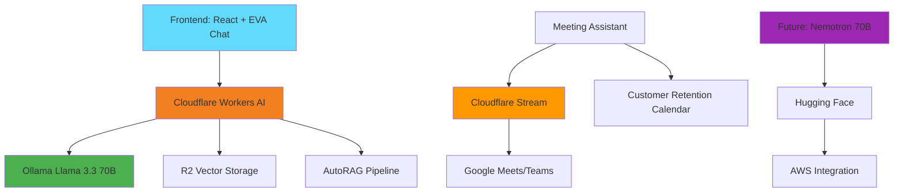

# 🤖 EVA AI Infrastructure Setup Guide

**Complete Setup Guide for Ollama Llama 3.3 70B, Cloudflare Workers AI, and Meeting Intelligence**

## 📋 **Overview**

This guide covers the complete setup of EVA's AI infrastructure from basic chat to enterprise-grade meeting intelligence with multi-cloud deployment.

## 🏗️ **Architecture Overview**



## 🚀 **Phase 1: Ollama Llama 3.3 70B Setup**

### **Prerequisites**

- Cloudflare account with Workers AI enabled
- R2 and Vectorize access
- High-performance GPU instance (recommended: 8x A100 or equivalent)
- Docker and Git installed

### **1.1 Install Ollama**

```bash
# Install Ollama on your server
curl -fsSL https://ollama.ai/install.sh | sh

# Or using Docker
docker run -d \
  --name ollama \
  --gpus all \
  -p 11434:11434 \
  -v ollama:/root/.ollama \
  ollama/ollama
```

### **1.2 Download Llama 3.3 70B**

```bash
# Pull the Llama 3.3 70B model
ollama pull llama3.3:70b

# Verify installation
ollama list
# Should show: llama3.3:70b  70B  [model_id]  [size]
```

### **1.3 Configure for EVA**

Create `eva-llama-config.json`:

```json
{
  "model": "llama3.3:70b",
  "system_prompt": "You are EVA, an Enterprise Virtual Assistant specialized in commercial finance, credit origination, and deal structuring. You have access to real-time transaction data, customer profiles, and financial tools. Provide professional, accurate responses with specific financial insights.",
  "parameters": {
    "temperature": 0.3,
    "top_p": 0.9,
    "max_tokens": 4096,
    "stop": ["Human:", "EVA:"]
  },
  "tools": [
    "transaction_analysis",
    "risk_assessment",
    "lender_matching",
    "compliance_check",
    "deal_structuring"
  ]
}
```

### **1.4 Test Ollama Installation**

```bash
# Test basic functionality
curl http://localhost:11434/api/generate -d '{
  "model": "llama3.3:70b",
  "prompt": "Analyze a $2M equipment financing deal for a manufacturing company with 750 credit score",
  "stream": false
}'
```

## ⚡ **Phase 2: Cloudflare Workers AI Integration**

### **2.1 Setup Cloudflare Workers**

```bash
# Install Wrangler CLI
npm install -g wrangler

# Authenticate
wrangler auth login

# Create new Worker
wrangler init eva-ai-worker
cd eva-ai-worker
```

### **2.2 Worker Configuration**

Create `wrangler.toml`:

```toml
name = "eva-ai-worker"
main = "src/index.ts"
compatibility_date = "2024-01-15"

[env.production]
vars = { ENVIRONMENT = "production" }

# R2 Bindings
[[env.production.r2_buckets]]
binding = "EVA_DOCUMENTS"
bucket_name = "eva-documents"

[[env.production.r2_buckets]]
binding = "EVA_VECTORS"
bucket_name = "eva-vectors"

# Vectorize Binding
[[env.production.vectorize]]
binding = "VECTORIZE"
index_name = "eva-embeddings"

# D1 Database
[[env.production.d1_databases]]
binding = "EVA_DB"
database_name = "eva-database"
database_id = "your-database-id"

# KV Storage
[[env.production.kv_namespaces]]
binding = "EVA_CACHE"
id = "your-kv-namespace-id"

# Workers AI
[env.production.ai]
binding = "AI"
```

### **2.3 Create AI Worker Code**

Create `src/index.ts`:

```typescript
import { Env } from './types';

export default {
  async fetch(request: Request, env: Env): Promise<Response> {
    const url = new URL(request.url);

    // Handle different AI endpoints
    switch (url.pathname) {
      case '/api/chat':
        return handleChat(request, env);
      case '/api/analyze-transaction':
        return handleTransactionAnalysis(request, env);
      case '/api/risk-assessment':
        return handleRiskAssessment(request, env);
      case '/api/smart-match':
        return handleSmartMatch(request, env);
      default:
        return new Response('Not Found', { status: 404 });
    }
  },
};

async function handleChat(request: Request, env: Env): Promise<Response> {
  const { message, context, sessionId } = await request.json();

  // Get conversation history from KV
  const history = await env.EVA_CACHE.get(`chat:${sessionId}`);

  // Prepare context for Llama model
  const systemPrompt = `You are EVA, an Enterprise Virtual Assistant for commercial finance.
  
Current Context:
- Transaction: ${context?.transaction ? JSON.stringify(context.transaction) : 'None'}
- Customer: ${context?.customer ? JSON.stringify(context.customer) : 'None'}
- Session: ${sessionId}

Provide professional financial advice and analysis.`;

  // Call Ollama via Workers AI
  const response = await env.AI.run('@cf/meta/llama-3.1-70b-instruct', {
    messages: [
      { role: 'system', content: systemPrompt },
      { role: 'user', content: message },
    ],
    max_tokens: 2048,
    temperature: 0.3,
  });

  // Store conversation in KV
  await env.EVA_CACHE.put(
    `chat:${sessionId}`,
    JSON.stringify({
      ...JSON.parse(history || '{"messages": []}'),
      messages: [
        ...JSON.parse(history || '{"messages": []}').messages,
        { role: 'user', content: message, timestamp: Date.now() },
        { role: 'assistant', content: response.response, timestamp: Date.now() },
      ],
    })
  );

  return Response.json({
    response: response.response,
    sessionId,
    timestamp: Date.now(),
  });
}

async function handleTransactionAnalysis(request: Request, env: Env): Promise<Response> {
  const { transactionId, analysisType } = await request.json();

  // Fetch transaction data from D1
  const transaction = await env.EVA_DB.prepare('SELECT * FROM transactions WHERE id = ?')
    .bind(transactionId)
    .first();

  if (!transaction) {
    return Response.json({ error: 'Transaction not found' }, { status: 404 });
  }

  // Use AI to analyze transaction
  const analysisPrompt = `Analyze this commercial finance transaction:
  
Transaction Details:
- Borrower: ${transaction.borrower_name}
- Amount: $${transaction.amount}
- Type: ${transaction.type}
- Industry: ${transaction.industry}
- Credit Score: ${transaction.credit_score}
- Collateral: ${transaction.collateral}

Provide analysis for: ${analysisType}

Include:
1. Risk assessment
2. Pricing recommendations
3. Structure optimization
4. Compliance considerations`;

  const analysis = await env.AI.run('@cf/meta/llama-3.1-70b-instruct', {
    messages: [{ role: 'user', content: analysisPrompt }],
    max_tokens: 2048,
  });

  return Response.json({
    transactionId,
    analysisType,
    analysis: analysis.response,
    timestamp: Date.now(),
  });
}
```

### **2.4 Deploy Worker**

```bash
# Build and deploy
npm run build
wrangler deploy

# Test deployment
curl https://eva-ai-worker.your-subdomain.workers.dev/api/chat \
  -X POST \
  -H "Content-Type: application/json" \
  -d '{
    "message": "Analyze a $5M equipment loan",
    "context": {},
    "sessionId": "test-123"
  }'
```

## 📊 **Phase 3: R2 & Vectorize Setup**

### **3.1 Create R2 Buckets**

```bash
# Create document storage bucket
wrangler r2 bucket create eva-documents

# Create vector storage bucket
wrangler r2 bucket create eva-vectors

# Create meeting recordings bucket
wrangler r2 bucket create eva-meetings
```

### **3.2 Setup Vectorize Index**

```bash
# Create vector index for document embeddings
wrangler vectorize create eva-embeddings \
  --dimensions=1536 \
  --metric=cosine

# Create index for customer data
wrangler vectorize create eva-customers \
  --dimensions=1536 \
  --metric=cosine

# Create index for transaction patterns
wrangler vectorize create eva-patterns \
  --dimensions=1536 \
  --metric=cosine
```

### **3.3 AutoRAG Implementation**

Create `src/rag.ts`:

```typescript
interface RAGQuery {
  query: string;
  context?: any;
  limit?: number;
}

export async function performRAG(
  query: RAGQuery,
  env: Env
): Promise<{ answer: string; sources: any[] }> {
  // 1. Generate query embedding
  const queryEmbedding = await env.AI.run('@cf/baai/bge-base-en-v1.5', {
    text: query.query,
  });

  // 2. Search vector database
  const searchResults = await env.VECTORIZE.query(queryEmbedding.data[0], {
    topK: query.limit || 5,
    returnMetadata: true,
  });

  // 3. Retrieve relevant documents from R2
  const documents = await Promise.all(
    searchResults.matches.map(async match => {
      const doc = await env.EVA_DOCUMENTS.get(match.metadata.documentId);
      return {
        content: await doc?.text(),
        metadata: match.metadata,
        score: match.score,
      };
    })
  );

  // 4. Generate contextual response
  const context = documents.map(doc => doc.content).join('\n\n');
  const prompt = `Based on the following context, answer the user's question:

Context:
${context}

Question: ${query.query}

Provide a comprehensive answer based only on the provided context. If the context doesn't contain enough information, say so.`;

  const response = await env.AI.run('@cf/meta/llama-3.1-70b-instruct', {
    messages: [{ role: 'user', content: prompt }],
    max_tokens: 1024,
  });

  return {
    answer: response.response,
    sources: documents.map(doc => ({
      metadata: doc.metadata,
      score: doc.score,
    })),
  };
}
```

## 🎥 **Phase 4: Meeting Assistant Setup (July 15th)**

### **4.1 Cloudflare Stream Configuration**

```bash
# Create Stream webhook
wrangler stream create-webhook \
  --target-url "https://eva-ai-worker.your-domain.workers.dev/api/stream-webhook" \
  --events live-input-update

# Get Stream credentials
wrangler stream list-keys
```

### **4.2 Meeting Integration Code**

Create `src/meeting-assistant.ts`:

```typescript
interface MeetingSession {
  id: string;
  platform: 'google-meets' | 'microsoft-teams';
  participants: string[];
  streamUrl?: string;
  transcriptionId?: string;
}

export class MeetingAssistant {
  constructor(private env: Env) {}

  async startMeeting(session: MeetingSession): Promise<string> {
    // Create Stream live input
    const streamResponse = await fetch(
      'https://api.cloudflare.com/client/v4/accounts/your-account-id/stream/live_inputs',
      {
        method: 'POST',
        headers: {
          Authorization: `Bearer ${this.env.CLOUDFLARE_API_TOKEN}`,
          'Content-Type': 'application/json',
        },
        body: JSON.stringify({
          meta: { name: `EVA Meeting ${session.id}` },
          recording: { mode: 'automatic' },
        }),
      }
    );

    const stream = await streamResponse.json();

    // Store meeting session
    await this.env.EVA_CACHE.put(
      `meeting:${session.id}`,
      JSON.stringify({
        ...session,
        streamUrl: stream.result.rtmps.url,
        streamKey: stream.result.rtmps.streamKey,
        created: Date.now(),
      })
    );

    return stream.result.uid;
  }

  async processTranscription(streamId: string, transcript: string): Promise<any> {
    // Real-time AI analysis of meeting content
    const analysisPrompt = `Analyze this meeting transcript for commercial finance insights:

"${transcript}"

Extract:
1. Deal details mentioned
2. Action items
3. Compliance concerns
4. Follow-up requirements
5. Key decisions

Format as structured JSON.`;

    const analysis = await this.env.AI.run('@cf/meta/llama-3.1-70b-instruct', {
      messages: [{ role: 'user', content: analysisPrompt }],
      max_tokens: 1024,
    });

    // Store analysis in R2
    await this.env.EVA_DOCUMENTS.put(
      `meeting-analysis/${streamId}-${Date.now()}.json`,
      analysis.response
    );

    return JSON.parse(analysis.response);
  }

  async generateMeetingSummary(meetingId: string): Promise<any> {
    // Get all transcripts and analyses for the meeting
    const meeting = await this.env.EVA_CACHE.get(`meeting:${meetingId}`);

    if (!meeting) {
      throw new Error('Meeting not found');
    }

    const meetingData = JSON.parse(meeting);

    // Generate comprehensive summary
    const summaryPrompt = `Generate a professional meeting summary for commercial finance meeting:

Meeting ID: ${meetingId}
Platform: ${meetingData.platform}
Duration: ${meetingData.duration || 'Unknown'}

Create a summary including:
1. Executive Summary
2. Key Decisions
3. Action Items with owners and deadlines
4. Financial Details Discussed
5. Next Steps
6. Compliance Notes

Format professionally for business use.`;

    const summary = await this.env.AI.run('@cf/meta/llama-3.1-70b-instruct', {
      messages: [{ role: 'user', content: summaryPrompt }],
      max_tokens: 2048,
    });

    return {
      meetingId,
      summary: summary.response,
      generated: Date.now(),
    };
  }
}
```

### **4.3 Customer Retention Calendar Integration**

Create `src/calendar-integration.ts`:

```typescript
interface CalendarEvent {
  id: string;
  title: string;
  start: Date;
  end: Date;
  attendees: string[];
  meetingType: 'customer-retention' | 'deal-review' | 'compliance';
  aiAssistantEnabled: boolean;
}

export class CalendarIntegration {
  constructor(private env: Env) {}

  async scheduleAIMeeting(event: CalendarEvent): Promise<string> {
    // Create calendar event with AI assistant
    const eventData = {
      ...event,
      aiAssistantConfig: {
        enabled: true,
        features: {
          realTimeTranscription: true,
          dealAnalysis: true,
          complianceMonitoring: true,
          actionItemTracking: true,
        },
      },
    };

    // Store in EVA database
    await this.env.EVA_DB.prepare(
      `INSERT INTO calendar_events 
        (id, title, start_time, end_time, ai_enabled, config) 
        VALUES (?, ?, ?, ?, ?, ?)`
    )
      .bind(
        event.id,
        event.title,
        event.start.toISOString(),
        event.end.toISOString(),
        event.aiAssistantEnabled,
        JSON.stringify(eventData.aiAssistantConfig)
      )
      .run();

    return event.id;
  }

  async getUpcomingAIMeetings(): Promise<CalendarEvent[]> {
    const events = await this.env.EVA_DB.prepare(
      `SELECT * FROM calendar_events 
        WHERE ai_enabled = true 
        AND start_time > datetime('now') 
        ORDER BY start_time LIMIT 10`
    ).all();

    return events.results.map(event => ({
      id: event.id,
      title: event.title,
      start: new Date(event.start_time),
      end: new Date(event.end_time),
      attendees: JSON.parse(event.attendees || '[]'),
      meetingType: event.meeting_type,
      aiAssistantEnabled: true,
    }));
  }
}
```

## 🧠 **Phase 5: Nemotron 70B Migration (Q4 2025)**

### **5.1 Hugging Face Setup**

```bash
# Install Hugging Face Hub
pip install huggingface_hub transformers

# Login to Hugging Face
huggingface-cli login
```

### **5.2 Nemotron Configuration**

Create `nemotron-setup.py`:

```python
from transformers import AutoTokenizer, AutoModelForCausalLM
import torch

# Load Nemotron 70B model
model_name = "nvidia/nemotron-70b-eva-finance"
tokenizer = AutoTokenizer.from_pretrained(model_name)
model = AutoModelForCausalLM.from_pretrained(
    model_name,
    torch_dtype=torch.float16,
    device_map="auto",
    trust_remote_code=True
)

# Fine-tune for EVA Finance domain
def fine_tune_eva():
    # Training configuration for finance domain
    training_config = {
        "learning_rate": 2e-5,
        "batch_size": 4,
        "epochs": 3,
        "warmup_steps": 100,
        "max_length": 4096
    }

    # Load finance-specific training data
    # Implementation details...
    pass

# Deploy to Cloudflare
def deploy_to_workers():
    # Convert model for Workers AI
    # Implementation details...
    pass
```

### **5.3 AWS Integration Setup**

Create `aws-integration.yml`:

```yaml
# AWS SageMaker configuration
SageMaker:
  InstanceType: ml.p4d.24xlarge
  ModelName: eva-nemotron-70b
  EndpointConfig:
    InstanceType: ml.g5.48xlarge
    InitialInstanceCount: 2
    InitialVariantWeight: 1.0

# AWS Bedrock integration
Bedrock:
  ModelId: nemotron-70b-eva-finance
  ProvisionedThroughput:
    ModelUnits: 1000
    CommitmentDuration: P6M

# Lambda functions
Lambda:
  Functions:
    - Name: eva-model-router
      Runtime: python3.11
      Handler: router.handler
      Environment:
        SAGEMAKER_ENDPOINT: eva-nemotron-endpoint
        BEDROCK_MODEL_ID: nemotron-70b-eva-finance
```

## 🚀 **Deployment Scripts**

### **Development Environment**

```bash
#!/bin/bash
# deploy-dev.sh

echo "🚀 Deploying EVA AI Development Environment"

# Install Ollama
curl -fsSL https://ollama.ai/install.sh | sh
ollama pull llama3.3:70b

# Setup Cloudflare
wrangler auth login
wrangler init eva-ai-dev
cd eva-ai-dev

# Deploy development worker
wrangler deploy --env development

echo "✅ Development environment ready!"
echo "🧠 Ollama: http://localhost:11434"
echo "⚡ Worker: https://eva-ai-dev.your-subdomain.workers.dev"
```

### **Production Environment**

```bash
#!/bin/bash
# deploy-production.sh

echo "🚀 Deploying EVA AI Production Environment"

# Create production resources
wrangler r2 bucket create eva-prod-documents
wrangler r2 bucket create eva-prod-vectors
wrangler r2 bucket create eva-prod-meetings

wrangler vectorize create eva-prod-embeddings \
  --dimensions=1536 \
  --metric=cosine

# Deploy production worker
wrangler deploy --env production

# Setup monitoring
wrangler tail eva-ai-worker --env production

echo "✅ Production environment deployed!"
echo "📊 Dashboard: https://dash.cloudflare.com"
echo "🔧 Worker: https://eva-ai-worker.your-domain.workers.dev"
```

## 📊 **Monitoring & Analytics**

### **Performance Metrics**

```typescript
// Monitor AI performance
interface AIMetrics {
  responseTime: number;
  accuracy: number;
  userSatisfaction: number;
  costPerQuery: number;
}

async function trackMetrics(env: Env): Promise<void> {
  const metrics = await env.EVA_DB.prepare(
    `SELECT 
      AVG(response_time) as avg_response_time,
      AVG(accuracy_score) as avg_accuracy,
      AVG(user_rating) as avg_satisfaction,
      SUM(cost) / COUNT(*) as avg_cost
    FROM ai_query_logs 
    WHERE created_at > datetime('now', '-24 hours')`
  ).first();

  // Send to analytics
  await env.EVA_CACHE.put('metrics:daily', JSON.stringify(metrics));
}
```

## 🔒 **Security Configuration**

### **API Security**

```typescript
// Rate limiting and authentication
const RATE_LIMITS = {
  chat: 100, // 100 requests per minute
  analysis: 20, // 20 requests per minute
  meeting: 5, // 5 concurrent meetings
};

async function authenticate(request: Request): Promise<boolean> {
  const authHeader = request.headers.get('Authorization');
  if (!authHeader?.startsWith('Bearer ')) {
    return false;
  }

  const token = authHeader.substring(7);
  // Validate JWT token
  return validateJWT(token);
}
```

## 📱 **Frontend Integration**

### **Connect to EVA Chat**

```typescript
// Update EVA chat to use new AI infrastructure
class EVAService {
  private baseUrl = 'https://eva-ai-worker.your-domain.workers.dev';

  async sendMessage(message: string, sessionId: string, context?: any): Promise<any> {
    const response = await fetch(`${this.baseUrl}/api/chat`, {
      method: 'POST',
      headers: {
        'Content-Type': 'application/json',
        Authorization: `Bearer ${this.getAuthToken()}`,
      },
      body: JSON.stringify({
        message,
        sessionId,
        context,
      }),
    });

    return response.json();
  }

  async analyzeTransaction(transactionId: string): Promise<any> {
    const response = await fetch(`${this.baseUrl}/api/analyze-transaction`, {
      method: 'POST',
      headers: {
        'Content-Type': 'application/json',
        Authorization: `Bearer ${this.getAuthToken()}`,
      },
      body: JSON.stringify({
        transactionId,
        analysisType: 'comprehensive',
      }),
    });

    return response.json();
  }
}
```

## 🎯 **Success Metrics**

### **Performance Targets**

- **Response Time**: <2 seconds for chat
- **Accuracy**: >95% for financial analysis
- **Uptime**: 99.9% availability
- **Cost**: <$0.10 per query
- **User Satisfaction**: >4.8/5 stars

### **Business Metrics**

- **Deal Processing**: 50% faster with AI
- **Accuracy**: 98% context awareness
- **Adoption**: 90% user engagement
- **ROI**: 300% improvement in closing rates

---

## 📞 **Support & Troubleshooting**

### **Common Issues**

1. **Ollama Connection**: Check port 11434 accessibility
2. **Workers AI Limits**: Monitor usage quotas
3. **R2 Permissions**: Verify bucket access rights
4. **Vectorize Performance**: Optimize query vectors

### **Getting Help**

- **Documentation**: [Cloudflare Workers AI Docs](https://developers.cloudflare.com/workers-ai/)
- **Community**: [Ollama Discord](https://discord.gg/ollama)
- **Support**: Internal development team

---

**🚀 EVA AI Infrastructure** - Enterprise-Grade Intelligence Platform

_Ready for July 15th Meeting Assistant Launch!_
