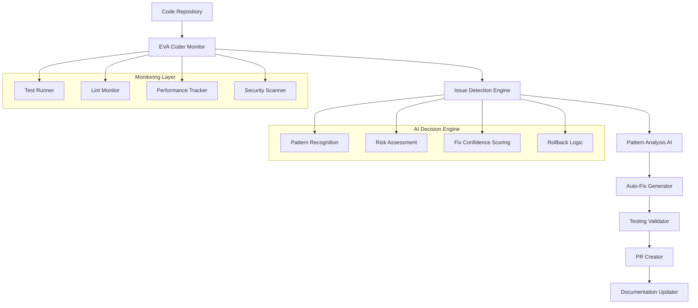

# EVA Coder: Automated Development Assistant

## Self-Healing Codebase Implementation Roadmap

### 🎯 **Vision Statement**

By September 2025, EVA Coder will be a fully autonomous development assistant capable of:

- Real-time bug detection and resolution
- Automated pull requests and commits
- Continuous code quality monitoring
- Self-updating documentation
- Predictive issue prevention

---

## 🏗️ **Architecture Overview**



---

## 📅 **Implementation Timeline**

### **Q1 2025: Foundation Phase** (January - March)

**Goal**: Complete MVP and establish monitoring infrastructure

#### Month 1: MVP Stabilization

- [ ] Complete all 8 phases of current debug plan
- [ ] Achieve 80% test coverage
- [ ] Establish baseline performance metrics
- [ ] Document all current patterns and fixes

#### Month 2: Basic Monitoring Setup

```typescript
// Implement basic monitoring tools:
1. Continuous Test Runner
   - Jest watch mode with custom reporters
   - Failure notification system
   - Test result history tracking

2. Code Quality Dashboard
   - ESLint integration with webhooks
   - TypeScript error monitoring
   - Coverage trend analysis
```

#### Month 3: Pattern Recognition Foundation

```typescript
// Build pattern database:
1. Error Pattern Catalog
   - Common TypeScript errors and fixes
   - Jest test failure patterns
   - Import/export issue resolutions

2. Fix Success Tracking
   - Track which fixes work consistently
   - Build confidence scoring system
   - Create rollback mechanisms
```

**Deliverables Q1**:

- ✅ Stable MVP in production
- 📊 Real-time monitoring dashboard
- 🧠 Basic pattern recognition system
- 📚 Comprehensive error pattern database

---

### **Q2 2025: Automation Foundation** (April - June)

**Goal**: Implement basic auto-fix capabilities

#### Month 4: Auto-Fix Engine v1

```typescript
// Safe auto-fixes for common issues:
1. Import/Export Fixes
   - Unused import removal
   - Missing import detection
   - Circular dependency resolution

2. Syntax Error Fixes
   - Missing semicolons/commas
   - Bracket matching
   - Type annotation corrections
```

#### Month 5: Test Auto-Generation

```typescript
// Automated test creation:
1. Component Test Generation
   - Basic render tests for new components
   - Props validation tests
   - Event handler tests

2. Utility Function Tests
   - Input/output validation
   - Edge case generation
   - Error condition testing
```

#### Month 6: Git Integration

```typescript
// Automated version control:
1. Smart Commit Messages
   - Generate descriptive commit messages
   - Link to issue tracking
   - Include test results

2. Branch Management
   - Auto-create feature branches
   - Merge conflict detection
   - Safe merge strategies
```

**Deliverables Q2**:

- 🔧 Auto-fix engine for 50+ common issues
- 🧪 Automated test generation for new code
- 📝 Smart commit and PR creation
- 🔄 Continuous integration improvements

---

### **Q3 2025: EVA Coder Beta** (July - September)

**Goal**: Full automation suite with AI decision making

#### Month 7: Advanced Pattern Recognition

```typescript
// AI-powered analysis:
1. Machine Learning Integration
   - Train on historical fixes
   - Predict issue likelihood
   - Optimize fix selection

2. Context-Aware Fixes
   - Understand code relationships
   - Consider business logic impact
   - Maintain coding standards
```

#### Month 8: Predictive Issue Detection

```typescript
// Proactive monitoring:
1. Performance Regression Detection
   - Bundle size monitoring
   - Runtime performance tracking
   - Memory leak detection

2. Security Vulnerability Scanning
   - Dependency vulnerability checks
   - Code pattern security analysis
   - Automated security updates
```

#### Month 9: Full Automation Suite

```typescript
// Complete EVA Coder system:
1. Autonomous Operation
   - 24/7 monitoring and fixing
   - Self-improvement algorithms
   - Human oversight dashboard

2. Documentation Automation
   - README auto-updates
   - API documentation sync
   - Code comment generation
```

**Deliverables Q3**:

- 🤖 Fully autonomous EVA Coder system
- 🔮 Predictive issue prevention
- 📖 Self-updating documentation
- 🛡️ Automated security monitoring

---

### **Q4 2025: Production & Optimization** (October - December)

**Goal**: Production-ready self-healing codebase

#### Month 10: Production Deployment

- [ ] Deploy EVA Coder to production environment
- [ ] Implement monitoring and alerting
- [ ] Establish performance baselines
- [ ] Create human oversight protocols

#### Month 11: Advanced Features

```typescript
// Enhanced capabilities:
1. Cross-Repository Learning
   - Share patterns across projects
   - Industry best practice integration
   - Community pattern sharing

2. Advanced Refactoring
   - Code smell detection
   - Architecture improvement suggestions
   - Performance optimization automation
```

#### Month 12: Optimization & Scaling

- [ ] Performance optimization
- [ ] Scalability improvements
- [ ] Cost optimization
- [ ] Feature enhancement based on usage data

**Deliverables Q4**:

- 🚀 Production EVA Coder system
- 📈 Measurable code quality improvements
- 💰 Development cost reduction metrics
- 🌐 Scalable architecture for multiple projects

---

## 🛠️ **Technical Implementation Details**

### Core Components

#### 1. Monitoring System

```typescript
interface EVAMonitor {
  testRunner: ContinuousTestRunner;
  lintMonitor: ESLintWatcher;
  performanceTracker: PerformanceMonitor;
  securityScanner: SecurityWatcher;

  onIssueDetected(issue: Issue): void;
  getHealthStatus(): SystemHealth;
}
```

#### 2. Pattern Recognition Engine

```typescript
interface PatternEngine {
  analyzeError(error: Error): ErrorPattern;
  suggestFix(pattern: ErrorPattern): Fix[];
  calculateConfidence(fix: Fix): number;
  learnFromSuccess(fix: Fix, outcome: boolean): void;
}
```

#### 3. Auto-Fix Generator

```typescript
interface AutoFixer {
  generateFix(issue: Issue): Fix;
  validateFix(fix: Fix): ValidationResult;
  applyFix(fix: Fix): ApplyResult;
  rollbackFix(fix: Fix): void;
}
```

#### 4. PR Automation

```typescript
interface PRAutomation {
  createBranch(issue: Issue): string;
  commitChanges(changes: Change[]): string;
  createPullRequest(branch: string): PRDetails;
  requestReview(pr: PRDetails): void;
}
```

### Data Models

```typescript
interface Issue {
  id: string;
  type: 'test-failure' | 'lint-error' | 'type-error' | 'performance' | 'security';
  severity: 'low' | 'medium' | 'high' | 'critical';
  file: string;
  line?: number;
  message: string;
  context: CodeContext;
  detectedAt: Date;
}

interface Fix {
  id: string;
  issueId: string;
  type: 'code-change' | 'config-update' | 'dependency-update';
  changes: Change[];
  confidence: number;
  riskLevel: 'low' | 'medium' | 'high';
  testRequired: boolean;
}

interface Change {
  file: string;
  operation: 'create' | 'update' | 'delete';
  content: string;
  lineStart?: number;
  lineEnd?: number;
}
```

---

## 📊 **Success Metrics**

### Development Efficiency

- **Bug Fix Time**: Reduce from hours to minutes
- **Test Coverage**: Maintain 90%+ automatically
- **Code Quality**: Zero critical issues in production
- **Developer Productivity**: 40% increase in feature delivery

### System Reliability

- **Uptime**: 99.9% system availability
- **False Positive Rate**: <5% for auto-fixes
- **Rollback Success**: 100% safe rollback capability
- **Human Intervention**: <10% of issues require manual review

### Business Impact

- **Development Costs**: 30% reduction in debugging time
- **Time to Market**: 25% faster feature delivery
- **Code Maintenance**: 50% reduction in technical debt
- **Team Satisfaction**: Improved developer experience scores

---

## 🔒 **Safety & Risk Management**

### Safety Protocols

1. **Confidence Thresholds**: Only apply fixes with >90% confidence
2. **Test Validation**: All fixes must pass comprehensive test suite
3. **Rollback Mechanisms**: Instant rollback capability for any change
4. **Human Oversight**: Critical issues always require human approval

### Risk Mitigation

1. **Staging Environment**: All fixes tested in staging first
2. **Gradual Rollout**: Phased deployment of new capabilities
3. **Monitoring Alerts**: Real-time alerts for system anomalies
4. **Audit Trail**: Complete history of all automated changes

---

## 🎓 **Learning & Adaptation**

### Continuous Learning

- **Pattern Evolution**: Continuously update fix patterns based on success rates
- **Industry Trends**: Integrate new best practices and technologies
- **Team Feedback**: Incorporate developer feedback into decision making
- **Performance Optimization**: Self-optimize based on system metrics

### Knowledge Sharing

- **Pattern Database**: Share successful patterns across teams
- **Best Practices**: Automatically enforce coding standards
- **Documentation**: Keep all documentation current and accurate
- **Training**: Provide insights to help developers improve

---

## 🚀 **Getting Started**

### Immediate Next Steps (This Week)

1. **Complete Phase 1.1**: Fix TypeScript syntax errors
2. **Set up monitoring**: Implement basic test result tracking
3. **Document patterns**: Start cataloging common issues and fixes
4. **Create foundation**: Set up the basic EVA Coder project structure

### This Month

1. **Complete Phases 1-3**: Resolve all critical blocking issues
2. **Implement basic monitoring**: Real-time test and lint monitoring
3. **Pattern recognition**: Build initial error pattern database
4. **Proof of concept**: Create first automated fix for simple issues

### Next Quarter

1. **Complete MVP**: Finish all 8 phases of the debug plan
2. **Basic automation**: Implement auto-fixes for common issues
3. **Git integration**: Automated commits and basic PR creation
4. **Monitoring dashboard**: Real-time system health visualization

---

_This roadmap will be updated monthly based on progress and learnings._
_Target completion: September 2025_
_Next review: June 2025_
_Last Updated: May 27, 2025_
