# EVA AI Frontend - System Architecture & Flow Diagrams

## 🏗️ **Complete System Architecture Overview**

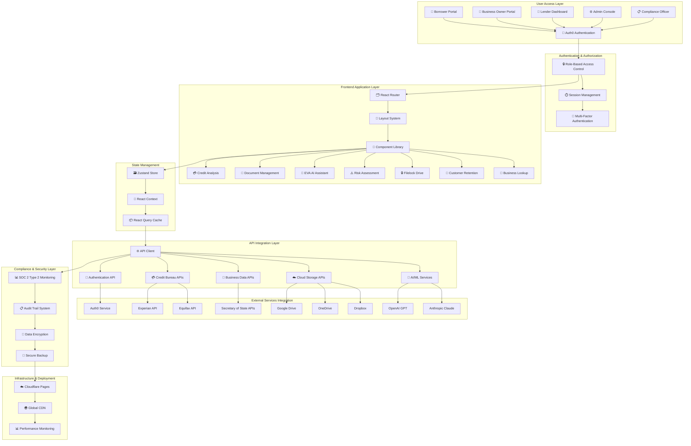

---

## 🔄 **Detailed User Journey & Access Flow**

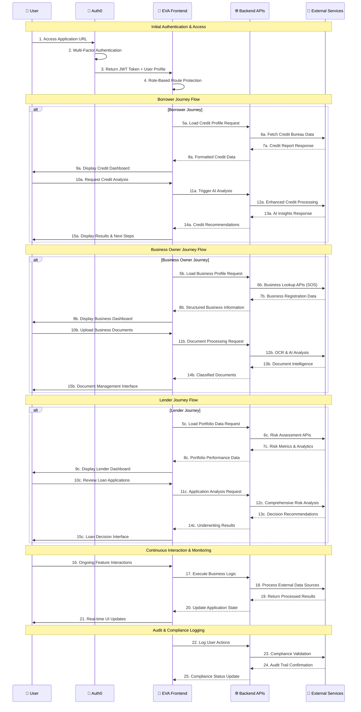

---

## 🤖 **EVA AI Assistant - Intelligence Integration Flow**

```mermaid
graph LR
    subgraph "User Interaction Layer"
        UI[💬 User Input] --> CHAT[🗨️ Chat Interface]
        CHAT --> VOICE[🎤 Voice Input]
        VOICE --> TEXT[📝 Text Processing]
    end

    subgraph "Natural Language Processing"
        TEXT --> NLP[🧠 NLP Engine]
        NLP --> INTENT[🎯 Intent Recognition]
        INTENT --> CONTEXT[📋 Context Analysis]
        CONTEXT --> ENTITY[🔍 Entity Extraction]
    end

    subgraph "AI Agent Routing System"
        ENTITY --> ROUTER[🔄 AI Agent Router]
        ROUTER --> CREDIT_AGENT[💳 Credit Analysis Agent]
        ROUTER --> RISK_AGENT[⚠️ Risk Assessment Agent]
        ROUTER --> DOC_AGENT[📄 Document Processing Agent]
        ROUTER --> BUSINESS_AGENT[🏢 Business Intelligence Agent]
        ROUTER --> COMPLIANCE_AGENT[📊 Compliance Agent]
        ROUTER --> GENERAL_AGENT[🤖 General Assistant Agent]
    end

    subgraph "Specialized Data Integration"
        CREDIT_AGENT --> CREDIT_DATA[💳 Credit Bureau Data]
        RISK_AGENT --> RISK_MODELS[📊 Risk Assessment Models]
        DOC_AGENT --> OCR_ENGINE[📝 OCR Processing Engine]
        BUSINESS_AGENT --> BUSINESS_REGISTRIES[🏢 Business Registry Data]
        COMPLIANCE_AGENT --> AUDIT_LOGS[📋 Compliance Audit Logs]
        GENERAL_AGENT --> KNOWLEDGE_BASE[📚 Financial Knowledge Base]
    end

    subgraph "AI Response Generation"
        CREDIT_DATA --> AI_PROCESSOR[🤖 AI Response Processor]
        RISK_MODELS --> AI_PROCESSOR
        OCR_ENGINE --> AI_PROCESSOR
        BUSINESS_REGISTRIES --> AI_PROCESSOR
        AUDIT_LOGS --> AI_PROCESSOR
        KNOWLEDGE_BASE --> AI_PROCESSOR

        AI_PROCESSOR --> RESPONSE_GEN[📝 Response Generator]
        RESPONSE_GEN --> FORMATTING[🎨 Response Formatting]
        FORMATTING --> RECOMMENDATIONS[💡 Action Recommendations]
        RECOMMENDATIONS --> UI_UPDATE[🔄 User Interface Update]
    end

    subgraph "Learning & Improvement"
        UI_UPDATE --> FEEDBACK[👍 User Feedback]
        FEEDBACK --> ML_TRAINING[🧠 Machine Learning]
        ML_TRAINING --> MODEL_UPDATE[📈 Model Improvement]
        MODEL_UPDATE --> ROUTER
    end
```

---

## 📄 **Document Management & Filelock Drive Architecture**

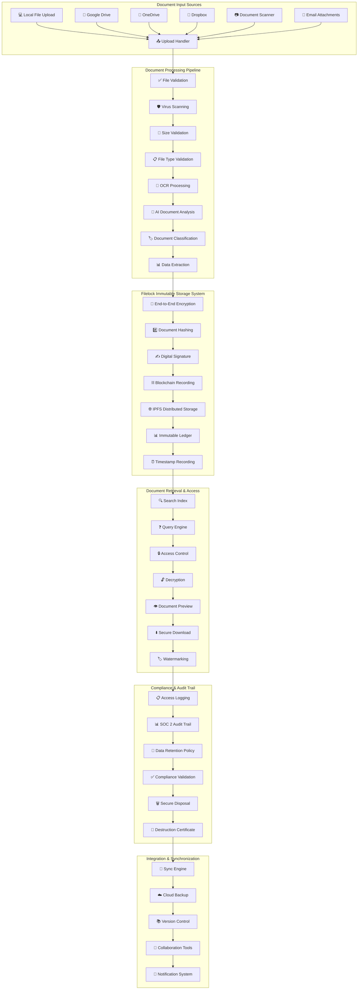

---

## 💳 **Credit Analysis & Risk Assessment Flow**

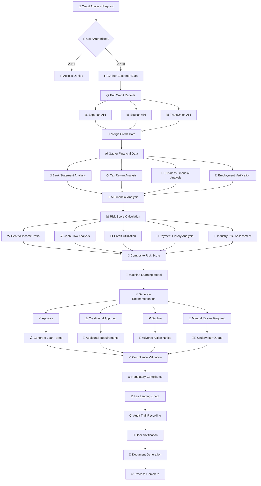

---

## 🏢 **Business Lookup & KYB (Know Your Business) Integration**

```mermaid
graph LR
    subgraph "Business Search Initiation"
        SEARCH_INPUT[🔍 Business Name/EIN Input] --> VALIDATION[✅ Input Validation]
        VALIDATION --> SEARCH_PARAMS[⚙️ Search Parameters]
        SEARCH_PARAMS --> DUPLICATE_CHECK[🔄 Duplicate Check]
    end

    subgraph "Multi-Source Data Collection"
        DUPLICATE_CHECK --> SOS_APIs[🏛️ Secretary of State APIs]
        DUPLICATE_CHECK --> FEDERAL_APIs[🇺🇸 Federal Business Registries]
        DUPLICATE_CHECK --> COMMERCIAL_APIs[💼 Commercial Data Providers]
        DUPLICATE_CHECK --> CREDIT_APIS[📊 Business Credit Bureaus]

        SOS_APIs --> STATE_DATA[📋 State Registration Data]
        FEDERAL_APIs --> FEDERAL_DATA[🏛️ Federal Registration Data]
        COMMERCIAL_APIs --> COMMERCIAL_DATA[💼 Commercial Information]
        CREDIT_APIS --> CREDIT_DATA[📊 Business Credit Data]
    end

    subgraph "Data Processing & Enrichment"
        STATE_DATA --> DATA_MERGE[🔄 Data Merging Engine]
        FEDERAL_DATA --> DATA_MERGE
        COMMERCIAL_DATA --> DATA_MERGE
        CREDIT_DATA --> DATA_MERGE

        DATA_MERGE --> DEDUPLICATION[🗂️ Deduplication]
        DEDUPLICATION --> VERIFICATION[✅ Data Verification]
        VERIFICATION --> ENRICHMENT[📈 Data Enrichment]
        ENRICHMENT --> STANDARDIZATION[📏 Data Standardization]
    end

    subgraph "KYB Compliance & Screening"
        STANDARDIZATION --> SANCTIONS_CHECK[🚫 Sanctions Screening]
        SANCTIONS_CHECK --> OFAC_CHECK[🏛️ OFAC Verification]
        OFAC_CHECK --> PEP_CHECK[👑 PEP Screening]
        PEP_CHECK --> AML_SCREENING[🕵️ AML Screening]
        AML_SCREENING --> WATCHLIST_CHECK[📋 Watchlist Verification]
        WATCHLIST_CHECK --> ADVERSE_MEDIA[📰 Adverse Media Check]
    end

    subgraph "Business Intelligence & Analysis"
        ADVERSE_MEDIA --> FINANCIAL_ANALYSIS[📊 Financial Analysis]
        FINANCIAL_ANALYSIS --> INDUSTRY_ANALYSIS[🏭 Industry Analysis]
        INDUSTRY_ANALYSIS --> RISK_ASSESSMENT[⚠️ Risk Assessment]
        RISK_ASSESSMENT --> OWNERSHIP_MAPPING[👥 Ownership Structure]
        OWNERSHIP_MAPPING --> UBO_IDENTIFICATION[🎯 Ultimate Beneficial Owner]
    end

    subgraph "Business Profile Generation"
        UBO_IDENTIFICATION --> BUSINESS_PROFILE[📋 Complete Business Profile]
        BUSINESS_PROFILE --> OWNERSHIP_STRUCTURE[🏗️ Ownership Structure]
        BUSINESS_PROFILE --> FINANCIAL_HISTORY[💰 Financial History]
        BUSINESS_PROFILE --> COMPLIANCE_STATUS[✅ Compliance Status]
        BUSINESS_PROFILE --> RISK_RATING[📊 Risk Rating]
        BUSINESS_PROFILE --> REGULATORY_STANDING[⚖️ Regulatory Standing]
    end

    subgraph "Output & Storage Management"
        REGULATORY_STANDING --> PROFILE_STORAGE[💾 Secure Profile Storage]
        PROFILE_STORAGE --> AUDIT_LOGGING[📋 Comprehensive Audit Logging]
        AUDIT_LOGGING --> ALERT_SYSTEM[🚨 Alert System]
        ALERT_SYSTEM --> DASHBOARD_UPDATE[📊 Dashboard Update]
        DASHBOARD_UPDATE --> NOTIFICATION[📧 Stakeholder Notification]
        NOTIFICATION --> PERIODIC_REFRESH[🔄 Periodic Data Refresh]
    end
```

---

## 🔐 **Security & Compliance Architecture**

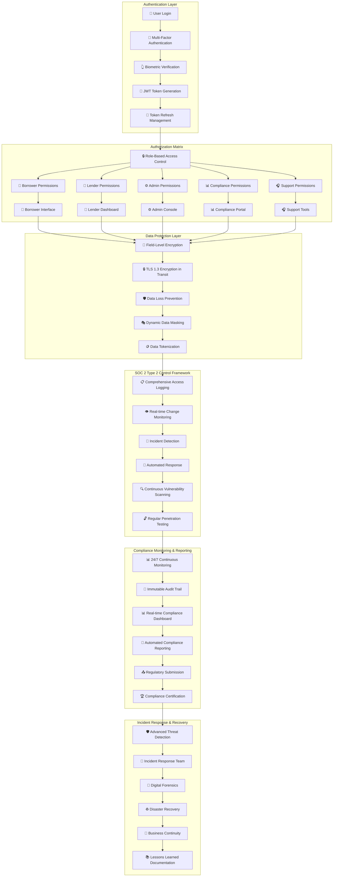

---

## 📱 **Customer Retention Platform & CRM Flow**

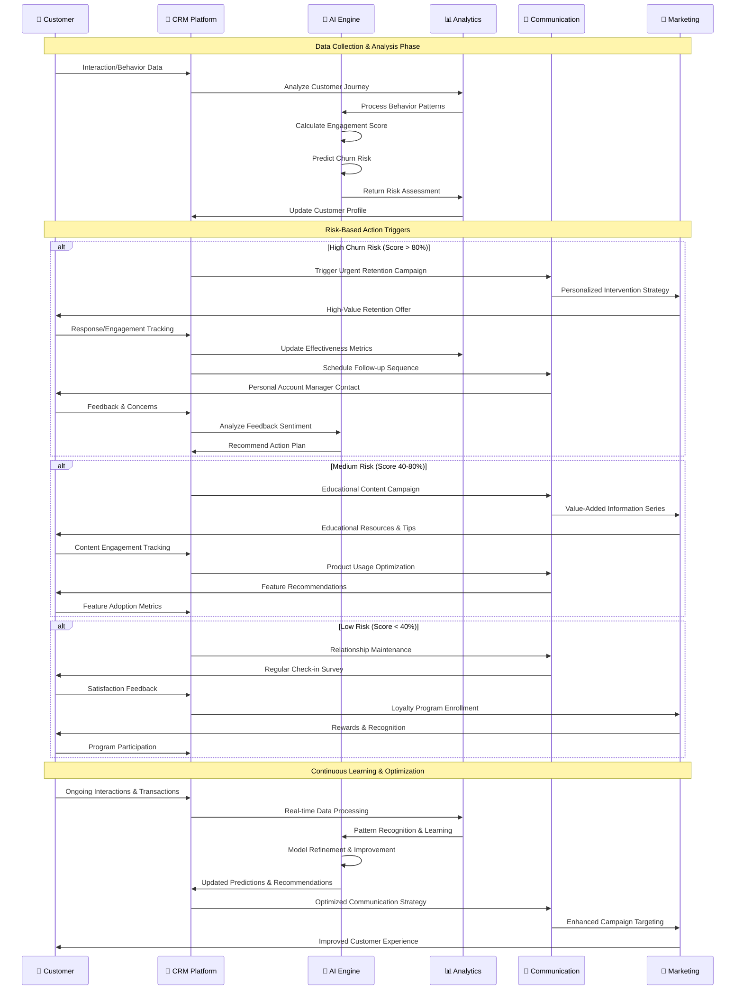

---

## 🌐 **API Integration & External Services Architecture**

```mermaid
graph TB
    subgraph "API Gateway & Management"
        GATEWAY[🌐 API Gateway] --> RATE_LIMIT[⏱️ Rate Limiting]
        RATE_LIMIT --> AUTH_CHECK[🔐 API Authentication]
        AUTH_CHECK --> LOAD_BALANCER[⚖️ Load Balancer]
        LOAD_BALANCER --> CACHE_LAYER[📦 Cache Layer]
    end

    subgraph "Financial Data APIs"
        CACHE_LAYER --> CREDIT_BUREAUS[📊 Credit Bureau APIs]
        CREDIT_BUREAUS --> EXPERIAN[Experian API]
        CREDIT_BUREAUS --> EQUIFAX[Equifax API]
        CREDIT_BUREAUS --> TRANSUNION[TransUnion API]

        CACHE_LAYER --> BANKING_APIS[🏦 Banking APIs]
        BANKING_APIS --> PLAID[Plaid API]
        BANKING_APIS --> YODLEE[Yodlee API]
        BANKING_APIS --> FINICITY[Finicity API]
    end

    subgraph "Business Data Integration"
        CACHE_LAYER --> BUSINESS_APIS[🏢 Business Data APIs]
        BUSINESS_APIS --> SOS_DATA[Secretary of State APIs]
        BUSINESS_APIS --> DUNS[D&B D-U-N-S API]
        BUSINESS_APIS --> COMMERCIAL_DATA[Commercial Data Providers]

        CACHE_LAYER --> REGULATORY_APIS[⚖️ Regulatory APIs]
        REGULATORY_APIS --> OFAC[OFAC Sanctions List]
        REGULATORY_APIS --> FATF[FATF Watchlists]
        REGULATORY_APIS --> COMPLIANCE_DB[Compliance Databases]
    end

    subgraph "Cloud Storage Integration"
        CACHE_LAYER --> STORAGE_APIS[☁️ Cloud Storage APIs]
        STORAGE_APIS --> GOOGLE_DRIVE[Google Drive API]
        STORAGE_APIS --> MICROSOFT_GRAPH[Microsoft Graph API]
        STORAGE_APIS --> DROPBOX_API[Dropbox API]
        STORAGE_APIS --> AWS_S3[AWS S3 API]
    end

    subgraph "AI & Machine Learning"
        CACHE_LAYER --> AI_SERVICES[🤖 AI Services]
        AI_SERVICES --> OPENAI[OpenAI GPT API]
        AI_SERVICES --> ANTHROPIC[Anthropic Claude API]
        AI_SERVICES --> AZURE_AI[Azure Cognitive Services]
        AI_SERVICES --> AWS_ML[AWS Machine Learning]
    end

    subgraph "Communication & Notifications"
        CACHE_LAYER --> COMM_APIS[📧 Communication APIs]
        COMM_APIS --> SENDGRID[SendGrid Email API]
        COMM_APIS --> TWILIO[Twilio SMS/Voice API]
        COMM_APIS --> SLACK[Slack Notifications API]
        COMM_APIS --> WEBHOOK[Webhook Integrations]
    end

    subgraph "Error Handling & Monitoring"
        WEBHOOK --> ERROR_HANDLER[❌ Error Handler]
        ERROR_HANDLER --> RETRY_LOGIC[🔄 Retry Logic]
        RETRY_LOGIC --> CIRCUIT_BREAKER[⚡ Circuit Breaker]
        CIRCUIT_BREAKER --> FALLBACK[🔙 Fallback Mechanisms]
        FALLBACK --> MONITORING[📊 API Monitoring]
        MONITORING --> ALERTS[🚨 Alert System]
    end
```

---

## 📊 **Data Flow & State Management Architecture**

```mermaid
graph LR
    subgraph "User Interface Layer"
        UI_COMPONENTS[🖥️ UI Components] --> USER_ACTIONS[👆 User Actions]
        USER_ACTIONS --> EVENT_HANDLERS[⚡ Event Handlers]
    end

    subgraph "State Management Layer"
        EVENT_HANDLERS --> LOCAL_STATE[📱 Local Component State]
        EVENT_HANDLERS --> ZUSTAND_STORE[🗃️ Zustand Global Store]
        EVENT_HANDLERS --> REACT_QUERY[📦 React Query Cache]

        LOCAL_STATE --> STATE_SYNC[🔄 State Synchronization]
        ZUSTAND_STORE --> STATE_SYNC
        REACT_QUERY --> STATE_SYNC
    end

    subgraph "Data Processing Layer"
        STATE_SYNC --> VALIDATION[✅ Data Validation]
        VALIDATION --> TRANSFORMATION[🔄 Data Transformation]
        TRANSFORMATION --> BUSINESS_LOGIC[🧠 Business Logic]
        BUSINESS_LOGIC --> API_REQUESTS[🌐 API Requests]
    end

    subgraph "External Data Sources"
        API_REQUESTS --> BACKEND_APIS[🖥️ Backend APIs]
        API_REQUESTS --> THIRD_PARTY[🔗 Third-party APIs]
        API_REQUESTS --> CLOUD_SERVICES[☁️ Cloud Services]

        BACKEND_APIS --> DATABASE[💾 Database]
        THIRD_PARTY --> EXTERNAL_DATA[📊 External Data]
        CLOUD_SERVICES --> FILE_STORAGE[📁 File Storage]
    end

    subgraph "Response Processing"
        DATABASE --> DATA_NORMALIZATION[📏 Data Normalization]
        EXTERNAL_DATA --> DATA_NORMALIZATION
        FILE_STORAGE --> DATA_NORMALIZATION

        DATA_NORMALIZATION --> CACHE_UPDATE[📦 Cache Update]
        CACHE_UPDATE --> STORE_UPDATE[🗃️ Store Update]
        STORE_UPDATE --> UI_REFRESH[🔄 UI Refresh]
    end

    subgraph "Persistence Layer"
        STORE_UPDATE --> LOCAL_STORAGE[💾 Local Storage]
        STORE_UPDATE --> SESSION_STORAGE[⏱️ Session Storage]
        STORE_UPDATE --> INDEXED_DB[🗂️ IndexedDB]

        LOCAL_STORAGE --> OFFLINE_SUPPORT[📴 Offline Support]
        SESSION_STORAGE --> OFFLINE_SUPPORT
        INDEXED_DB --> OFFLINE_SUPPORT
    end
```

---

## 🔄 **Continuous Integration & Deployment Pipeline**

```mermaid
graph TB
    subgraph "Development Workflow"
        DEV_COMMIT[👨‍💻 Developer Commit] --> FEATURE_BRANCH[🌿 Feature Branch]
        FEATURE_BRANCH --> PULL_REQUEST[📥 Pull Request]
        PULL_REQUEST --> CODE_REVIEW[👥 Code Review]
    end

    subgraph "Automated Quality Gates"
        CODE_REVIEW --> LINT_CHECK[✨ Linting]
        LINT_CHECK --> TYPE_CHECK[📝 TypeScript Check]
        TYPE_CHECK --> UNIT_TESTS[🧪 Unit Tests]
        UNIT_TESTS --> INTEGRATION_TESTS[🔗 Integration Tests]
        INTEGRATION_TESTS --> SECURITY_SCAN[🔒 Security Scan]
        SECURITY_SCAN --> COMPLIANCE_CHECK[📊 SOC 2 Compliance]
    end

    subgraph "Build & Package"
        COMPLIANCE_CHECK --> BUILD_STAGING[🏗️ Build Staging]
        BUILD_STAGING --> BUNDLE_ANALYSIS[📦 Bundle Analysis]
        BUNDLE_ANALYSIS --> PERFORMANCE_TEST[⚡ Performance Test]
        PERFORMANCE_TEST --> E2E_TESTS[🖱️ E2E Tests]
    end

    subgraph "Staging Deployment"
        E2E_TESTS --> STAGING_DEPLOY[🚀 Deploy to Staging]
        STAGING_DEPLOY --> SMOKE_TESTS[💨 Smoke Tests]
        SMOKE_TESTS --> UAT[👥 User Acceptance Testing]
        UAT --> ACCESSIBILITY_TEST[♿ Accessibility Testing]
    end

    subgraph "Production Deployment"
        ACCESSIBILITY_TEST --> PROD_APPROVAL[✅ Production Approval]
        PROD_APPROVAL --> PROD_BUILD[🏗️ Production Build]
        PROD_BUILD --> CDN_DEPLOY[🌍 CDN Deployment]
        CDN_DEPLOY --> HEALTH_CHECK[❤️ Health Check]
        HEALTH_CHECK --> MONITORING[📊 Monitoring Setup]
    end

    subgraph "Post-Deployment"
        MONITORING --> PERFORMANCE_MONITOR[📈 Performance Monitoring]
        PERFORMANCE_MONITOR --> ERROR_TRACKING[❌ Error Tracking]
        ERROR_TRACKING --> USER_FEEDBACK[💬 User Feedback]
        USER_FEEDBACK --> ANALYTICS[📊 Usage Analytics]
        ANALYTICS --> OPTIMIZATION[⚡ Optimization Planning]
    end
```

---

## 📱 **Mobile-First Responsive Design Flow**

```mermaid
graph LR
    subgraph "Device Detection"
        USER_ACCESS[📱 User Access] --> DEVICE_DETECT[📟 Device Detection]
        DEVICE_DETECT --> MOBILE[📱 Mobile (< 768px)]
        DEVICE_DETECT --> TABLET[📱 Tablet (768px - 1024px)]
        DEVICE_DETECT --> DESKTOP[🖥️ Desktop (> 1024px)]
    end

    subgraph "Layout Adaptation"
        MOBILE --> MOBILE_LAYOUT[📱 Mobile Layout]
        TABLET --> TABLET_LAYOUT[📱 Tablet Layout]
        DESKTOP --> DESKTOP_LAYOUT[🖥️ Desktop Layout]

        MOBILE_LAYOUT --> TOUCH_OPTIMIZE[👆 Touch Optimization]
        TABLET_LAYOUT --> HYBRID_INTERFACE[🔄 Hybrid Interface]
        DESKTOP_LAYOUT --> FULL_INTERFACE[🖥️ Full Interface]
    end

    subgraph "Component Adaptation"
        TOUCH_OPTIMIZE --> MOBILE_NAV[📱 Mobile Navigation]
        HYBRID_INTERFACE --> ADAPTIVE_NAV[🔄 Adaptive Navigation]
        FULL_INTERFACE --> FULL_NAV[🖥️ Full Navigation]

        MOBILE_NAV --> COMPONENT_STACK[📚 Component Stack]
        ADAPTIVE_NAV --> COMPONENT_STACK
        FULL_NAV --> COMPONENT_STACK
    end

    subgraph "Performance Optimization"
        COMPONENT_STACK --> LAZY_LOADING[⏳ Lazy Loading]
        LAZY_LOADING --> IMAGE_OPTIMIZATION[🖼️ Image Optimization]
        IMAGE_OPTIMIZATION --> CODE_SPLITTING[✂️ Code Splitting]
        CODE_SPLITTING --> CACHING[📦 Intelligent Caching]
    end

    subgraph "User Experience"
        CACHING --> OFFLINE_MODE[📴 Offline Mode]
        OFFLINE_MODE --> PWA_FEATURES[📱 PWA Features]
        PWA_FEATURES --> PUSH_NOTIFICATIONS[🔔 Push Notifications]
        PUSH_NOTIFICATIONS --> GESTURE_SUPPORT[👆 Gesture Support]
    end
```

---

This comprehensive system architecture demonstrates the complete integration of all EVA AI Frontend components, showing how users interact with the system, how data flows between services, and how all features work together to provide a secure, compliant, and intelligent financial services platform.
