# 🏗️ Individual Feature Architectures

## EVA AI Platform - Detailed Component Analysis - June 6, 2025

---

## 🔐 **AUTHENTICATION & AUTHORIZATION ARCHITECTURE**

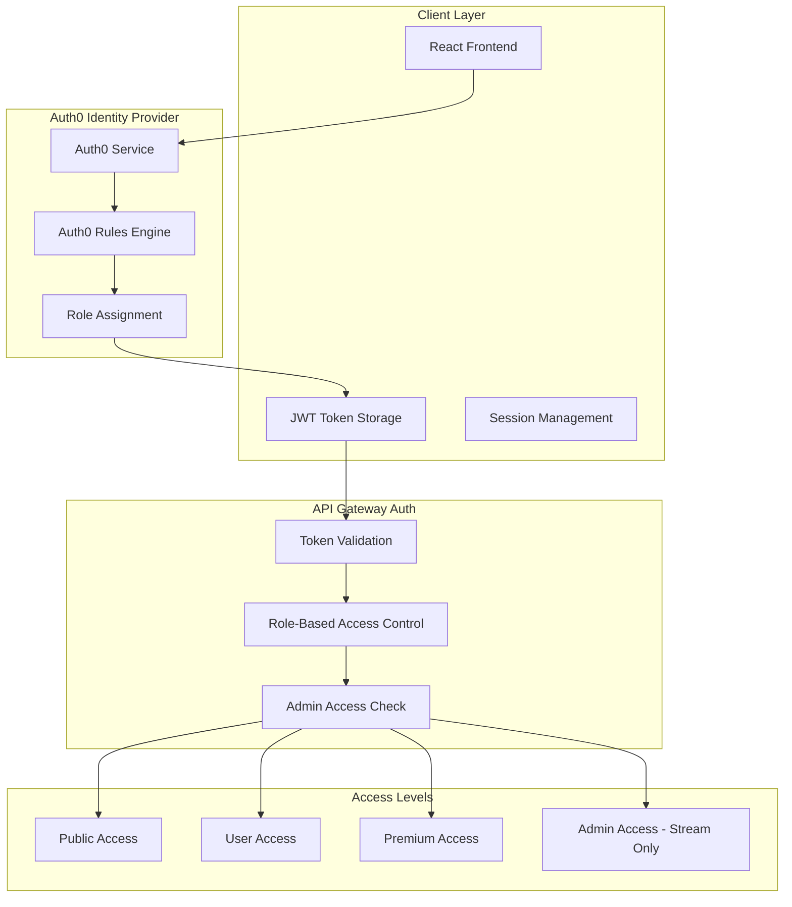

### **Authentication Flow Details**

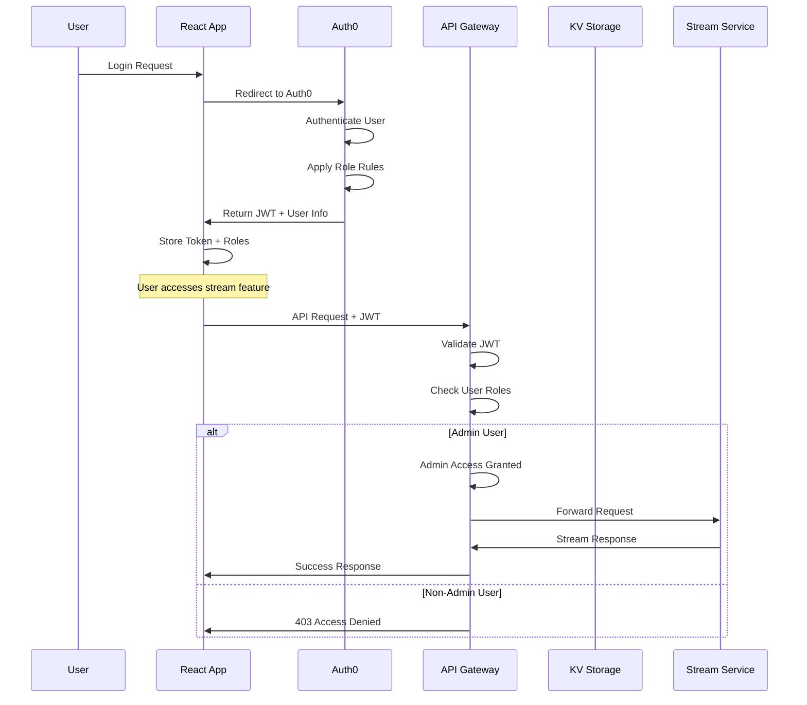

### **Role-Based Access Matrix**

| Feature              | Public | User | Premium | Admin |
| -------------------- | ------ | ---- | ------- | ----- |
| Health Check         | ✅     | ✅   | ✅      | ✅    |
| Financial Data       | ❌     | ✅   | ✅      | ✅    |
| Credit Applications  | ❌     | ❌   | ✅      | ✅    |
| Analytics            | ❌     | ❌   | ✅      | ✅    |
| **Stream Upload**    | ❌     | ❌   | ❌      | ✅    |
| **Stream Library**   | ❌     | ❌   | ❌      | ✅    |
| **Stream Analytics** | ❌     | ❌   | ❌      | ✅    |

---

## 💳 **FINANCIAL DATA PROCESSING ARCHITECTURE**

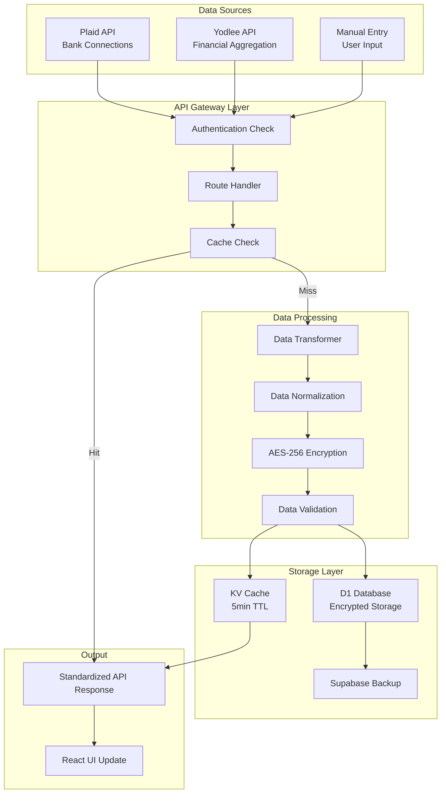

### **Data Flow Sequence**

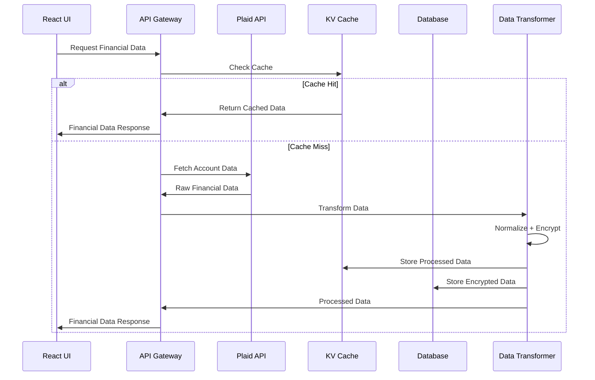

---

## 📊 **ANALYTICS PIPELINE ARCHITECTURE**

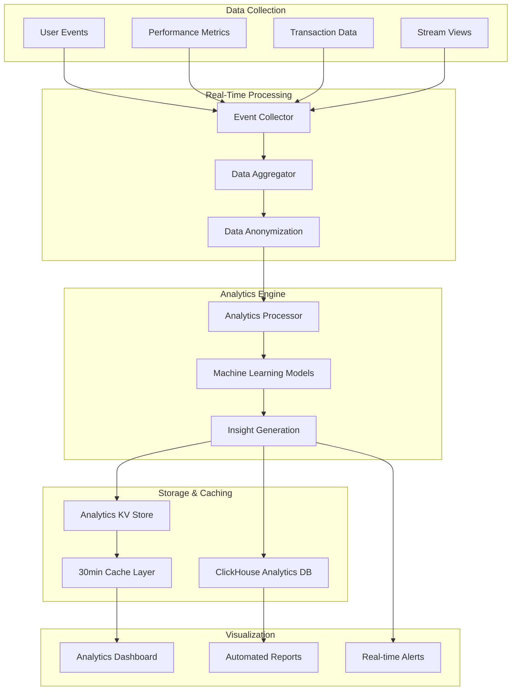

---

## 🎥 **STREAM PROCESSING ARCHITECTURE (ADMIN ONLY)**

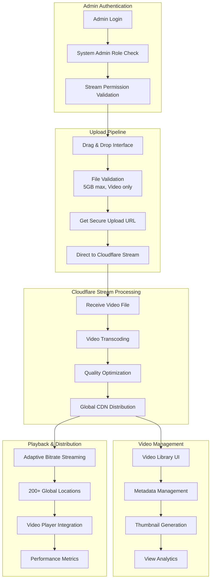

### **Stream Upload Sequence (Admin Only)**

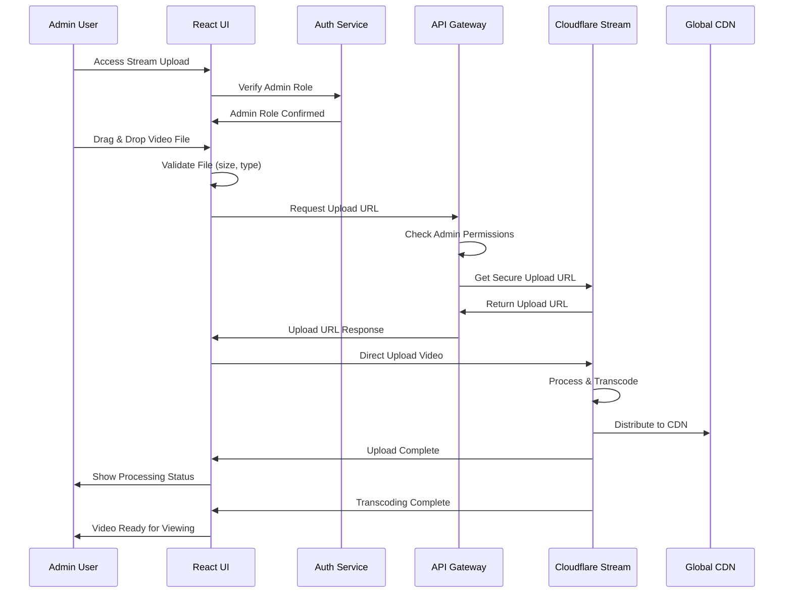

---

## ⚖️ **LOAD BALANCING & TRAFFIC DISTRIBUTION**

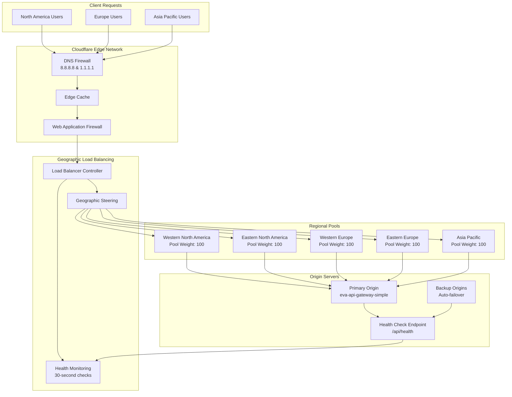

---

## 🛡️ **SECURITY LAYER ARCHITECTURE**

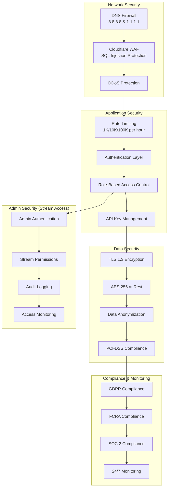

---

## 🔄 **DATA FLOW & CACHING ARCHITECTURE**

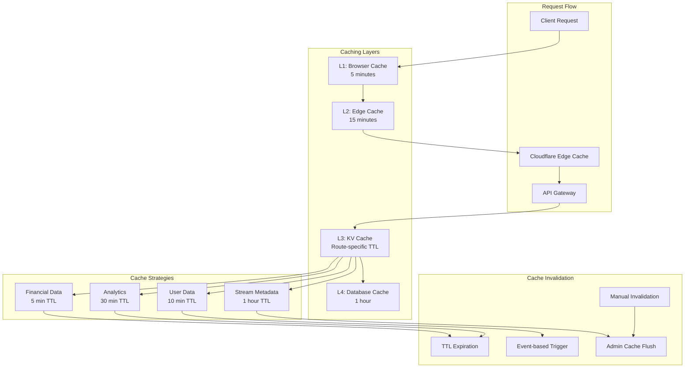

---

## 📈 **MONITORING & OBSERVABILITY ARCHITECTURE**

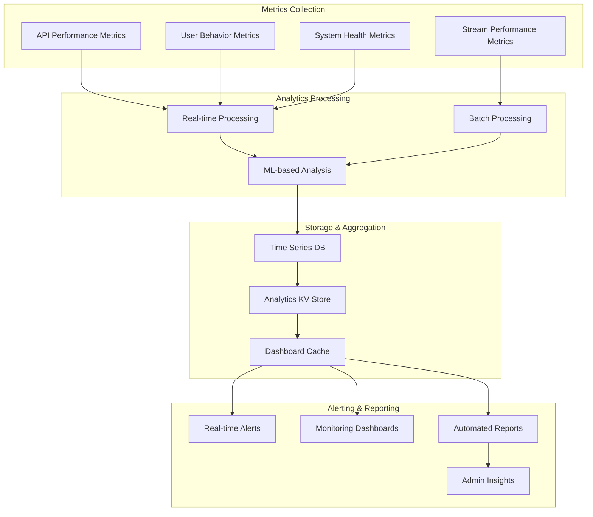

---

## 🎯 **PERFORMANCE OPTIMIZATION ARCHITECTURE**

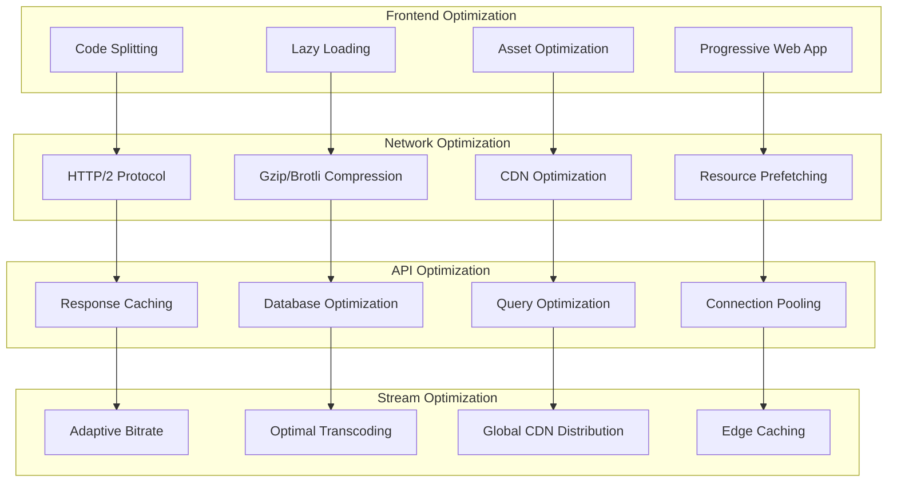

---

**📊 Performance Targets:**

- **Response Time P50**: <50ms
- **Response Time P95**: <100ms
- **Response Time P99**: <200ms
- **Availability**: 99.99% SLA
- **Error Rate**: <0.01%
- **Stream Load Time**: <2 seconds
- **Admin Access Control**: 100% enforcement

**🔒 Security Compliance:**

- **PCI-DSS**: Level 1 compliance for financial data
- **GDPR**: Full compliance for EU users
- **FCRA**: Compliance for credit reporting
- **SOC 2**: Type II compliance
- **Admin Stream Access**: Role-based with audit logging

---

_Deployed: June 6, 2025_  
_Version: 2.5.0_  
_Architecture: Enterprise-Scale with Admin-Only Stream Management_
