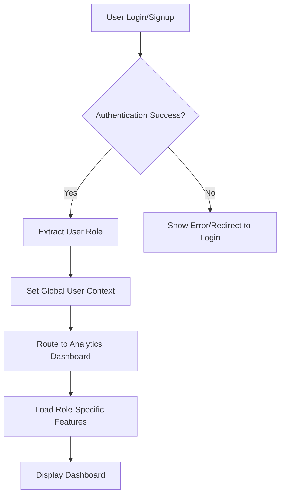
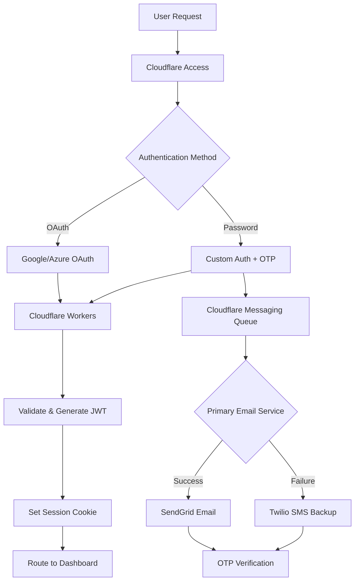

# EVA AI Platform - Authentication Integration Guide

## Overview

This document provides comprehensive guidance for integrating authentication systems with the EVA AI Platform's role-based dashboard system. It covers current implementations, migration paths, and future scaling strategies.

## Table of Contents

1. [Current Architecture](#current-architecture)
2. [Auth0 Integration (Current)](#auth0-integration-current)
3. [Supabase Migration Path](#supabase-migration-path)
4. [Future Cloudflare Scaling Strategy](#future-cloudflare-scaling-strategy)
5. [Role-Based Dashboard Integration](#role-based-dashboard-integration)
6. [Implementation Examples](#implementation-examples)
7. [Testing Procedures](#testing-procedures)
8. [Security Considerations](#security-considerations)

## Current Architecture

### Dashboard Landing Flow



### User Role Hierarchy

The platform supports 5 primary user roles:

- **Borrower**: Business owners applying for loans
- **Lender**: Financial institutions providing loans
- **Broker**: Intermediaries facilitating transactions
- **Vendor**: Service providers in the lending ecosystem
- **Admin**: System administrators with full access

## Auth0 Integration (Current)

### Environment Configuration

```bash
# .env.local
REACT_APP_AUTH0_DOMAIN=your-tenant.auth0.com
REACT_APP_AUTH0_CLIENT_ID=your-client-id
REACT_APP_AUTH0_AUDIENCE=https://your-api-audience
REACT_APP_AUTH0_REDIRECT_URI=http://localhost:3000/callback
REACT_APP_AUTH0_POST_LOGOUT_REDIRECT_URI=http://localhost:3000
```

### Auth0 Provider Setup

```typescript
// src/providers/Auth0Provider.tsx
import { Auth0Provider } from '@auth0/auth0-react';
import { ReactNode } from 'react';

interface Auth0WrapperProps {
  children: ReactNode;
}

export const Auth0Wrapper: React.FC<Auth0WrapperProps> = ({ children }) => {
  return (
    <Auth0Provider
      domain={process.env.REACT_APP_AUTH0_DOMAIN!}
      clientId={process.env.REACT_APP_AUTH0_CLIENT_ID!}
      audience={process.env.REACT_APP_AUTH0_AUDIENCE}
      redirectUri={window.location.origin}
      useRefreshTokens={true}
      cacheLocation="localstorage"
      onRedirectCallback={(appState) => {
        // Handle post-login redirect to dashboard
        window.location.replace(appState?.returnTo || '/dashboard');
      }}
    >
      {children}
    </Auth0Provider>
  );
};
```

### Authentication Hook Integration

```typescript
// src/hooks/useAuth.ts
import { useAuth0 } from '@auth0/auth0-react';
import { useContext, useEffect } from 'react';
import { UserContext } from '../contexts/UserContext';

export const useAuth = () => {
  const { user, isAuthenticated, isLoading, loginWithRedirect, logout, getAccessTokenSilently } =
    useAuth0();

  const { setUserRole, setUser } = useContext(UserContext);

  useEffect(() => {
    if (isAuthenticated && user) {
      // Extract role from Auth0 user metadata
      const userRole = user['https://eva-platform.com/roles']?.[0] || 'borrower';
      const userType = user['https://eva-platform.com/user_type'] || 'individual';

      // Set global user context
      setUserRole(userRole);
      setUser({
        id: user.sub,
        name: user.name,
        email: user.email,
        role: userRole,
        userType: userType,
        permissions: user['https://eva-platform.com/permissions'] || [],
      });
    }
  }, [isAuthenticated, user, setUserRole, setUser]);

  const login = () => {
    loginWithRedirect({
      appState: {
        returnTo: '/dashboard',
      },
    });
  };

  const logoutUser = () => {
    logout({
      returnTo: window.location.origin,
    });
  };

  return {
    user,
    isAuthenticated,
    isLoading,
    login,
    logout: logoutUser,
    getAccessTokenSilently,
  };
};
```

### Role Assignment in Auth0

#### Auth0 Rules Configuration

```javascript
// Auth0 Rule: Assign User Roles
function assignUserRoles(user, context, callback) {
  const namespace = 'https://eva-platform.com/';

  // Default role assignment logic
  let userRole = 'borrower'; // Default
  let userType = 'individual';
  let permissions = [];

  // Role assignment based on email domain or signup metadata
  if (user.email && user.email.includes('@bank.')) {
    userRole = 'lender';
    userType = 'corporation';
    permissions = ['review_applications', 'risk_assessment', 'approve_loans'];
  } else if (user.email && user.email.includes('@broker.')) {
    userRole = 'broker';
    userType = 'business';
    permissions = ['facilitate_transactions', 'manage_clients'];
  } else if (user.email && user.email.includes('@vendor.')) {
    userRole = 'vendor';
    userType = 'business';
    permissions = ['provide_services', 'manage_contracts'];
  } else if (user.email && user.email.includes('@admin.')) {
    userRole = 'admin';
    userType = 'corporation';
    permissions = ['full_system_access', 'user_management'];
  } else {
    // Check signup metadata
    const signupData = user.user_metadata || {};
    userRole = signupData.role || 'borrower';
    userType = signupData.business_type || 'individual';
    permissions = signupData.permissions || ['apply_credit', 'upload_documents'];
  }

  // Add claims to token
  context.idToken[namespace + 'roles'] = [userRole];
  context.idToken[namespace + 'user_type'] = userType;
  context.idToken[namespace + 'permissions'] = permissions;

  // Add to access token as well
  context.accessToken[namespace + 'roles'] = [userRole];
  context.accessToken[namespace + 'user_type'] = userType;
  context.accessToken[namespace + 'permissions'] = permissions;

  callback(null, user, context);
}
```

## Supabase Migration Path

### Environment Configuration

```bash
# .env.local - Supabase Configuration
REACT_APP_SUPABASE_URL=https://your-project.supabase.co
REACT_APP_SUPABASE_ANON_KEY=your-anon-key
REACT_APP_SUPABASE_JWT_SECRET=your-jwt-secret
```

### Supabase Client Setup

```typescript
// src/lib/supabase.ts
import { createClient } from '@supabase/supabase-js';

const supabaseUrl = process.env.REACT_APP_SUPABASE_URL!;
const supabaseAnonKey = process.env.REACT_APP_SUPABASE_ANON_KEY!;

export const supabase = createClient(supabaseUrl, supabaseAnonKey, {
  auth: {
    autoRefreshToken: true,
    persistSession: true,
    detectSessionInUrl: true,
  },
});

// Database types
export interface UserProfile {
  id: string;
  email: string;
  full_name: string;
  role: 'borrower' | 'lender' | 'broker' | 'vendor' | 'admin';
  user_type: 'individual' | 'business' | 'corporation' | 'llc' | 'partnership';
  permissions: string[];
  created_at: string;
  updated_at: string;
}

export interface UserSession {
  user: UserProfile;
  session: any;
}
```

### Database Schema

```sql
-- Create user profiles table
CREATE TABLE user_profiles (
  id UUID REFERENCES auth.users(id) PRIMARY KEY,
  email TEXT UNIQUE NOT NULL,
  full_name TEXT,
  role TEXT CHECK (role IN ('borrower', 'lender', 'broker', 'vendor', 'admin')) DEFAULT 'borrower',
  user_type TEXT CHECK (user_type IN ('individual', 'business', 'corporation', 'llc', 'partnership')) DEFAULT 'individual',
  permissions TEXT[] DEFAULT ARRAY['apply_credit', 'upload_documents'],
  created_at TIMESTAMP WITH TIME ZONE DEFAULT NOW(),
  updated_at TIMESTAMP WITH TIME ZONE DEFAULT NOW()
);

-- Create RLS policies
ALTER TABLE user_profiles ENABLE ROW LEVEL SECURITY;

-- Users can only view and update their own profile
CREATE POLICY "Users can view own profile" ON user_profiles
  FOR SELECT USING (auth.uid() = id);

CREATE POLICY "Users can update own profile" ON user_profiles
  FOR UPDATE USING (auth.uid() = id);

-- Function to handle new user creation
CREATE OR REPLACE FUNCTION handle_new_user()
RETURNS TRIGGER AS $$
BEGIN
  INSERT INTO user_profiles (id, email, full_name)
  VALUES (NEW.id, NEW.email, COALESCE(NEW.raw_user_meta_data->>'full_name', ''));
  RETURN NEW;
END;
$$ LANGUAGE plpgsql SECURITY DEFINER;

-- Trigger for new user creation
CREATE TRIGGER on_auth_user_created
  AFTER INSERT ON auth.users
  FOR EACH ROW EXECUTE FUNCTION handle_new_user();
```

### Supabase Authentication Hook

```typescript
// src/hooks/useSupabaseAuth.ts
import { useEffect, useState } from 'react';
import { supabase, UserProfile } from '../lib/supabase';
import { useContext } from 'react';
import { UserContext } from '../contexts/UserContext';

export const useSupabaseAuth = () => {
  const [isLoading, setIsLoading] = useState(true);
  const [user, setUser] = useState<UserProfile | null>(null);
  const { setUserRole, setUser: setGlobalUser } = useContext(UserContext);

  useEffect(() => {
    // Get initial session
    const getInitialSession = async () => {
      const {
        data: { session },
        error,
      } = await supabase.auth.getSession();

      if (session?.user && !error) {
        await loadUserProfile(session.user.id);
      }
      setIsLoading(false);
    };

    getInitialSession();

    // Listen for auth changes
    const {
      data: { subscription },
    } = supabase.auth.onAuthStateChange(async (event, session) => {
      if (event === 'SIGNED_IN' && session?.user) {
        await loadUserProfile(session.user.id);
      } else if (event === 'SIGNED_OUT') {
        setUser(null);
        setUserRole('borrower');
        setGlobalUser(null);
      }
      setIsLoading(false);
    });

    return () => subscription.unsubscribe();
  }, [setUserRole, setGlobalUser]);

  const loadUserProfile = async (userId: string) => {
    const { data: profile, error } = await supabase
      .from('user_profiles')
      .select('*')
      .eq('id', userId)
      .single();

    if (profile && !error) {
      setUser(profile);
      setUserRole(profile.role);
      setGlobalUser({
        id: profile.id,
        name: profile.full_name,
        email: profile.email,
        role: profile.role,
        userType: profile.user_type,
        permissions: profile.permissions,
      });
    }
  };

  const signIn = async (email: string, password: string) => {
    const { data, error } = await supabase.auth.signInWithPassword({
      email,
      password,
    });

    if (!error && data.session) {
      // Redirect to dashboard after successful login
      window.location.href = '/dashboard';
    }

    return { data, error };
  };

  const signUp = async (email: string, password: string, metadata: any) => {
    const { data, error } = await supabase.auth.signUp({
      email,
      password,
      options: {
        data: metadata, // Include role and user type in signup
      },
    });

    return { data, error };
  };

  const signOut = async () => {
    const { error } = await supabase.auth.signOut();
    if (!error) {
      window.location.href = '/';
    }
    return { error };
  };

  return {
    user,
    isLoading,
    isAuthenticated: !!user,
    signIn,
    signUp,
    signOut,
  };
};
```

## Future Cloudflare Scaling Strategy

### Architecture Overview



### Cloudflare Workers Authentication

```typescript
// workers/auth.ts
import { Hono } from 'hono';
import { jwt } from 'hono/jwt';
import { cors } from 'hono/cors';

const app = new Hono();

app.use('/*', cors());

// OAuth login endpoint
app.post('/auth/oauth', async c => {
  const { provider, code, state } = await c.req.json();

  try {
    // Exchange code for tokens with OAuth provider
    const tokens = await exchangeOAuthCode(provider, code);

    // Get user info from provider
    const userInfo = await getUserInfo(provider, tokens.access_token);

    // Create or update user in D1 database
    const user = await createOrUpdateUser(userInfo, provider);

    // Generate EVA platform JWT
    const jwt_token = await generateJWT(user);

    // Set secure cookie
    c.header(
      'Set-Cookie',
      `eva_session=${jwt_token}; HttpOnly; Secure; SameSite=Strict; Max-Age=86400`
    );

    return c.json({
      success: true,
      user: {
        id: user.id,
        name: user.name,
        email: user.email,
        role: user.role,
      },
      redirect: '/dashboard',
    });
  } catch (error) {
    return c.json({ success: false, error: error.message }, 400);
  }
});

// Password + OTP login
app.post('/auth/login', async c => {
  const { email, password } = await c.req.json();

  try {
    // Verify password
    const user = await verifyPassword(email, password);
    if (!user) {
      return c.json({ success: false, error: 'Invalid credentials' }, 401);
    }

    // Generate OTP
    const otp = generateOTP();
    await storeOTP(user.id, otp);

    // Send OTP via email/SMS
    await sendOTP(user, otp);

    return c.json({
      success: true,
      message: 'OTP sent to your email/phone',
      temp_token: await generateTempToken(user.id),
    });
  } catch (error) {
    return c.json({ success: false, error: error.message }, 400);
  }
});

// OTP verification
app.post('/auth/verify-otp', async c => {
  const { temp_token, otp } = await c.req.json();

  try {
    // Verify temp token and OTP
    const userId = await verifyTempToken(temp_token);
    const isValidOTP = await verifyOTP(userId, otp);

    if (!isValidOTP) {
      return c.json({ success: false, error: 'Invalid OTP' }, 401);
    }

    // Get user and generate session
    const user = await getUser(userId);
    const jwt_token = await generateJWT(user);

    c.header(
      'Set-Cookie',
      `eva_session=${jwt_token}; HttpOnly; Secure; SameSite=Strict; Max-Age=86400`
    );

    return c.json({
      success: true,
      user: {
        id: user.id,
        name: user.name,
        email: user.email,
        role: user.role,
      },
      redirect: '/dashboard',
    });
  } catch (error) {
    return c.json({ success: false, error: error.message }, 400);
  }
});

// Helper functions
async function sendOTP(user: any, otp: string) {
  // Try Cloudflare Email first
  try {
    await sendCloudflareEmail(user.email, otp);
    return;
  } catch (cloudflareError) {
    console.log('Cloudflare email failed, trying SendGrid');
  }

  // Fallback to SendGrid
  try {
    await sendSendGridEmail(user.email, otp);
    return;
  } catch (sendGridError) {
    console.log('SendGrid failed, trying Twilio SMS');
  }

  // Final fallback to Twilio SMS
  if (user.phone) {
    await sendTwilioSMS(user.phone, otp);
  } else {
    throw new Error('Unable to send OTP - no communication method available');
  }
}

export default app;
```

### Cloudflare D1 Database Schema

```sql
-- Users table
CREATE TABLE users (
  id TEXT PRIMARY KEY,
  email TEXT UNIQUE NOT NULL,
  name TEXT,
  phone TEXT,
  password_hash TEXT,
  role TEXT CHECK (role IN ('borrower', 'lender', 'broker', 'vendor', 'admin')) DEFAULT 'borrower',
  user_type TEXT CHECK (user_type IN ('individual', 'business', 'corporation', 'llc', 'partnership')) DEFAULT 'individual',
  permissions TEXT, -- JSON string
  oauth_providers TEXT, -- JSON string
  email_verified BOOLEAN DEFAULT FALSE,
  phone_verified BOOLEAN DEFAULT FALSE,
  created_at TEXT DEFAULT (datetime('now')),
  updated_at TEXT DEFAULT (datetime('now'))
);

-- OTP table
CREATE TABLE otps (
  id TEXT PRIMARY KEY,
  user_id TEXT REFERENCES users(id),
  otp_code TEXT NOT NULL,
  expires_at TEXT NOT NULL,
  used BOOLEAN DEFAULT FALSE,
  created_at TEXT DEFAULT (datetime('now'))
);

-- Sessions table
CREATE TABLE sessions (
  id TEXT PRIMARY KEY,
  user_id TEXT REFERENCES users(id),
  jwt_token TEXT NOT NULL,
  expires_at TEXT NOT NULL,
  created_at TEXT DEFAULT (datetime('now'))
);
```

## Role-Based Dashboard Integration

### Dashboard Router Integration

```typescript
// src/components/routing/ProtectedRoute.tsx
import React from 'react';
import { useAuth } from '../hooks/useAuth'; // or useSupabaseAuth
import { Navigate } from 'react-router-dom';
import { LoadingSpinner } from '../components/LoadingSpinner';

interface ProtectedRouteProps {
  children: React.ReactNode;
  requiredRole?: string[];
  requiredPermission?: string[];
}

export const ProtectedRoute: React.FC<ProtectedRouteProps> = ({
  children,
  requiredRole = [],
  requiredPermission = [],
}) => {
  const { isAuthenticated, isLoading, user } = useAuth();

  if (isLoading) {
    return <LoadingSpinner />;
  }

  if (!isAuthenticated) {
    return <Navigate to="/login" replace />;
  }

  // Check role requirements
  if (requiredRole.length > 0 && !requiredRole.includes(user?.role)) {
    return <Navigate to="/unauthorized" replace />;
  }

  // Check permission requirements
  if (requiredPermission.length > 0) {
    const hasPermission = requiredPermission.some(permission =>
      user?.permissions?.includes(permission)
    );
    if (!hasPermission) {
      return <Navigate to="/unauthorized" replace />;
    }
  }

  return <>{children}</>;
};
```

### App Router Configuration

```typescript
// src/App.tsx
import React from 'react';
import { BrowserRouter as Router, Routes, Route, Navigate } from 'react-router-dom';
import { Auth0Wrapper } from './providers/Auth0Provider'; // or SupabaseProvider
import { UserContextProvider } from './contexts/UserContext';
import { ProtectedRoute } from './components/routing/ProtectedRoute';
import { RoleBasedDashboard } from './components/dashboards/RoleBasedDashboard';
import { LoginPage } from './pages/LoginPage';
import { LoadingSpinner } from './components/LoadingSpinner';
import { useAuth } from './hooks/useAuth';

const AppRoutes: React.FC = () => {
  const { isAuthenticated, isLoading } = useAuth();

  if (isLoading) {
    return <LoadingSpinner />;
  }

  return (
    <Routes>
      {/* Public routes */}
      <Route path="/login" element={<LoginPage />} />
      <Route path="/signup" element={<SignUpPage />} />

      {/* Protected routes */}
      <Route path="/dashboard" element={
        <ProtectedRoute>
          <RoleBasedDashboard />
        </ProtectedRoute>
      } />

      {/* Analytics Dashboard (same as main dashboard) */}
      <Route path="/analytics" element={
        <ProtectedRoute>
          <RoleBasedDashboard />
        </ProtectedRoute>
      } />

      {/* Role-specific routes */}
      <Route path="/risk-assessment" element={
        <ProtectedRoute requiredRole={['lender', 'admin']}>
          <RiskAssessmentPage />
        </ProtectedRoute>
      } />

      <Route path="/risk-map" element={
        <ProtectedRoute requiredRole={['lender', 'broker', 'admin']}>
          <RiskMapNavigator />
        </ProtectedRoute>
      } />

      <Route path="/auto-originations" element={
        <ProtectedRoute requiredRole={['lender', 'broker', 'admin']}>
          <AutoOriginationsPage />
        </ProtectedRoute>
      } />

      {/* Default redirect */}
      <Route path="/" element={
        isAuthenticated ?
          <Navigate to="/dashboard" replace /> :
          <Navigate to="/login" replace />
      } />
    </Routes>
  );
};

const App: React.FC = () => {
  return (
    <Auth0Wrapper>
      <UserContextProvider>
        <Router>
          <AppRoutes />
        </Router>
      </UserContextProvider>
    </Auth0Wrapper>
  );
};

export default App;
```

## Implementation Examples

### Signup Flow with Role Selection

```typescript
// src/components/auth/SignUpForm.tsx
import React, { useState } from 'react';
import { useAuth } from '../../hooks/useAuth';

export const SignUpForm: React.FC = () => {
  const [formData, setFormData] = useState({
    email: '',
    password: '',
    name: '',
    role: 'borrower',
    userType: 'individual',
    businessName: '',
  });

  const { signUp } = useAuth();

  const handleSignUp = async (e: React.FormEvent) => {
    e.preventDefault();

    try {
      await signUp(formData.email, formData.password, {
        full_name: formData.name,
        role: formData.role,
        user_type: formData.userType,
        business_name: formData.businessName,
      });

      // User will be redirected to dashboard after email verification
    } catch (error) {
      console.error('Signup failed:', error);
    }
  };

  return (
    <form onSubmit={handleSignUp} className="space-y-6">
      <div>
        <label className="block text-sm font-medium text-gray-700">
          Full Name
        </label>
        <input
          type="text"
          value={formData.name}
          onChange={(e) => setFormData({ ...formData, name: e.target.value })}
          className="mt-1 block w-full border border-gray-300 rounded-md px-3 py-2"
          required
        />
      </div>

      <div>
        <label className="block text-sm font-medium text-gray-700">
          Email
        </label>
        <input
          type="email"
          value={formData.email}
          onChange={(e) => setFormData({ ...formData, email: e.target.value })}
          className="mt-1 block w-full border border-gray-300 rounded-md px-3 py-2"
          required
        />
      </div>

      <div>
        <label className="block text-sm font-medium text-gray-700">
          Password
        </label>
        <input
          type="password"
          value={formData.password}
          onChange={(e) => setFormData({ ...formData, password: e.target.value })}
          className="mt-1 block w-full border border-gray-300 rounded-md px-3 py-2"
          required
        />
      </div>

      <div>
        <label className="block text-sm font-medium text-gray-700">
          I am a...
        </label>
        <select
          value={formData.role}
          onChange={(e) => setFormData({ ...formData, role: e.target.value })}
          className="mt-1 block w-full border border-gray-300 rounded-md px-3 py-2"
        >
          <option value="borrower">Borrower (Seeking Funding)</option>
          <option value="lender">Lender (Providing Funding)</option>
          <option value="broker">Broker (Facilitating Deals)</option>
          <option value="vendor">Vendor (Service Provider)</option>
        </select>
      </div>

      <div>
        <label className="block text-sm font-medium text-gray-700">
          Entity Type
        </label>
        <select
          value={formData.userType}
          onChange={(e) => setFormData({ ...formData, userType: e.target.value })}
          className="mt-1 block w-full border border-gray-300 rounded-md px-3 py-2"
        >
          <option value="individual">Individual</option>
          <option value="business">Business</option>
          <option value="corporation">Corporation</option>
          <option value="llc">LLC</option>
          <option value="partnership">Partnership</option>
        </select>
      </div>

      {formData.userType !== 'individual' && (
        <div>
          <label className="block text-sm font-medium text-gray-700">
            Business Name
          </label>
          <input
            type="text"
            value={formData.businessName}
            onChange={(e) => setFormData({ ...formData, businessName: e.target.value })}
            className="mt-1 block w-full border border-gray-300 rounded-md px-3 py-2"
          />
        </div>
      )}

      <button
        type="submit"
        className="w-full bg-blue-600 text-white py-2 px-4 rounded-md hover:bg-blue-700"
      >
        Create Account
      </button>
    </form>
  );
};
```

## Testing Procedures

### Role Dashboard Testing

```typescript
// src/tests/auth-integration.test.ts
import { render, screen, waitFor } from '@testing-library/react';
import { userEvent } from '@testing-library/user-event';
import { MemoryRouter } from 'react-router-dom';
import { RoleBasedDashboard } from '../components/dashboards/RoleBasedDashboard';
import { UserContextProvider } from '../contexts/UserContext';

describe('Role-Based Dashboard Integration', () => {
  const renderDashboard = (userRole: string) => {
    return render(
      <MemoryRouter>
        <UserContextProvider initialRole={userRole}>
          <RoleBasedDashboard />
        </UserContextProvider>
      </MemoryRouter>
    );
  };

  test('borrower sees borrower-specific features', async () => {
    renderDashboard('borrower');

    await waitFor(() => {
      expect(screen.getByText('Credit Application')).toBeInTheDocument();
      expect(screen.getByText('Document Center')).toBeInTheDocument();
      expect(screen.getByText('Application Status')).toBeInTheDocument();

      // Should not see lender-specific features
      expect(screen.queryByText('Risk Map Navigator')).not.toBeInTheDocument();
      expect(screen.queryByText('Auto Originations')).not.toBeInTheDocument();
    });
  });

  test('lender sees lender-specific features', async () => {
    renderDashboard('lender');

    await waitFor(() => {
      expect(screen.getByText('Loan Portfolio')).toBeInTheDocument();
      expect(screen.getByText('Risk Assessment')).toBeInTheDocument();
      expect(screen.getByText('Risk Map Navigator')).toBeInTheDocument();
      expect(screen.getByText('Auto Originations')).toBeInTheDocument();

      // Should not see borrower-specific features
      expect(screen.queryByText('Credit Application')).not.toBeInTheDocument();
    });
  });

  test('broker sees broker-specific features', async () => {
    renderDashboard('broker');

    await waitFor(() => {
      expect(screen.getByText('Client Management')).toBeInTheDocument();
      expect(screen.getByText('Transaction Hub')).toBeInTheDocument();
      expect(screen.getByText('Commission Tracker')).toBeInTheDocument();
      expect(screen.getByText('Risk Map Navigator')).toBeInTheDocument(); // Shared with lenders
      expect(screen.getByText('Auto Originations')).toBeInTheDocument(); // Shared with lenders
    });
  });

  test('vendor sees only vendor and shared features', async () => {
    renderDashboard('vendor');

    await waitFor(() => {
      expect(screen.getByText('Service Management')).toBeInTheDocument();
      expect(screen.getByText('Billing & Invoicing')).toBeInTheDocument();
      expect(screen.getByText('Service Analytics')).toBeInTheDocument();

      // Should not see risk map or auto originations
      expect(screen.queryByText('Risk Map Navigator')).not.toBeInTheDocument();
      expect(screen.queryByText('Auto Originations')).not.toBeInTheDocument();
    });
  });

  test('admin sees all features', async () => {
    renderDashboard('admin');

    await waitFor(() => {
      expect(screen.getByText('System Analytics')).toBeInTheDocument();
      expect(screen.getByText('User Management')).toBeInTheDocument();
      expect(screen.getByText('Risk Map Navigator')).toBeInTheDocument();
      expect(screen.getByText('Auto Originations')).toBeInTheDocument();
    });
  });
});
```

### Authentication Flow Testing

```bash
# Manual testing procedure

# 1. Test Auth0 Integration
npm run start
# - Navigate to /login
# - Click "Log in with Auth0"
# - Complete Auth0 flow
# - Verify redirect to /dashboard
# - Verify correct role-based features displayed

# 2. Test Role Switching (Dev/Staging Only)
# - Use top-left role selector
# - Switch between different roles
# - Verify dashboard content updates
# - Verify analytics and charts change

# 3. Test Protected Routes
# - Try accessing /risk-assessment as borrower (should redirect)
# - Try accessing /auto-originations as vendor (should redirect)
# - Verify admin can access all routes

# 4. Test Logout Flow
# - Click logout
# - Verify redirect to home/login
# - Verify protected routes redirect to login
```

## Security Considerations

### Token Security

```typescript
// src/utils/tokenSecurity.ts
export const securityConfig = {
  // JWT Configuration
  jwt: {
    algorithm: 'RS256',
    expiresIn: '24h',
    issuer: 'https://eva-platform.com',
    audience: 'eva-platform-api',
  },

  // Cookie Security
  cookies: {
    httpOnly: true,
    secure: process.env.NODE_ENV === 'production',
    sameSite: 'strict' as const,
    maxAge: 24 * 60 * 60 * 1000, // 24 hours
  },

  // Rate Limiting
  rateLimit: {
    login: { windowMs: 15 * 60 * 1000, max: 5 }, // 5 attempts per 15 minutes
    otp: { windowMs: 5 * 60 * 1000, max: 3 }, // 3 attempts per 5 minutes
    general: { windowMs: 15 * 60 * 1000, max: 100 }, // 100 requests per 15 minutes
  },

  // Password Requirements
  password: {
    minLength: 12,
    requireUppercase: true,
    requireLowercase: true,
    requireNumbers: true,
    requireSymbols: true,
  },
};
```

### Role-Based Access Control

```typescript
// src/utils/rbac.ts
export interface Permission {
  resource: string;
  action: string;
  condition?: (user: any, resource: any) => boolean;
}

export const rolePermissions: Record<string, Permission[]> = {
  borrower: [
    { resource: 'application', action: 'create' },
    { resource: 'application', action: 'read', condition: (user, app) => app.userId === user.id },
    { resource: 'document', action: 'upload' },
    { resource: 'document', action: 'read', condition: (user, doc) => doc.userId === user.id },
  ],

  lender: [
    { resource: 'application', action: 'read' },
    { resource: 'application', action: 'approve' },
    { resource: 'risk-assessment', action: 'create' },
    { resource: 'risk-assessment', action: 'read' },
    { resource: 'portfolio', action: 'manage' },
  ],

  broker: [
    { resource: 'application', action: 'read' },
    { resource: 'client', action: 'manage' },
    { resource: 'transaction', action: 'facilitate' },
    { resource: 'commission', action: 'track' },
  ],

  vendor: [
    { resource: 'service', action: 'provide' },
    { resource: 'contract', action: 'manage' },
    { resource: 'billing', action: 'manage' },
  ],

  admin: [
    { resource: '*', action: '*' }, // Full access
  ],
};

export const checkPermission = (
  userRole: string,
  resource: string,
  action: string,
  user?: any,
  resourceData?: any
): boolean => {
  const permissions = rolePermissions[userRole] || [];

  for (const permission of permissions) {
    if (
      (permission.resource === '*' || permission.resource === resource) &&
      (permission.action === '*' || permission.action === action)
    ) {
      if (permission.condition) {
        return permission.condition(user, resourceData);
      }
      return true;
    }
  }

  return false;
};
```

## Migration Timeline

### Phase 1: Auth0 Enhancement (Current - 2 weeks)

- ✅ Enhanced role assignment rules
- ✅ Improved user metadata handling
- ✅ Dashboard integration
- 🔄 Additional role-based features

### Phase 2: Supabase Migration (Weeks 3-6)

- 📋 Database schema setup
- 📋 User migration scripts
- 📋 Authentication flow testing
- 📋 Production deployment

### Phase 3: Cloudflare Scaling (Weeks 7-12)

- 📋 Cloudflare Workers setup
- 📋 D1 database configuration
- 📋 OAuth provider integration
- 📋 OTP system implementation
- 📋 Failover mechanisms

### Phase 4: Production Optimization (Weeks 13-16)

- 📋 Performance optimization
- 📋 Security auditing
- 📋 Load testing
- 📋 Documentation finalization

## Support and Troubleshooting

### Common Issues

1. **Role not updating after login**

   - Check Auth0 rules configuration
   - Verify custom claims namespace
   - Clear browser localStorage

2. **Dashboard not showing correct features**

   - Verify UserContext is receiving role updates
   - Check role mapping in dashboard component
   - Ensure feature arrays include correct roles

3. **Protected routes not working**
   - Verify ProtectedRoute component integration
   - Check role and permission requirements
   - Ensure user object contains required fields

### Debug Tools

```typescript
// Debug helper for development
if (process.env.NODE_ENV === 'development') {
  window.debugAuth = {
    user: currentUser,
    role: userRole,
    permissions: userPermissions,
    features: availableFeatures,
  };
}
```

## Conclusion

This authentication integration guide provides a comprehensive roadmap for connecting authentication systems to the EVA AI Platform's role-based dashboard. The phased approach ensures smooth migration from Auth0 to Supabase and eventual scaling with Cloudflare infrastructure.

For questions or issues, refer to the troubleshooting section or contact the development team.
