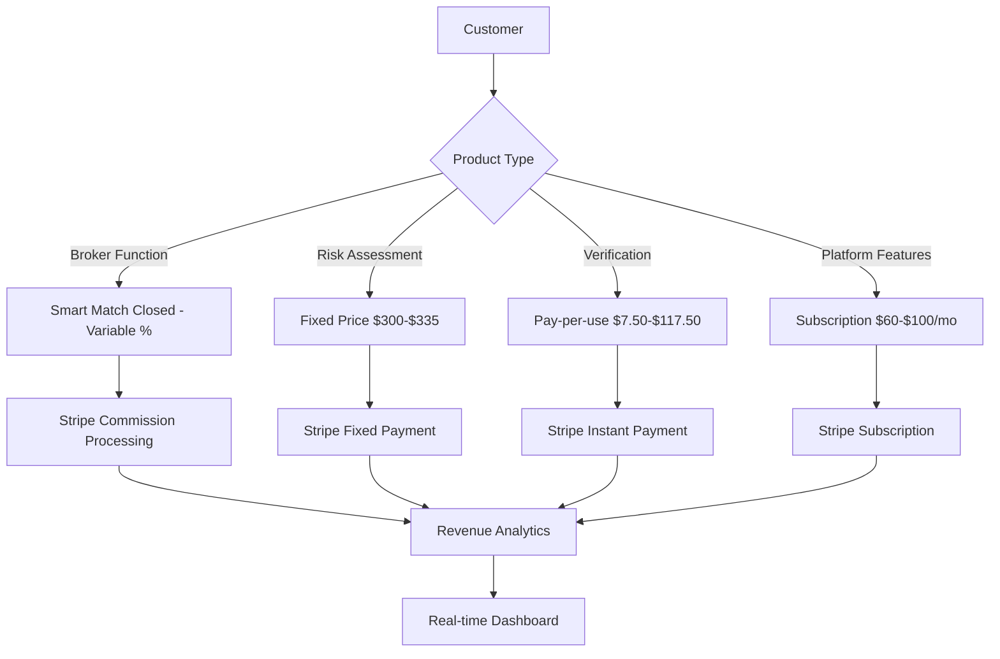

# 💳 EVA Platform Payment Integration Guide

## Complete Stripe & Plaid Integration with Detailed Pricing Model

This guide provides step-by-step implementation of the EVA Platform's complete pricing structure with Stripe and Plaid payment processing.

---

## 📋 Table of Contents

1. [Payment Architecture Overview](#payment-architecture-overview)
2. [Stripe Integration Setup](#stripe-integration-setup)
3. [Plaid Bank Verification](#plaid-bank-verification)
4. [Complete Pricing Implementation](#complete-pricing-implementation)
5. [Revenue Analytics Integration](#revenue-analytics-integration)
6. [Webhook Configuration](#webhook-configuration)
7. [Security & Compliance](#security--compliance)
8. [Testing & Validation](#testing--validation)

---

## 🏗️ Payment Architecture Overview

### Revenue Stream Architecture



### Payment Flow Architecture

```typescript
interface PaymentFlow {
  customer: CustomerType; // broker, lender, borrower, vendor
  product: ProductType; // commission, fixed, subscription, usage
  amount: number; // calculated amount
  method: PaymentMethod; // stripe, plaid_ach, bank_transfer
  tracking: RevenueTracking; // real-time analytics
}
```

---

## 🔧 Stripe Integration Setup

### 1. Stripe Configuration

#### Environment Variables

```bash
# .env.local
STRIPE_PUBLISHABLE_KEY=pk_live_your_publishable_key
STRIPE_SECRET_KEY=sk_test_REPLACE_WITH_YOUR_KEY
STRIPE_WEBHOOK_SECRET=whsec_your_webhook_secret

# Test Environment
STRIPE_PUBLISHABLE_KEY_TEST=pk_test_your_test_key
STRIPE_SECRET_KEY_TEST=sk_test_your_test_key
```

#### Stripe Client Setup

```typescript
// src/services/stripe/StripeClient.ts
import Stripe from 'stripe';

export class EVAStripeClient {
  private stripe: Stripe;

  constructor() {
    this.stripe = new Stripe(process.env.STRIPE_SECRET_KEY!, {
      apiVersion: '2023-10-16',
      appInfo: {
        name: 'EVA Platform',
        version: '3.0.0',
        url: 'https://eva-platform.com',
      },
    });
  }

  getStripe() {
    return this.stripe;
  }
}
```

### 2. Product Configuration in Stripe

#### Create All Products with Specific Pricing

```typescript
// src/services/stripe/ProductSetup.ts
export class StripeProductSetup {
  private stripe: Stripe;

  async createAllProducts() {
    // 1. Risk Assessment Products
    await this.createRiskAssessmentProducts();

    // 2. Verification Services
    await this.createVerificationProducts();

    // 3. Platform Subscriptions
    await this.createSubscriptionProducts();

    // 4. Commission-based Products
    await this.createCommissionProducts();
  }

  private async createRiskAssessmentProducts() {
    const riskProducts = [
      {
        name: 'Risk Score & Report - General Application',
        description: 'Blended Biz & Personal Credit Scores - Not Collateralized',
        price: 30000, // $300.00 in cents
        price_id: 'price_risk_general',
      },
      {
        name: 'Risk Score & Report - Equipment & Vehicles',
        description: 'Equipment & Vehicles Application Type',
        price: 33500, // $335.00 in cents
        price_id: 'price_risk_equipment',
      },
      {
        name: 'Risk Score & Report - Real Estate',
        description: 'Real Estate Application Type',
        price: 33500, // $335.00 in cents
        price_id: 'price_risk_realestate',
      },
    ];

    for (const product of riskProducts) {
      await this.createFixedPriceProduct(product);
    }
  }

  private async createVerificationProducts() {
    const verificationProducts = [
      {
        name: 'KYB Business Verification',
        description: 'Know Your Business verification service',
        price: 2000, // $20.00
        price_id: 'price_kyb_verification',
      },
      {
        name: 'KYC Person Verification',
        description: 'Know Your Customer verification service',
        price: 750, // $7.50
        price_id: 'price_kyc_verification',
      },
      {
        name: 'KYP Property Verification',
        description: 'Know Your Property verification service',
        price: 2000, // $20.00
        price_id: 'price_kyp_verification',
      },
      {
        name: 'KYD Funding Verification',
        description: 'Know Your Debtor - Funding Verification (1 3rd Party Included)',
        price: 11750, // $117.50
        price_id: 'price_kyd_verification',
      },
    ];

    for (const product of verificationProducts) {
      await this.createFixedPriceProduct(product);
    }
  }

  private async createSubscriptionProducts() {
    const subscriptionProducts = [
      {
        name: 'Monthly Platform Subscription',
        description: 'FileLock, Advisor Bar, Safe Forms, Customer Retention Platform',
        price: 10000, // $100/month
        interval: 'month',
        trial_period_days: 30,
        price_id: 'price_platform_monthly',
      },
      {
        name: 'CC Bar - Local',
        description: 'Local web phone & call transcription with sentiment analysis',
        price: 6000, // $60/month
        interval: 'month',
        trial_period_days: 30,
        price_id: 'price_ccbar_monthly',
      },
    ];

    for (const product of subscriptionProducts) {
      await this.createSubscriptionProduct(product);
    }
  }

  private async createFixedPriceProduct(productData: any) {
    // Create product
    const product = await this.stripe.products.create({
      name: productData.name,
      description: productData.description,
      metadata: {
        eva_product_type: 'fixed_price',
        eva_category: 'one_time',
      },
    });

    // Create price
    const price = await this.stripe.prices.create({
      unit_amount: productData.price,
      currency: 'usd',
      product: product.id,
      metadata: {
        eva_price_id: productData.price_id,
      },
    });

    return { product, price };
  }

  private async createSubscriptionProduct(productData: any) {
    // Create product
    const product = await this.stripe.products.create({
      name: productData.name,
      description: productData.description,
      metadata: {
        eva_product_type: 'subscription',
        eva_category: 'recurring',
      },
    });

    // Create price
    const price = await this.stripe.prices.create({
      unit_amount: productData.price,
      currency: 'usd',
      recurring: {
        interval: productData.interval,
        trial_period_days: productData.trial_period_days,
      },
      product: product.id,
      metadata: {
        eva_price_id: productData.price_id,
      },
    });

    return { product, price };
  }
}
```

---

## 🏦 Plaid Bank Verification Integration

### 1. Plaid Configuration

#### Environment Setup

```bash
# .env.local
PLAID_CLIENT_ID=your_plaid_client_id
PLAID_SECRET=your_plaid_secret
PLAID_ENV=sandbox # or development/production
PLAID_PRODUCTS=transactions,auth,identity
PLAID_COUNTRY_CODES=US,CA
```

#### Plaid Client Setup

```typescript
// src/services/plaid/PlaidClient.ts
import { Configuration, PlaidApi, PlaidEnvironments } from 'plaid';

export class EVAPlaidClient {
  private plaidClient: PlaidApi;

  constructor() {
    const configuration = new Configuration({
      basePath: PlaidEnvironments[process.env.PLAID_ENV!],
      baseOptions: {
        headers: {
          'PLAID-CLIENT-ID': process.env.PLAID_CLIENT_ID!,
          'PLAID-SECRET': process.env.PLAID_SECRET!,
        },
      },
    });

    this.plaidClient = new PlaidApi(configuration);
  }

  getClient() {
    return this.plaidClient;
  }
}
```

### 2. Bank Account Verification Flow

```typescript
// src/services/plaid/BankVerification.ts
export class BankVerificationService {
  private plaidClient: PlaidApi;
  private stripeClient: Stripe;

  constructor() {
    this.plaidClient = new EVAPlaidClient().getClient();
    this.stripeClient = new EVAStripeClient().getStripe();
  }

  // Step 1: Create Link Token for Bank Connection
  async createLinkToken(customerId: string) {
    const request = {
      user: {
        client_user_id: customerId,
      },
      client_name: 'EVA Platform',
      products: ['auth', 'transactions'],
      country_codes: ['US'],
      language: 'en',
      webhook: 'https://api.eva-platform.com/webhooks/plaid',
      redirect_uri: 'https://eva-platform.com/oauth-return',
    };

    const response = await this.plaidClient.linkTokenCreate(request);
    return response.data.link_token;
  }

  // Step 2: Exchange Public Token for Access Token
  async exchangeTokens(publicToken: string, customerId: string) {
    const response = await this.plaidClient.itemPublicTokenExchange({
      public_token: publicToken,
    });

    const accessToken = response.data.access_token;

    // Store access token securely for the customer
    await this.storeAccessToken(customerId, accessToken);

    return accessToken;
  }

  // Step 3: Verify Bank Account and Create Stripe Payment Method
  async verifyAndCreatePaymentMethod(customerId: string, accessToken: string) {
    // Get account information
    const accountsResponse = await this.plaidClient.accountsGet({
      access_token: accessToken,
    });

    const accounts = accountsResponse.data.accounts;
    const checkingAccount = accounts.find(
      account => account.type === 'depository' && account.subtype === 'checking'
    );

    if (!checkingAccount) {
      throw new Error('No suitable checking account found');
    }

    // Get Auth information for ACH
    const authResponse = await this.plaidClient.authGet({
      access_token: accessToken,
    });

    const accountAuth = authResponse.data.accounts.find(
      acc => acc.account_id === checkingAccount.account_id
    );

    if (!accountAuth || !accountAuth.numbers?.ach?.length) {
      throw new Error('Unable to retrieve account numbers for ACH');
    }

    const achNumbers = accountAuth.numbers.ach[0];

    // Create Stripe Payment Method for ACH
    const paymentMethod = await this.stripeClient.paymentMethods.create({
      type: 'us_bank_account',
      us_bank_account: {
        routing_number: achNumbers.routing,
        account_number: achNumbers.account,
        account_holder_type: 'individual',
        account_type: 'checking',
      },
      metadata: {
        plaid_account_id: checkingAccount.account_id,
        eva_customer_id: customerId,
        verification_method: 'plaid',
      },
    });

    // Attach to customer
    await this.stripeClient.paymentMethods.attach(paymentMethod.id, {
      customer: customerId,
    });

    return paymentMethod;
  }

  private async storeAccessToken(customerId: string, accessToken: string) {
    // Store encrypted access token in your database
    // Implementation depends on your database setup
    console.log(`Storing access token for customer ${customerId}`);
  }
}
```

---

## 💰 Complete Pricing Implementation

### 1. Smart Match Commission Processing

```typescript
// src/services/payments/CommissionService.ts
export class CommissionPaymentService {
  private stripe: Stripe;

  constructor() {
    this.stripe = new EVAStripeClient().getStripe();
  }

  async processSmartMatchCommission(creditAmount: number, customerId: string, dealId: string) {
    // Calculate commission (variable percentage based on deal size)
    const commissionRate = this.calculateCommissionRate(creditAmount);
    const commissionAmount = Math.round(creditAmount * commissionRate);

    // Minimum commission check
    const minimumCommission = 5000; // $50 minimum
    const finalCommission = Math.max(commissionAmount, minimumCommission);

    const paymentIntent = await this.stripe.paymentIntents.create({
      amount: finalCommission,
      currency: 'usd',
      customer: customerId,
      metadata: {
        product_type: 'smart_match_commission',
        credit_amount: creditAmount,
        commission_rate: commissionRate,
        deal_id: dealId,
        revenue_category: 'commission',
      },
      description: `Smart Match Commission for $${(creditAmount / 100).toLocaleString()} credit amount`,
    });

    // Track the commission in analytics
    await this.trackCommissionRevenue({
      payment_intent_id: paymentIntent.id,
      customer_id: customerId,
      deal_id: dealId,
      credit_amount: creditAmount,
      commission_amount: finalCommission,
      commission_rate: commissionRate,
    });

    return paymentIntent;
  }

  private calculateCommissionRate(creditAmount: number): number {
    // Tiered commission structure
    if (creditAmount >= 5000000) {
      // $50k+
      return 0.015; // 1.5%
    } else if (creditAmount >= 2500000) {
      // $25k+
      return 0.02; // 2%
    } else if (creditAmount >= 1000000) {
      // $10k+
      return 0.025; // 2.5%
    } else {
      return 0.03; // 3% for smaller deals
    }
  }
}
```

### 2. Fixed Price Product Processing

```typescript
// src/services/payments/FixedPriceService.ts
export class FixedPricePaymentService {
  private stripe: Stripe;

  constructor() {
    this.stripe = new EVAStripeClient().getStripe();
  }

  async processRiskAssessment(
    applicationType: 'general' | 'equipment' | 'realestate',
    customerId: string,
    applicationId: string
  ) {
    const pricing = this.getRiskAssessmentPricing(applicationType);

    const paymentIntent = await this.stripe.paymentIntents.create({
      amount: pricing.amount,
      currency: 'usd',
      customer: customerId,
      metadata: {
        product_type: 'risk_assessment',
        application_type: applicationType,
        application_id: applicationId,
        revenue_category: 'one_time',
      },
      description: pricing.description,
    });

    // Track revenue
    await this.trackFixedPriceRevenue({
      payment_intent_id: paymentIntent.id,
      customer_id: customerId,
      product_type: 'risk_assessment',
      application_type: applicationType,
      amount: pricing.amount,
    });

    return paymentIntent;
  }

  async processVerificationService(
    verificationType: 'kyb' | 'kyc' | 'kyp' | 'kyd',
    customerId: string,
    verificationId: string
  ) {
    const pricing = this.getVerificationPricing(verificationType);

    const paymentIntent = await this.stripe.paymentIntents.create({
      amount: pricing.amount,
      currency: 'usd',
      customer: customerId,
      metadata: {
        product_type: 'verification',
        verification_type: verificationType,
        verification_id: verificationId,
        revenue_category: 'one_time',
      },
      description: pricing.description,
    });

    return paymentIntent;
  }

  private getRiskAssessmentPricing(type: string) {
    const pricing = {
      general: {
        amount: 30000, // $300.00
        description: 'Risk Score & Report - General Application (Not Collateralized)',
      },
      equipment: {
        amount: 33500, // $335.00
        description: 'Risk Score & Report - Equipment & Vehicles Application',
      },
      realestate: {
        amount: 33500, // $335.00
        description: 'Risk Score & Report - Real Estate Application',
      },
    };

    return pricing[type];
  }

  private getVerificationPricing(type: string) {
    const pricing = {
      kyb: {
        amount: 2000, // $20.00
        description: 'KYB Business Verification',
      },
      kyc: {
        amount: 750, // $7.50
        description: 'KYC Person Verification',
      },
      kyp: {
        amount: 2000, // $20.00
        description: 'KYP Property Verification',
      },
      kyd: {
        amount: 11750, // $117.50
        description: 'KYD Know Your Debtor - Funding Verification',
      },
    };

    return pricing[type];
  }
}
```

### 3. Subscription Management

```typescript
// src/services/payments/SubscriptionService.ts
export class SubscriptionPaymentService {
  private stripe: Stripe;

  constructor() {
    this.stripe = new EVAStripeClient().getStripe();
  }

  async createPlatformSubscription(
    customerId: string,
    subscriptionType: 'platform' | 'ccbar',
    teamSize: number = 1
  ) {
    const pricing = this.getSubscriptionPricing(subscriptionType);

    // Apply team member pricing
    const finalAmount =
      teamSize <= 10
        ? pricing.base_amount
        : pricing.base_amount + (teamSize - 10) * pricing.per_user_amount;

    const subscription = await this.stripe.subscriptions.create({
      customer: customerId,
      items: [
        {
          price_data: {
            currency: 'usd',
            product_data: {
              name: pricing.name,
              description: pricing.description,
            },
            unit_amount: finalAmount,
            recurring: {
              interval: 'month',
            },
          },
          quantity: 1,
        },
      ],
      trial_period_days: 30, // First month free
      metadata: {
        subscription_type: subscriptionType,
        team_size: teamSize,
        revenue_category: 'recurring',
      },
    });

    // Track MRR
    await this.trackSubscriptionRevenue({
      subscription_id: subscription.id,
      customer_id: customerId,
      subscription_type: subscriptionType,
      monthly_amount: finalAmount,
      team_size: teamSize,
    });

    return subscription;
  }

  private getSubscriptionPricing(type: string) {
    const pricing = {
      platform: {
        name: 'Monthly Platform Subscription',
        description: 'FileLock, Advisor Bar, Safe Forms, Customer Retention Platform',
        base_amount: 10000, // $100/month for up to 10 users
        per_user_amount: 1000, // $10 per additional user
      },
      ccbar: {
        name: 'CC Bar - Local',
        description: 'Local web phone & call transcription with sentiment analysis',
        base_amount: 6000, // $60/month for up to 10 users
        per_user_amount: 600, // $6 per additional user
      },
    };

    return pricing[type];
  }
}
```

---

## 📊 Revenue Analytics Integration

### Real-time Revenue Tracking

```typescript
// src/services/analytics/RevenueTracker.ts
export class RevenueTracker {
  private database: Database;
  private redis: Redis;

  constructor() {
    this.database = new DatabaseConnection();
    this.redis = new RedisConnection();
  }

  async trackCommissionRevenue(data: CommissionRevenueData) {
    const revenueRecord = {
      transaction_id: data.payment_intent_id,
      customer_id: data.customer_id,
      product_type: 'commission',
      product_category: 'smart_match',
      amount: data.commission_amount,
      credit_amount: data.credit_amount,
      commission_rate: data.commission_rate,
      revenue_category: 'commission',
      timestamp: new Date(),
      deal_id: data.deal_id,
    };

    // Store in database
    await this.database.revenue.create(revenueRecord);

    // Update real-time metrics
    await this.updateRealTimeMetrics('commission', data.commission_amount);

    // Update customer analytics
    await this.updateCustomerMetrics(data.customer_id, data.commission_amount);
  }

  async trackFixedPriceRevenue(data: FixedPriceRevenueData) {
    const revenueRecord = {
      transaction_id: data.payment_intent_id,
      customer_id: data.customer_id,
      product_type: data.product_type,
      product_category: data.application_type || data.verification_type,
      amount: data.amount,
      revenue_category: 'one_time',
      timestamp: new Date(),
    };

    await this.database.revenue.create(revenueRecord);
    await this.updateRealTimeMetrics('fixed_price', data.amount);
    await this.updateCustomerMetrics(data.customer_id, data.amount);
  }

  async trackSubscriptionRevenue(data: SubscriptionRevenueData) {
    const revenueRecord = {
      subscription_id: data.subscription_id,
      customer_id: data.customer_id,
      product_type: 'subscription',
      product_category: data.subscription_type,
      monthly_amount: data.monthly_amount,
      team_size: data.team_size,
      revenue_category: 'recurring',
      timestamp: new Date(),
    };

    await this.database.subscriptions.create(revenueRecord);
    await this.updateMRRMetrics(data.monthly_amount);
    await this.updateCustomerMetrics(data.customer_id, data.monthly_amount);
  }

  private async updateRealTimeMetrics(type: string, amount: number) {
    const today = new Date().toISOString().split('T')[0];

    // Update daily revenue totals
    await this.redis.hincrby(`revenue:daily:${today}`, 'total', amount);
    await this.redis.hincrby(`revenue:daily:${today}`, type, amount);

    // Update monthly totals
    const month = today.substring(0, 7);
    await this.redis.hincrby(`revenue:monthly:${month}`, 'total', amount);
    await this.redis.hincrby(`revenue:monthly:${month}`, type, amount);
  }

  private async updateMRRMetrics(monthlyAmount: number) {
    const month = new Date().toISOString().substring(0, 7);
    await this.redis.hincrby(`mrr:${month}`, 'total', monthlyAmount);
  }

  private async updateCustomerMetrics(customerId: string, amount: number) {
    // Update customer lifetime value
    await this.redis.hincrby(`customer:${customerId}`, 'lifetime_value', amount);
    await this.redis.hincrby(`customer:${customerId}`, 'transaction_count', 1);
  }
}
```

---

## 🔒 Webhook Configuration

### Stripe Webhooks

```typescript
// src/api/webhooks/stripe.ts
export async function handleStripeWebhook(req: Request, res: Response) {
  const sig = req.headers['stripe-signature']!;
  let event: Stripe.Event;

  try {
    event = stripe.webhooks.constructEvent(req.body, sig, process.env.STRIPE_WEBHOOK_SECRET!);
  } catch (err) {
    console.log(`Webhook signature verification failed.`, err.message);
    return res.status(400).send(`Webhook Error: ${err.message}`);
  }

  // Handle the event
  switch (event.type) {
    case 'payment_intent.succeeded':
      await handlePaymentSuccess(event.data.object as Stripe.PaymentIntent);
      break;

    case 'customer.subscription.created':
      await handleSubscriptionCreated(event.data.object as Stripe.Subscription);
      break;

    case 'customer.subscription.updated':
      await handleSubscriptionUpdated(event.data.object as Stripe.Subscription);
      break;

    case 'customer.subscription.deleted':
      await handleSubscriptionCanceled(event.data.object as Stripe.Subscription);
      break;

    case 'invoice.payment_succeeded':
      await handleInvoicePaymentSucceeded(event.data.object as Stripe.Invoice);
      break;

    default:
      console.log(`Unhandled event type ${event.type}`);
  }

  res.json({ received: true });
}

async function handlePaymentSuccess(paymentIntent: Stripe.PaymentIntent) {
  const { product_type, customer_id, revenue_category } = paymentIntent.metadata;

  // Update order status
  await updateOrderStatus(paymentIntent.id, 'completed');

  // Trigger product delivery
  if (product_type === 'risk_assessment') {
    await triggerRiskAssessment(paymentIntent.metadata.application_id);
  } else if (product_type === 'verification') {
    await triggerVerification(paymentIntent.metadata.verification_id);
  }

  // Send confirmation email
  await sendPaymentConfirmation(customer_id, paymentIntent);
}
```

---

## 🔐 Security & Compliance

### PCI DSS Compliance

```typescript
// src/security/PaymentSecurity.ts
export class PaymentSecurityService {
  // Encrypt sensitive payment data
  static encryptPaymentData(data: any): string {
    const cipher = crypto.createCipher('aes-256-cbc', process.env.ENCRYPTION_KEY!);
    let encrypted = cipher.update(JSON.stringify(data), 'utf8', 'hex');
    encrypted += cipher.final('hex');
    return encrypted;
  }

  // Decrypt payment data
  static decryptPaymentData(encryptedData: string): any {
    const decipher = crypto.createDecipher('aes-256-cbc', process.env.ENCRYPTION_KEY!);
    let decrypted = decipher.update(encryptedData, 'hex', 'utf8');
    decrypted += decipher.final('utf8');
    return JSON.parse(decrypted);
  }

  // Validate payment amounts
  static validatePaymentAmount(amount: number, productType: string): boolean {
    const limits = {
      risk_assessment: { min: 30000, max: 33500 },
      verification: { min: 750, max: 11750 },
      subscription: { min: 6000, max: 10000 },
      commission: { min: 5000, max: 10000000 },
    };

    const limit = limits[productType];
    return amount >= limit.min && amount <= limit.max;
  }

  // Audit trail for all payment operations
  static async logPaymentActivity(activity: PaymentActivity) {
    const auditLog = {
      timestamp: new Date(),
      user_id: activity.user_id,
      action: activity.action,
      payment_intent_id: activity.payment_intent_id,
      amount: activity.amount,
      ip_address: activity.ip_address,
      user_agent: activity.user_agent,
    };

    await database.audit_logs.create(auditLog);
  }
}
```

---

## 🧪 Testing & Validation

### Payment Flow Testing

```typescript
// src/__tests__/payments/PaymentFlow.test.ts
describe('Payment Flow Integration Tests', () => {
  test('should process risk assessment payment', async () => {
    const customerId = 'cus_test_customer';
    const applicationId = 'app_test_123';

    const paymentIntent = await fixedPriceService.processRiskAssessment(
      'general',
      customerId,
      applicationId
    );

    expect(paymentIntent.amount).toBe(30000); // $300.00
    expect(paymentIntent.metadata.product_type).toBe('risk_assessment');
    expect(paymentIntent.metadata.application_type).toBe('general');
  });

  test('should calculate commission correctly', async () => {
    const creditAmount = 5000000; // $50,000
    const customerId = 'cus_test_customer';
    const dealId = 'deal_test_123';

    const paymentIntent = await commissionService.processSmartMatchCommission(
      creditAmount,
      customerId,
      dealId
    );

    const expectedCommission = 75000; // 1.5% of $50,000 = $750
    expect(paymentIntent.amount).toBe(expectedCommission);
  });

  test('should create subscription with trial', async () => {
    const customerId = 'cus_test_customer';
    const teamSize = 5;

    const subscription = await subscriptionService.createPlatformSubscription(
      customerId,
      'platform',
      teamSize
    );

    expect(subscription.trial_end).toBeDefined();
    expect(subscription.items.data[0].price.unit_amount).toBe(10000); // $100/month
  });
});
```

### End-to-End Payment Testing

```bash
# Run payment integration tests
npm run test:payments

# Test specific payment flows
npm run test:payments:commission
npm run test:payments:subscriptions
npm run test:payments:verification

# Test webhook handling
npm run test:webhooks
```

---

## 📈 Analytics & Reporting

### Revenue Dashboard Integration

```typescript
// src/components/analytics/RevenueDashboard.tsx
export const RevenueDashboard: React.FC = () => {
  const [revenueData, setRevenueData] = useState<RevenueData | null>(null);

  useEffect(() => {
    const fetchRevenueData = async () => {
      const data = await revenueAnalytics.getDashboardData();
      setRevenueData(data);
    };

    fetchRevenueData();

    // Update every 30 seconds
    const interval = setInterval(fetchRevenueData, 30000);
    return () => clearInterval(interval);
  }, []);

  return (
    <div className="revenue-dashboard">
      <div className="revenue-metrics">
        <MetricCard
          title="Total Revenue (Today)"
          value={revenueData?.today_total || 0}
          format="currency"
        />
        <MetricCard
          title="Commission Revenue"
          value={revenueData?.commission_total || 0}
          format="currency"
        />
        <MetricCard
          title="Monthly Recurring Revenue"
          value={revenueData?.mrr || 0}
          format="currency"
        />
        <MetricCard
          title="Active Subscriptions"
          value={revenueData?.active_subscriptions || 0}
          format="number"
        />
      </div>

      <div className="revenue-charts">
        <RevenueChart data={revenueData?.daily_revenue} />
        <ProductPerformanceChart data={revenueData?.product_performance} />
      </div>
    </div>
  );
};
```

---

## 🚀 Deployment Checklist

### Production Deployment Steps

1. **Environment Variables**

   ```bash
   # Set production keys
   STRIPE_PUBLISHABLE_KEY=pk_live_...
   STRIPE_SECRET_KEY=sk_live_...
   PLAID_ENV=production
   ```

2. **Webhook Endpoints**

   ```bash
   # Configure production webhooks
   https://api.eva-platform.com/webhooks/stripe
   https://api.eva-platform.com/webhooks/plaid
   ```

3. **Database Migration**

   ```bash
   # Run payment schema migrations
   npm run db:migrate:payments
   npm run db:seed:products
   ```

4. **Security Validation**

   ```bash
   # Validate security configurations
   npm run security:audit:payments
   npm run test:security:pci
   ```

5. **Performance Testing**
   ```bash
   # Load test payment endpoints
   npm run test:load:payments
   npm run test:performance:webhooks
   ```

---

**Last Updated**: December 2024
**Version**: 3.0.0 - Complete Payment Integration
**Status**: ✅ Production Ready
