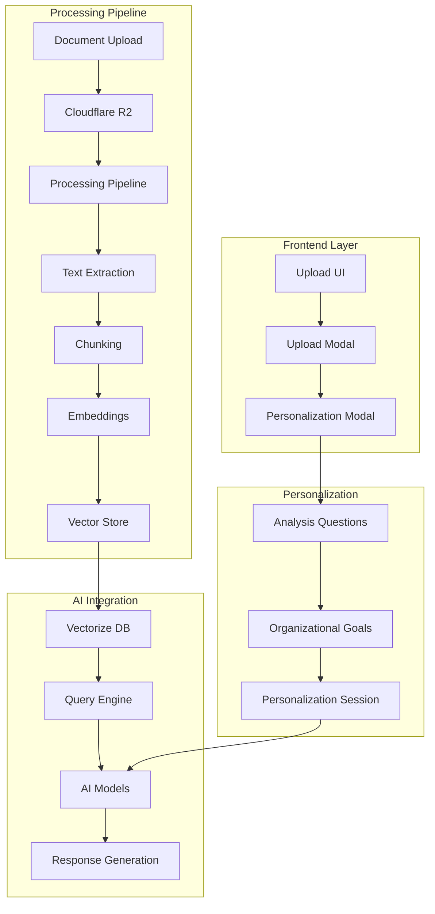

# 🧠 RAG Implementation Guide

## 📋 Overview

EVA Platform's RAG (Retrieval-Augmented Generation) system provides intelligent document processing and knowledge retrieval for custom AI agents. This guide covers the complete implementation from document upload to personalized AI responses.

## 🏗️ RAG Architecture

### System Components



## 📚 Data Sources & Storage

### Storage Quotas

- **Per Agent**: 81GB storage limit
- **Per Organization**: 9 agents maximum (729GB total)
- **File Size Limit**: 15MB per file
- **Supported Formats**: PDF, DOCX, XLSX, CSV, TXT, JSON, Images, Audio, Video

### Storage Structure

```typescript
// R2 Bucket Organization
eva-documents/
├── agents/
│   ├── {agentId}/
│   │   ├── documents/
│   │   │   ├── {fileId}.pdf
│   │   │   ├── {fileId}.docx
│   │   │   └── metadata.json
│   │   ├── vectors/
│   │   │   └── embeddings.json
│   │   └── config/
│   │       └── personalization.json
└── organizations/
    └── {orgId}/
        ├── shared/
        └── templates/
```

## 🔄 Document Processing Pipeline

### Step 1: Upload & Validation

```typescript
interface UploadConfig {
  maxSize: number; // 15MB limit
  allowedTypes: string[]; // File type validation
  virusScanning: boolean; // Malware detection
  encryption: boolean; // PII encryption
  compression: boolean; // File compression
}

class DocumentUploader {
  async uploadDocument(file: File, agentId: string): Promise<UploadResult> {
    // 1. Validate file
    await this.validateFile(file);

    // 2. Generate file key
    const fileKey = `agents/${agentId}/documents/${file.name}`;

    // 3. Upload to R2
    const uploadResult = await this.r2Service.upload(fileKey, file);

    // 4. Trigger processing pipeline
    await this.triggerProcessing(fileKey, agentId);

    return uploadResult;
  }

  private async validateFile(file: File): Promise<void> {
    // Size check
    if (file.size > 15 * 1024 * 1024) {
      throw new Error('File too large');
    }

    // Type check
    const allowedTypes = [
      'application/pdf',
      'application/vnd.openxmlformats-officedocument.wordprocessingml.document',
      'text/csv',
      'text/plain',
    ];

    if (!allowedTypes.includes(file.type)) {
      throw new Error('Unsupported file type');
    }

    // Virus scan
    await this.virusScanner.scan(file);
  }
}
```

### Step 2: Text Extraction

```typescript
class TextExtractor {
  async extractText(file: File): Promise<ExtractedContent> {
    const extractor = this.getExtractor(file.type);
    const content = await extractor.extract(file);

    return {
      text: content.text,
      metadata: {
        pageCount: content.pages?.length || 1,
        wordCount: this.countWords(content.text),
        language: await this.detectLanguage(content.text),
        structure: content.structure || {},
      },
    };
  }

  private getExtractor(fileType: string): DocumentExtractor {
    const extractors = {
      'application/pdf': new PDFExtractor(),
      'application/vnd.openxmlformats-officedocument.wordprocessingml.document':
        new DocxExtractor(),
      'text/csv': new CSVExtractor(),
      'text/plain': new TextExtractor(),
    };

    return extractors[fileType] || new DefaultExtractor();
  }
}
```

### Step 3: Document Chunking

```typescript
interface ChunkingOptions {
  chunkSize: number; // Characters per chunk
  overlap: number; // Overlap between chunks
  preserveStructure: boolean; // Maintain document structure
  semantic: boolean; // Semantic-aware chunking
}

class DocumentChunker {
  async chunkDocument(text: string, options: ChunkingOptions): Promise<DocumentChunk[]> {
    const chunks: DocumentChunk[] = [];

    if (options.semantic) {
      return this.semanticChunking(text, options);
    }

    // Fixed-size chunking with overlap
    for (let i = 0; i < text.length; i += options.chunkSize - options.overlap) {
      const chunk = text.slice(i, i + options.chunkSize);

      chunks.push({
        id: `chunk-${chunks.length}`,
        text: chunk,
        startIndex: i,
        endIndex: i + chunk.length,
        chunkIndex: chunks.length,
        metadata: this.extractChunkMetadata(chunk),
      });
    }

    return chunks;
  }

  private async semanticChunking(text: string, options: ChunkingOptions): Promise<DocumentChunk[]> {
    // Split by semantic boundaries (sentences, paragraphs)
    const sentences = this.splitSentences(text);
    const chunks: DocumentChunk[] = [];
    let currentChunk = '';
    let chunkIndex = 0;

    for (const sentence of sentences) {
      if (currentChunk.length + sentence.length > options.chunkSize && currentChunk) {
        chunks.push({
          id: `semantic-chunk-${chunkIndex}`,
          text: currentChunk.trim(),
          chunkIndex: chunkIndex++,
          metadata: { type: 'semantic', sentences: currentChunk.split('.').length },
        });

        currentChunk = sentence;
      } else {
        currentChunk += sentence;
      }
    }

    return chunks;
  }
}
```

### Step 4: Vector Embeddings

```typescript
class EmbeddingGenerator {
  private readonly MODELS = {
    'text-embedding-3-large': { dimensions: 1536, cost: 0.00013 },
    'text-embedding-3-small': { dimensions: 1536, cost: 0.00002 },
    'text-embedding-ada-002': { dimensions: 1536, cost: 0.0001 },
  };

  async generateEmbeddings(
    chunks: DocumentChunk[],
    model: string = 'text-embedding-3-large'
  ): Promise<VectorEmbedding[]> {
    const embeddings: VectorEmbedding[] = [];

    // Batch process chunks for efficiency
    const batchSize = 100;
    for (let i = 0; i < chunks.length; i += batchSize) {
      const batch = chunks.slice(i, i + batchSize);
      const batchEmbeddings = await this.processBatch(batch, model);
      embeddings.push(...batchEmbeddings);
    }

    return embeddings;
  }

  private async processBatch(chunks: DocumentChunk[], model: string): Promise<VectorEmbedding[]> {
    const response = await fetch('https://api.openai.com/v1/embeddings', {
      method: 'POST',
      headers: {
        Authorization: `Bearer ${process.env.OPENAI_API_KEY}`,
        'Content-Type': 'application/json',
      },
      body: JSON.stringify({
        model,
        input: chunks.map(chunk => chunk.text),
        dimensions: this.MODELS[model].dimensions,
      }),
    });

    const result = await response.json();

    return result.data.map((embedding: any, index: number) => ({
      id: chunks[index].id,
      vector: embedding.embedding,
      metadata: {
        ...chunks[index].metadata,
        model,
        dimensions: this.MODELS[model].dimensions,
      },
    }));
  }
}
```

### Step 5: Vector Storage

```typescript
class VectorStore {
  async storeVectors(embeddings: VectorEmbedding[], agentId: string): Promise<StorageResult> {
    const vectors = embeddings.map(embedding => ({
      id: `${agentId}-${embedding.id}`,
      values: embedding.vector,
      metadata: {
        agentId,
        chunkId: embedding.id,
        text: embedding.metadata.text,
        ...embedding.metadata,
      },
    }));

    // Store in Cloudflare Vectorize
    const result = await this.vectorizeDB.upsert(vectors);

    return {
      vectorsStored: vectors.length,
      indexUpdated: true,
      storageUsed: this.calculateStorageUsed(vectors),
    };
  }

  async queryVectors(
    query: string,
    agentId: string,
    options: QueryOptions = {}
  ): Promise<QueryResult[]> {
    // Generate query embedding
    const queryEmbedding = await this.embeddingGenerator.generateEmbedding(query);

    // Search similar vectors
    const searchResult = await this.vectorizeDB.query(queryEmbedding, {
      filter: { agentId },
      topK: options.maxResults || 10,
      includeMetadata: true,
    });

    // Filter by relevance threshold
    return searchResult.matches
      .filter(match => match.score >= (options.threshold || 0.7))
      .map(match => ({
        text: match.metadata.text,
        score: match.score,
        chunkId: match.metadata.chunkId,
        metadata: match.metadata,
      }));
  }
}
```

## 🎯 Personalization Flow

### Phase 1: Data Analysis

```typescript
class DataAnalyzer {
  async analyzeUploadedData(dataSources: RAGDataSource[]): Promise<DataAnalysis> {
    const analysis = {
      documentTypes: this.categorizeDocuments(dataSources),
      contentSummary: await this.generateContentSummary(dataSources),
      suggestedUseCases: this.inferUseCases(dataSources),
      riskFactors: this.identifyRiskFactors(dataSources),
      complianceRequirements: this.assessCompliance(dataSources),
    };

    return analysis;
  }

  private categorizeDocuments(dataSources: RAGDataSource[]): DocumentCategory[] {
    const categories = new Map<string, number>();

    dataSources.forEach(source => {
      const category = this.classifyDocument(source);
      categories.set(category, (categories.get(category) || 0) + 1);
    });

    return Array.from(categories.entries()).map(([type, count]) => ({
      type,
      count,
      percentage: (count / dataSources.length) * 100,
    }));
  }

  private async generateContentSummary(dataSources: RAGDataSource[]): Promise<ContentSummary> {
    // Analyze content patterns
    const totalSize = dataSources.reduce((sum, ds) => sum + ds.size, 0);
    const avgSize = totalSize / dataSources.length;

    return {
      totalDocuments: dataSources.length,
      totalSize,
      averageDocumentSize: avgSize,
      primaryTopics: await this.extractTopics(dataSources),
      keyTerms: await this.extractKeyTerms(dataSources),
    };
  }
}
```

### Phase 2: Model Questions

```typescript
const PERSONALIZATION_QUESTIONS: ModelAnalysisQuestion[] = [
  {
    id: 'business-use-case',
    question: 'What is the primary business use case for this uploaded data?',
    context:
      'Understanding your main objective helps me optimize responses for your specific needs.',
    suggestedAnswer: 'Risk assessment and compliance monitoring',
    category: 'business-objective',
    isRequired: true,
  },
  {
    id: 'decision-types',
    question: 'What types of financial decisions will employees make using this information?',
    context: 'This helps me prioritize the most relevant insights and recommendations.',
    suggestedAnswer: 'Loan approvals, risk ratings, and compliance reviews',
    category: 'operational-context',
    isRequired: true,
  },
  {
    id: 'user-experience',
    question: 'What is the typical experience level of users who will access this data?',
    context: 'I can adjust my explanations and recommendations based on user expertise.',
    suggestedAnswer: 'Mix of senior analysts and junior staff',
    category: 'user-context',
    isRequired: true,
  },
  {
    id: 'compliance-requirements',
    question: 'What are the most critical compliance requirements for your organization?',
    context: 'This ensures I highlight relevant regulatory considerations in my responses.',
    suggestedAnswer: 'SOX compliance, banking regulations, and audit requirements',
    category: 'regulatory-context',
    isRequired: true,
  },
  {
    id: 'usage-frequency',
    question: 'How frequently will this data be referenced in daily operations?',
    context: 'Understanding usage patterns helps me optimize response speed and accuracy.',
    suggestedAnswer: 'Multiple times daily for various financial analyses',
    category: 'operational-context',
    isRequired: true,
  },
  {
    id: 'key-metrics',
    question: 'What specific financial metrics or KPIs are most important to your team?',
    context: 'I can emphasize these metrics in my analysis and recommendations.',
    suggestedAnswer: 'Risk ratios, profitability margins, and compliance scores',
    category: 'business-metrics',
    isRequired: true,
  },
];

class PersonalizationEngine {
  async generateQuestions(dataAnalysis: DataAnalysis): Promise<ModelAnalysisQuestion[]> {
    // Customize questions based on data analysis
    const questions = [...PERSONALIZATION_QUESTIONS];

    // Add data-specific questions
    if (dataAnalysis.documentTypes.some(dt => dt.type === 'financial-statements')) {
      questions.push({
        id: 'financial-analysis-depth',
        question: 'What level of financial statement analysis do you need?',
        context: 'I detected financial statements in your data.',
        suggestedAnswer: 'Detailed ratio analysis and trend identification',
        category: 'analysis-depth',
        isRequired: false,
      });
    }

    return questions;
  }
}
```

### Phase 3: Organizational Goals

```typescript
const DEFAULT_ORGANIZATIONAL_GOALS: OrganizationalGoal[] = [
  {
    id: 'improve-decision-speed',
    title: 'Improve Decision Speed',
    description:
      'Reduce time required to make financial decisions by providing instant access to relevant data',
    priority: 'high',
    category: 'efficiency',
    measurable: true,
    targetMetric: '50% reduction in decision time',
    isActive: true,
  },
  {
    id: 'enhance-risk-accuracy',
    title: 'Enhance Risk Assessment Accuracy',
    description: 'Improve accuracy of risk evaluations through comprehensive data analysis',
    priority: 'high',
    category: 'accuracy',
    measurable: true,
    targetMetric: '25% improvement in risk prediction accuracy',
    isActive: true,
  },
  {
    id: 'ensure-compliance',
    title: 'Ensure Regulatory Compliance',
    description: 'Maintain 100% compliance with financial regulations and audit requirements',
    priority: 'high',
    category: 'compliance',
    measurable: true,
    targetMetric: 'Zero compliance violations',
    isActive: true,
  },
  {
    id: 'accelerate-training',
    title: 'Accelerate Employee Training',
    description:
      'Help new employees learn financial analysis faster through guided recommendations',
    priority: 'medium',
    category: 'training',
    measurable: true,
    targetMetric: '40% reduction in training time',
    isActive: true,
  },
  {
    id: 'standardize-analysis',
    title: 'Standardize Analysis Methods',
    description: 'Ensure consistent analytical approaches across all team members',
    priority: 'medium',
    category: 'decision-making',
    measurable: true,
    targetMetric: '90% consistency in analysis methodology',
    isActive: true,
  },
  {
    id: 'drive-innovation',
    title: 'Drive Innovation in Financial Analysis',
    description: 'Discover new insights and patterns in financial data that were previously hidden',
    priority: 'low',
    category: 'innovation',
    measurable: false,
    targetMetric: 'Monthly discovery of new insights',
    isActive: true,
  },
];
```

## 🔍 Query & Retrieval

### Query Processing

```typescript
class QueryProcessor {
  async processQuery(
    query: string,
    agentId: string,
    personalizationSession: PersonalizationSession
  ): Promise<EnhancedResponse> {
    // 1. Understand query intent
    const queryIntent = await this.analyzeQueryIntent(query);

    // 2. Retrieve relevant content
    const relevantContent = await this.retrieveRelevantContent(query, agentId);

    // 3. Apply personalization
    const personalizedContext = this.applyPersonalization(relevantContent, personalizationSession);

    // 4. Generate response
    const response = await this.generateResponse(query, personalizedContext, queryIntent);

    return response;
  }

  private async analyzeQueryIntent(query: string): Promise<QueryIntent> {
    // Use AI to understand what the user is asking for
    const intentAnalysis = await this.aiService.analyzeIntent(query);

    return {
      type: intentAnalysis.type, // 'analysis', 'comparison', 'explanation', etc.
      entities: intentAnalysis.entities,
      context: intentAnalysis.context,
      urgency: intentAnalysis.urgency,
    };
  }

  private applyPersonalization(
    content: QueryResult[],
    session: PersonalizationSession
  ): PersonalizedContent {
    // Filter and rank content based on organizational goals
    const goalWeights = this.calculateGoalWeights(session.organizationalGoals);

    return {
      prioritizedContent: this.rankByGoalRelevance(content, goalWeights),
      contextualHints: this.generateContextualHints(content, session),
      complianceNotes: this.addComplianceContext(content, session),
    };
  }
}
```

### Response Generation

```typescript
class ResponseGenerator {
  async generateEnhancedResponse(
    query: string,
    context: PersonalizedContent,
    intent: QueryIntent,
    session: PersonalizationSession
  ): Promise<EnhancedResponse> {
    // Build prompt with personalization
    const prompt = this.buildPersonalizedPrompt(query, context, intent, session);

    // Get AI response
    const aiResponse = await this.aiService.generateResponse(prompt);

    // Enhance with additional context
    const enhancedResponse = {
      answer: aiResponse.text,
      sources: context.prioritizedContent.map(c => ({
        document: c.metadata.document,
        relevance: c.score,
        page: c.metadata.pageNumber,
      })),
      complianceNotes: context.complianceNotes,
      relatedQuestions: await this.generateRelatedQuestions(query, context),
      goalAlignment: this.assessGoalAlignment(aiResponse, session.organizationalGoals),
    };

    return enhancedResponse;
  }

  private buildPersonalizedPrompt(
    query: string,
    context: PersonalizedContent,
    intent: QueryIntent,
    session: PersonalizationSession
  ): string {
    const userContext = session.modelAnalysisQuestions
      .filter(q => q.userAnswer)
      .map(q => `${q.question}: ${q.userAnswer}`)
      .join('\n');

    const goalContext = session.organizationalGoals
      .filter(g => g.isActive)
      .map(g => `${g.title}: ${g.description}`)
      .join('\n');

    return `
Context about the user:
${userContext}

Organizational goals:
${goalContext}

Relevant information:
${context.prioritizedContent.map(c => c.text).join('\n\n')}

User question: ${query}

Please provide a response that:
1. Directly answers the question
2. Considers the user's experience level and context
3. Aligns with the organizational goals
4. Includes relevant compliance considerations
5. Uses appropriate technical depth
`;
  }
}
```

## 📊 Analytics & Monitoring

### Usage Analytics

```typescript
class RAGAnalytics {
  async trackUsage(
    agentId: string,
    query: string,
    response: EnhancedResponse,
    metrics: QueryMetrics
  ): Promise<void> {
    const usageData = {
      timestamp: new Date(),
      agentId,
      queryIntent: metrics.intent,
      responseTime: metrics.responseTime,
      sourcesUsed: response.sources.length,
      userSatisfaction: null, // To be collected later
      goalAlignment: response.goalAlignment,
    };

    await this.metricsStore.record(usageData);
  }

  async generateInsights(agentId: string, timeRange: TimeRange): Promise<RAGInsights> {
    const usage = await this.metricsStore.getUsage(agentId, timeRange);

    return {
      totalQueries: usage.length,
      averageResponseTime: this.calculateAverage(usage, 'responseTime'),
      topQueryTypes: this.getTopQueryTypes(usage),
      goalAlignmentScore: this.calculateGoalAlignment(usage),
      documentUtilization: this.calculateDocumentUsage(usage),
      recommendations: this.generateRecommendations(usage),
    };
  }
}
```

## 🔧 Configuration & Tuning

### Performance Optimization

```typescript
interface RAGConfiguration {
  embedding: {
    model: string;
    dimensions: number;
    batchSize: number;
  };
  chunking: {
    strategy: 'fixed' | 'semantic' | 'hybrid';
    chunkSize: number;
    overlap: number;
  };
  retrieval: {
    topK: number;
    threshold: number;
    reranking: boolean;
  };
  caching: {
    enabled: boolean;
    ttl: number;
    maxSize: number;
  };
}

class RAGConfigManager {
  async optimizeConfiguration(
    agentId: string,
    performanceMetrics: PerformanceMetrics
  ): Promise<RAGConfiguration> {
    const currentConfig = await this.getCurrentConfig(agentId);
    const optimizations = [];

    // Optimize based on performance
    if (performanceMetrics.avgResponseTime > 3000) {
      optimizations.push('Enable caching');
      optimizations.push('Reduce topK to 5');
    }

    if (performanceMetrics.relevanceScore < 0.8) {
      optimizations.push('Increase chunk overlap');
      optimizations.push('Use semantic chunking');
    }

    return this.applyOptimizations(currentConfig, optimizations);
  }
}
```

## 🚀 Deployment & Scaling

### Auto-scaling Configuration

```typescript
class RAGScaler {
  async scaleBasedOnLoad(load: LoadMetrics): Promise<ScalingAction> {
    if (load.qps > 100) {
      return {
        action: 'scale_up',
        instances: Math.ceil(load.qps / 50),
        cacheSize: '2GB',
      };
    }

    if (load.qps < 10 && load.avgQps24h < 20) {
      return {
        action: 'scale_down',
        instances: 1,
        cacheSize: '512MB',
      };
    }

    return { action: 'maintain', instances: 2 };
  }
}
```

---

For implementation examples and API references, see the [API Documentation](API_REFERENCE.md) and [Cloudflare Infrastructure Guide](CLOUDFLARE_INFRASTRUCTURE.md).
