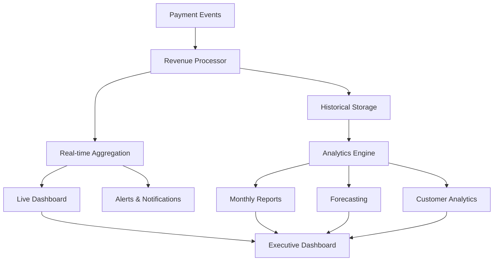

# 📊 EVA Platform Revenue Analytics Guide

## Complete Revenue Tracking & Analytics System

This guide covers the comprehensive revenue analytics system that tracks all income streams from the EVA Platform pricing model, providing real-time insights and forecasting capabilities.

---

## 📋 Table of Contents

1. [Revenue Stream Overview](#revenue-stream-overview)
2. [Real-time Analytics Dashboard](#real-time-analytics-dashboard)
3. [Commission Tracking System](#commission-tracking-system)
4. [Subscription Analytics (MRR/ARR)](#subscription-analytics-mrrarr)
5. [Customer Segmentation](#customer-segmentation)
6. [Performance Metrics](#performance-metrics)
7. [Forecasting & Predictions](#forecasting--predictions)
8. [API Documentation](#api-documentation)

---

## 💰 Revenue Stream Overview

### Complete Product Revenue Breakdown

Our platform generates revenue through 4 primary categories with detailed tracking:

```typescript
interface RevenueStreams {
  commission: {
    smart_match_closed: number; // Variable % of credit amount
    total_deals_closed: number;
    average_commission_rate: number;
    monthly_volume: number;
  };

  fixed_pricing: {
    risk_assessments: {
      general: number; // $300.00 per assessment
      equipment: number; // $335.00 per assessment
      real_estate: number; // $335.00 per assessment
    };
    smart_match_tools: {
      broker_tools: number; // $45.00 per use
      lender_tools: number; // $35.00 per use
    };
    asset_services: {
      tokenization: number; // $150.00 per asset
      shield_vault: number; // $30.00 per transaction
    };
  };

  verification_services: {
    kyb_business: number; // $20.00 per verification
    kyc_person: number; // $7.50 per verification
    kyp_property: number; // $20.00 per verification
    kyd_funding: number; // $117.50 per verification
  };

  subscriptions: {
    platform_features: {
      base_revenue: number; // $100/month (up to 10 users)
      additional_users: number; // $10/user beyond 10
      active_subscriptions: number;
    };
    cc_bar_local: {
      base_revenue: number; // $60/month (up to 10 users)
      additional_users: number; // $6/user beyond 10
      active_subscriptions: number;
    };
  };
}
```

### Revenue Analytics Architecture



---

## 📈 Real-time Analytics Dashboard

### Dashboard Components

```typescript
// src/components/analytics/RevenueDashboard.tsx
export const ExecutiveRevenueDashboard: React.FC = () => {
  const [metrics, setMetrics] = useState<RevenueMetrics | null>(null);
  const [timeframe, setTimeframe] = useState<'today' | 'week' | 'month' | 'quarter'>('today');

  useEffect(() => {
    const fetchMetrics = async () => {
      const data = await revenueAPI.getMetrics(timeframe);
      setMetrics(data);
    };

    fetchMetrics();

    // Real-time updates every 30 seconds
    const interval = setInterval(fetchMetrics, 30000);
    return () => clearInterval(interval);
  }, [timeframe]);

  return (
    <div className="executive-dashboard">
      {/* Revenue Overview Cards */}
      <div className="revenue-overview grid grid-cols-4 gap-6 mb-8">
        <RevenueCard
          title="Total Revenue"
          value={metrics?.total_revenue || 0}
          change={metrics?.revenue_growth || 0}
          timeframe={timeframe}
        />
        <RevenueCard
          title="Commission Revenue"
          value={metrics?.commission_revenue || 0}
          change={metrics?.commission_growth || 0}
          timeframe={timeframe}
        />
        <RevenueCard
          title="Monthly Recurring Revenue"
          value={metrics?.mrr || 0}
          change={metrics?.mrr_growth || 0}
          timeframe={timeframe}
        />
        <RevenueCard
          title="Average Deal Size"
          value={metrics?.avg_deal_size || 0}
          change={metrics?.deal_size_change || 0}
          timeframe={timeframe}
        />
      </div>

      {/* Revenue Breakdown Charts */}
      <div className="revenue-charts grid grid-cols-2 gap-6 mb-8">
        <RevenueByCategory data={metrics?.category_breakdown} />
        <RevenueTimeline data={metrics?.revenue_timeline} />
      </div>

      {/* Product Performance Table */}
      <ProductPerformanceTable data={metrics?.product_performance} />

      {/* Customer Analytics */}
      <CustomerRevenueAnalytics data={metrics?.customer_analytics} />
    </div>
  );
};
```

### Revenue Cards with Real-time Updates

```typescript
// src/components/analytics/RevenueCard.tsx
export const RevenueCard: React.FC<RevenueCardProps> = ({
  title,
  value,
  change,
  timeframe
}) => {
  const formatCurrency = (amount: number) => {
    return new Intl.NumberFormat('en-US', {
      style: 'currency',
      currency: 'USD',
      minimumFractionDigits: 0,
      maximumFractionDigits: 0,
    }).format(amount / 100); // Convert from cents
  };

  const formatPercent = (percent: number) => {
    const sign = percent >= 0 ? '+' : '';
    return `${sign}${percent.toFixed(1)}%`;
  };

  const getChangeColor = (change: number) => {
    if (change > 0) return 'text-green-600';
    if (change < 0) return 'text-red-600';
    return 'text-gray-600';
  };

  return (
    <div className="bg-white rounded-lg shadow-lg p-6">
      <div className="flex items-center justify-between">
        <h3 className="text-sm font-medium text-gray-500">{title}</h3>
        <div className="flex items-center space-x-1">
          {change !== 0 && (
            <ArrowIcon
              direction={change > 0 ? 'up' : 'down'}
              className={`w-4 h-4 ${getChangeColor(change)}`}
            />
          )}
          <span className={`text-sm font-medium ${getChangeColor(change)}`}>
            {formatPercent(change)}
          </span>
        </div>
      </div>

      <div className="mt-2">
        <div className="text-3xl font-bold text-gray-900">
          {formatCurrency(value)}
        </div>
        <div className="text-sm text-gray-500 mt-1">
          {timeframe === 'today' ? 'Today' :
           timeframe === 'week' ? 'This Week' :
           timeframe === 'month' ? 'This Month' : 'This Quarter'}
        </div>
      </div>
    </div>
  );
};
```

---

## 💳 Commission Tracking System

### Smart Match Commission Analytics

```typescript
// src/services/analytics/CommissionAnalytics.ts
export class CommissionAnalytics {
  async getCommissionMetrics(timeframe: string) {
    const data = await this.database.query(
      `
      SELECT
        COUNT(*) as total_deals,
        SUM(commission_amount) as total_commission,
        SUM(credit_amount) as total_credit_volume,
        AVG(commission_rate) as avg_commission_rate,
        AVG(commission_amount) as avg_commission_amount,

        -- Commission rate distribution
        COUNT(CASE WHEN commission_rate >= 0.03 THEN 1 END) as high_rate_deals,
        COUNT(CASE WHEN commission_rate BETWEEN 0.02 AND 0.029 THEN 1 END) as mid_rate_deals,
        COUNT(CASE WHEN commission_rate < 0.02 THEN 1 END) as low_rate_deals,

        -- Deal size distribution
        COUNT(CASE WHEN credit_amount >= 5000000 THEN 1 END) as large_deals, -- $50k+
        COUNT(CASE WHEN credit_amount BETWEEN 2500000 AND 4999999 THEN 1 END) as medium_deals,
        COUNT(CASE WHEN credit_amount < 2500000 THEN 1 END) as small_deals

      FROM commission_transactions
      WHERE created_at >= ?
    `,
      [this.getTimeframeStart(timeframe)]
    );

    return data[0];
  }

  async getCommissionTrends(months: number = 12) {
    const data = await this.database.query(
      `
      SELECT
        DATE_FORMAT(created_at, '%Y-%m') as month,
        COUNT(*) as deals_count,
        SUM(commission_amount) as total_commission,
        SUM(credit_amount) as total_volume,
        AVG(commission_rate) as avg_rate
      FROM commission_transactions
      WHERE created_at >= DATE_SUB(NOW(), INTERVAL ? MONTH)
      GROUP BY DATE_FORMAT(created_at, '%Y-%m')
      ORDER BY month
    `,
      [months]
    );

    return data;
  }

  async getTopPerformingBrokers(limit: number = 10) {
    const data = await this.database.query(
      `
      SELECT
        customer_id,
        customers.name,
        customers.company,
        COUNT(*) as deals_count,
        SUM(commission_amount) as total_commission,
        AVG(commission_amount) as avg_commission,
        SUM(credit_amount) as total_volume
      FROM commission_transactions
      JOIN customers ON commission_transactions.customer_id = customers.id
      WHERE created_at >= DATE_SUB(NOW(), INTERVAL 30 DAY)
      GROUP BY customer_id
      ORDER BY total_commission DESC
      LIMIT ?
    `,
      [limit]
    );

    return data;
  }
}
```

### Commission Rate Optimization

```typescript
// src/services/analytics/CommissionOptimization.ts
export class CommissionOptimization {
  // Analyze optimal commission rates for different deal sizes
  async analyzeOptimalRates() {
    const dealSizeRanges = [
      { min: 0, max: 1000000, label: 'Small (<$10k)' },
      { min: 1000000, max: 2500000, label: 'Medium ($10k-$25k)' },
      { min: 2500000, max: 5000000, label: 'Large ($25k-$50k)' },
      { min: 5000000, max: Infinity, label: 'Enterprise ($50k+)' },
    ];

    const analysis = [];

    for (const range of dealSizeRanges) {
      const data = await this.database.query(
        `
        SELECT
          commission_rate,
          COUNT(*) as deal_count,
          AVG(CASE WHEN deal_closed = 1 THEN 1 ELSE 0 END) as close_rate,
          SUM(commission_amount) as total_revenue
        FROM commission_transactions
        WHERE credit_amount >= ? AND credit_amount < ?
        GROUP BY commission_rate
        ORDER BY commission_rate
      `,
        [range.min, range.max]
      );

      analysis.push({
        size_range: range.label,
        rate_performance: data,
        optimal_rate: this.calculateOptimalRate(data),
      });
    }

    return analysis;
  }

  private calculateOptimalRate(rateData: any[]) {
    // Find rate that maximizes revenue while maintaining good close rates
    let optimalRate = null;
    let maxScore = 0;

    for (const rate of rateData) {
      // Score = revenue * close_rate (weighted formula)
      const score = rate.total_revenue * rate.close_rate;
      if (score > maxScore) {
        maxScore = score;
        optimalRate = rate.commission_rate;
      }
    }

    return optimalRate;
  }
}
```

---

## 🔄 Subscription Analytics (MRR/ARR)

### Monthly Recurring Revenue Tracking

```typescript
// src/services/analytics/SubscriptionAnalytics.ts
export class SubscriptionAnalytics {
  async getMRRMetrics() {
    const currentMRR = await this.getCurrentMRR();
    const previousMRR = await this.getPreviousMRR();
    const newMRR = await this.getNewMRR();
    const churnedMRR = await this.getChurnedMRR();
    const upgradeMRR = await this.getUpgradeMRR();
    const downgradeMRR = await this.getDowngradeMRR();

    return {
      current_mrr: currentMRR,
      previous_mrr: previousMRR,
      mrr_growth: ((currentMRR - previousMRR) / previousMRR) * 100,

      // MRR Movement Components
      new_mrr: newMRR,
      churned_mrr: churnedMRR,
      upgrade_mrr: upgradeMRR,
      downgrade_mrr: downgradeMRR,
      net_new_mrr: newMRR - churnedMRR + upgradeMRR - downgradeMRR,

      // Additional Metrics
      arr: currentMRR * 12,
      customer_count: await this.getActiveSubscribers(),
      average_revenue_per_user: currentMRR / (await this.getActiveSubscribers()),
      churn_rate: await this.getChurnRate(),
    };
  }

  private async getCurrentMRR() {
    const result = await this.database.query(`
      SELECT SUM(monthly_amount) as mrr
      FROM subscriptions
      WHERE status = 'active'
    `);
    return result[0].mrr || 0;
  }

  private async getNewMRR() {
    const result = await this.database.query(`
      SELECT SUM(monthly_amount) as new_mrr
      FROM subscriptions
      WHERE status = 'active'
      AND created_at >= DATE_SUB(NOW(), INTERVAL 30 DAY)
    `);
    return result[0].new_mrr || 0;
  }

  private async getChurnedMRR() {
    const result = await this.database.query(`
      SELECT SUM(monthly_amount) as churned_mrr
      FROM subscription_changes
      WHERE change_type = 'canceled'
      AND created_at >= DATE_SUB(NOW(), INTERVAL 30 DAY)
    `);
    return result[0].churned_mrr || 0;
  }

  async getSubscriptionCohortAnalysis() {
    const cohorts = await this.database.query(`
      SELECT
        DATE_FORMAT(s.created_at, '%Y-%m') as cohort_month,
        COUNT(DISTINCT s.customer_id) as subscribers,
        SUM(s.monthly_amount) as total_mrr,

        -- Retention rates by month
        COUNT(DISTINCT CASE WHEN months_diff = 1 THEN s.customer_id END) as month_1,
        COUNT(DISTINCT CASE WHEN months_diff = 3 THEN s.customer_id END) as month_3,
        COUNT(DISTINCT CASE WHEN months_diff = 6 THEN s.customer_id END) as month_6,
        COUNT(DISTINCT CASE WHEN months_diff = 12 THEN s.customer_id END) as month_12

      FROM subscriptions s
      LEFT JOIN (
        SELECT
          customer_id,
          TIMESTAMPDIFF(MONTH, MIN(created_at), NOW()) as months_diff
        FROM subscriptions
        GROUP BY customer_id
      ) retention ON s.customer_id = retention.customer_id

      WHERE s.created_at >= DATE_SUB(NOW(), INTERVAL 24 MONTH)
      GROUP BY DATE_FORMAT(s.created_at, '%Y-%m')
      ORDER BY cohort_month
    `);

    return cohorts;
  }
}
```

### Subscription Performance Dashboard

```typescript
// src/components/analytics/SubscriptionDashboard.tsx
export const SubscriptionDashboard: React.FC = () => {
  const [mrrMetrics, setMrrMetrics] = useState<MRRMetrics | null>(null);
  const [cohortData, setCohortData] = useState<CohortData[]>([]);

  useEffect(() => {
    const fetchData = async () => {
      const [metrics, cohorts] = await Promise.all([
        subscriptionAPI.getMRRMetrics(),
        subscriptionAPI.getCohortAnalysis()
      ]);
      setMrrMetrics(metrics);
      setCohortData(cohorts);
    };

    fetchData();
  }, []);

  return (
    <div className="subscription-dashboard">
      {/* MRR Overview */}
      <div className="mrr-overview grid grid-cols-3 gap-6 mb-8">
        <MRRCard
          title="Monthly Recurring Revenue"
          value={mrrMetrics?.current_mrr || 0}
          growth={mrrMetrics?.mrr_growth || 0}
        />
        <MRRCard
          title="Annual Recurring Revenue"
          value={mrrMetrics?.arr || 0}
          growth={mrrMetrics?.mrr_growth || 0}
        />
        <MRRCard
          title="Average Revenue Per User"
          value={mrrMetrics?.average_revenue_per_user || 0}
          growth={0}
        />
      </div>

      {/* MRR Movement Waterfall Chart */}
      <div className="mrr-movement mb-8">
        <h3 className="text-lg font-semibold mb-4">MRR Movement</h3>
        <MRRWaterfallChart data={{
          starting_mrr: mrrMetrics?.previous_mrr || 0,
          new_mrr: mrrMetrics?.new_mrr || 0,
          churned_mrr: -(mrrMetrics?.churned_mrr || 0),
          upgrade_mrr: mrrMetrics?.upgrade_mrr || 0,
          downgrade_mrr: -(mrrMetrics?.downgrade_mrr || 0),
          ending_mrr: mrrMetrics?.current_mrr || 0
        }} />
      </div>

      {/* Subscription Breakdown */}
      <div className="subscription-breakdown grid grid-cols-2 gap-6 mb-8">
        <SubscriptionTypeChart data={mrrMetrics?.subscription_breakdown} />
        <TeamSizeAnalysis data={mrrMetrics?.team_size_distribution} />
      </div>

      {/* Cohort Analysis */}
      <div className="cohort-analysis">
        <h3 className="text-lg font-semibold mb-4">Cohort Retention Analysis</h3>
        <CohortTable data={cohortData} />
      </div>
    </div>
  );
};
```

---

## 👥 Customer Segmentation

### Revenue by Customer Type

```typescript
// src/services/analytics/CustomerSegmentation.ts
export class CustomerSegmentation {
  async getRevenueByCustomerType(timeframe: string) {
    const data = await this.database.query(
      `
      SELECT
        c.customer_type,
        COUNT(DISTINCT c.id) as customer_count,
        SUM(CASE WHEN r.revenue_category = 'commission' THEN r.amount ELSE 0 END) as commission_revenue,
        SUM(CASE WHEN r.revenue_category = 'one_time' THEN r.amount ELSE 0 END) as one_time_revenue,
        SUM(CASE WHEN r.revenue_category = 'recurring' THEN r.amount ELSE 0 END) as recurring_revenue,
        SUM(r.amount) as total_revenue,
        AVG(r.amount) as avg_transaction_value,
        COUNT(r.transaction_id) as transaction_count
      FROM customers c
      LEFT JOIN revenue_transactions r ON c.id = r.customer_id
      WHERE r.created_at >= ?
      GROUP BY c.customer_type
      ORDER BY total_revenue DESC
    `,
      [this.getTimeframeStart(timeframe)]
    );

    return data;
  }

  async getCustomerLifetimeValue() {
    const data = await this.database.query(`
      SELECT
        c.customer_type,
        c.id,
        c.name,
        c.company,
        SUM(r.amount) as lifetime_value,
        COUNT(r.transaction_id) as total_transactions,
        MIN(r.created_at) as first_transaction,
        MAX(r.created_at) as last_transaction,
        DATEDIFF(MAX(r.created_at), MIN(r.created_at)) as customer_age_days,

        -- Calculate monthly average
        SUM(r.amount) / (DATEDIFF(MAX(r.created_at), MIN(r.created_at)) / 30) as monthly_avg_revenue

      FROM customers c
      JOIN revenue_transactions r ON c.id = r.customer_id
      GROUP BY c.id
      HAVING total_transactions >= 2  -- Only customers with multiple transactions
      ORDER BY lifetime_value DESC
    `);

    return data;
  }

  async getCustomerGrowthMetrics() {
    const data = await this.database.query(`
      SELECT
        customer_type,
        DATE_FORMAT(created_at, '%Y-%m') as month,
        COUNT(*) as new_customers,
        SUM(COUNT(*)) OVER (PARTITION BY customer_type ORDER BY DATE_FORMAT(created_at, '%Y-%m')) as cumulative_customers
      FROM customers
      WHERE created_at >= DATE_SUB(NOW(), INTERVAL 12 MONTH)
      GROUP BY customer_type, DATE_FORMAT(created_at, '%Y-%m')
      ORDER BY customer_type, month
    `);

    return data;
  }
}
```

### Customer Behavior Analysis

```typescript
// src/services/analytics/CustomerBehavior.ts
export class CustomerBehaviorAnalytics {
  async getProductUsageByCustomerType() {
    const usage = await this.database.query(`
      SELECT
        c.customer_type,
        r.product_type,
        COUNT(*) as usage_count,
        SUM(r.amount) as total_revenue,
        AVG(r.amount) as avg_amount
      FROM customers c
      JOIN revenue_transactions r ON c.id = r.customer_id
      WHERE r.created_at >= DATE_SUB(NOW(), INTERVAL 90 DAY)
      GROUP BY c.customer_type, r.product_type
      ORDER BY c.customer_type, total_revenue DESC
    `);

    return this.formatUsageData(usage);
  }

  async getCustomerJourney() {
    const journeys = await this.database.query(`
      SELECT
        c.id,
        c.customer_type,
        c.name,

        -- First transaction details
        first_trans.product_type as first_product,
        first_trans.amount as first_amount,
        first_trans.created_at as first_transaction_date,

        -- Recent activity
        recent_trans.product_type as recent_product,
        recent_trans.amount as recent_amount,
        recent_trans.created_at as recent_transaction_date,

        -- Overall stats
        COUNT(all_trans.transaction_id) as total_transactions,
        SUM(all_trans.amount) as total_spent,
        DATEDIFF(NOW(), first_trans.created_at) as customer_age_days

      FROM customers c

      -- First transaction
      JOIN revenue_transactions first_trans ON c.id = first_trans.customer_id
      AND first_trans.created_at = (
        SELECT MIN(created_at)
        FROM revenue_transactions
        WHERE customer_id = c.id
      )

      -- Most recent transaction
      JOIN revenue_transactions recent_trans ON c.id = recent_trans.customer_id
      AND recent_trans.created_at = (
        SELECT MAX(created_at)
        FROM revenue_transactions
        WHERE customer_id = c.id
      )

      -- All transactions for aggregation
      JOIN revenue_transactions all_trans ON c.id = all_trans.customer_id

      GROUP BY c.id
      ORDER BY total_spent DESC
    `);

    return journeys;
  }
}
```

---

## 📊 Performance Metrics

### Key Performance Indicators

```typescript
// src/services/analytics/KPITracker.ts
export class KPITracker {
  async getAllKPIs(timeframe: string) {
    const [revenueMetrics, customerMetrics, productMetrics, operationalMetrics] = await Promise.all(
      [
        this.getRevenueKPIs(timeframe),
        this.getCustomerKPIs(timeframe),
        this.getProductKPIs(timeframe),
        this.getOperationalKPIs(timeframe),
      ]
    );

    return {
      revenue: revenueMetrics,
      customer: customerMetrics,
      product: productMetrics,
      operational: operationalMetrics,

      // Combined insights
      health_score: this.calculateHealthScore({
        revenue: revenueMetrics,
        customer: customerMetrics,
        product: productMetrics,
      }),
    };
  }

  private async getRevenueKPIs(timeframe: string) {
    const data = await this.database.query(
      `
      SELECT
        SUM(amount) as total_revenue,
        COUNT(DISTINCT customer_id) as paying_customers,
        SUM(amount) / COUNT(DISTINCT customer_id) as revenue_per_customer,
        COUNT(transaction_id) as total_transactions,
        SUM(amount) / COUNT(transaction_id) as avg_transaction_value,

        -- Growth metrics (compare to previous period)
        (SELECT SUM(amount) FROM revenue_transactions
         WHERE created_at BETWEEN ? AND ?) as previous_revenue,

        -- Commission metrics
        SUM(CASE WHEN revenue_category = 'commission' THEN amount ELSE 0 END) as commission_revenue,
        AVG(CASE WHEN revenue_category = 'commission' THEN
          metadata->>'$.commission_rate' ELSE NULL END) as avg_commission_rate

      FROM revenue_transactions
      WHERE created_at >= ?
    `,
      [
        this.getPreviousPeriodStart(timeframe),
        this.getPreviousPeriodEnd(timeframe),
        this.getTimeframeStart(timeframe),
      ]
    );

    const current = data[0];
    const growthRate =
      current.previous_revenue > 0
        ? ((current.total_revenue - current.previous_revenue) / current.previous_revenue) * 100
        : 0;

    return {
      ...current,
      revenue_growth_rate: growthRate,
    };
  }

  private async getCustomerKPIs(timeframe: string) {
    const data = await this.database.query(
      `
      SELECT
        COUNT(DISTINCT id) as total_customers,
        COUNT(DISTINCT CASE WHEN created_at >= ? THEN id END) as new_customers,

        -- Customer type breakdown
        COUNT(CASE WHEN customer_type = 'broker' THEN 1 END) as broker_count,
        COUNT(CASE WHEN customer_type = 'lender' THEN 1 END) as lender_count,
        COUNT(CASE WHEN customer_type = 'borrower' THEN 1 END) as borrower_count,
        COUNT(CASE WHEN customer_type = 'vendor' THEN 1 END) as vendor_count,

        -- Engagement metrics
        (SELECT COUNT(DISTINCT customer_id)
         FROM revenue_transactions
         WHERE created_at >= ?) as active_customers

      FROM customers
    `,
      [this.getTimeframeStart(timeframe), this.getTimeframeStart(timeframe)]
    );

    return data[0];
  }

  private calculateHealthScore(metrics: any): number {
    // Proprietary health score calculation
    const revenueScore = this.normalizeScore(metrics.revenue.revenue_growth_rate, -50, 100);
    const customerScore = this.normalizeScore(metrics.customer.new_customers, 0, 50);
    const engagementScore = this.normalizeScore(
      (metrics.customer.active_customers / metrics.customer.total_customers) * 100,
      0,
      100
    );

    // Weighted average
    return Math.round(revenueScore * 0.4 + customerScore * 0.3 + engagementScore * 0.3);
  }

  private normalizeScore(value: number, min: number, max: number): number {
    return Math.max(0, Math.min(100, ((value - min) / (max - min)) * 100));
  }
}
```

---

## 🔮 Forecasting & Predictions

### Revenue Forecasting Engine

```typescript
// src/services/analytics/ForecastingEngine.ts
export class ForecastingEngine {
  async generateRevenueForcast(months: number = 6) {
    // Get historical data for trend analysis
    const historicalData = await this.getHistoricalRevenue(24); // 24 months of data

    // Apply multiple forecasting models
    const linearForecast = this.linearTrendForecast(historicalData, months);
    const seasonalForecast = this.seasonalForecast(historicalData, months);
    const growthForecast = this.exponentialGrowthForecast(historicalData, months);

    // Combine forecasts with weighted average
    const combinedForecast = this.combineForcasts([
      { forecast: linearForecast, weight: 0.3 },
      { forecast: seasonalForecast, weight: 0.4 },
      { forecast: growthForecast, weight: 0.3 },
    ]);

    // Calculate confidence intervals
    const confidenceIntervals = this.calculateConfidenceIntervals(historicalData, combinedForecast);

    return {
      forecast: combinedForecast,
      confidence_intervals: confidenceIntervals,
      models_used: ['linear', 'seasonal', 'exponential'],
      accuracy_score: await this.calculateModelAccuracy(),
    };
  }

  private async getHistoricalRevenue(months: number) {
    const data = await this.database.query(
      `
      SELECT
        DATE_FORMAT(created_at, '%Y-%m') as month,
        SUM(amount) as total_revenue,
        SUM(CASE WHEN revenue_category = 'commission' THEN amount ELSE 0 END) as commission,
        SUM(CASE WHEN revenue_category = 'recurring' THEN amount ELSE 0 END) as recurring,
        SUM(CASE WHEN revenue_category = 'one_time' THEN amount ELSE 0 END) as one_time
      FROM revenue_transactions
      WHERE created_at >= DATE_SUB(NOW(), INTERVAL ? MONTH)
      GROUP BY DATE_FORMAT(created_at, '%Y-%m')
      ORDER BY month
    `,
      [months]
    );

    return data;
  }

  private linearTrendForecast(data: any[], months: number) {
    // Simple linear regression on historical data
    const revenues = data.map(d => d.total_revenue);
    const { slope, intercept } = this.calculateLinearRegression(revenues);

    const forecast = [];
    const lastDataPoint = revenues.length;

    for (let i = 1; i <= months; i++) {
      const predictedRevenue = slope * (lastDataPoint + i) + intercept;
      forecast.push({
        month: this.getMonthLabel(i),
        predicted_revenue: Math.max(0, predictedRevenue),
      });
    }

    return forecast;
  }

  private seasonalForecast(data: any[], months: number) {
    // Account for seasonal patterns in the data
    const monthlyAverages = this.calculateSeasonalFactors(data);
    const baselineGrowth = this.calculateAverageGrowth(data);

    const forecast = [];
    const lastRevenue = data[data.length - 1]?.total_revenue || 0;

    for (let i = 1; i <= months; i++) {
      const monthIndex = (new Date().getMonth() + i - 1) % 12;
      const seasonalFactor = monthlyAverages[monthIndex];
      const growthAdjusted = lastRevenue * Math.pow(1 + baselineGrowth, i);

      forecast.push({
        month: this.getMonthLabel(i),
        predicted_revenue: growthAdjusted * seasonalFactor,
      });
    }

    return forecast;
  }

  async predictCustomerLifetimeValue(customerId: string) {
    const customerData = await this.database.query(
      `
      SELECT
        c.customer_type,
        c.created_at as signup_date,
        COUNT(r.transaction_id) as transaction_count,
        SUM(r.amount) as total_spent,
        AVG(r.amount) as avg_transaction,
        DATEDIFF(NOW(), c.created_at) as customer_age_days,

        -- Recent activity pattern
        COUNT(CASE WHEN r.created_at >= DATE_SUB(NOW(), INTERVAL 30 DAY)
              THEN 1 END) as recent_transactions

      FROM customers c
      LEFT JOIN revenue_transactions r ON c.id = r.customer_id
      WHERE c.id = ?
      GROUP BY c.id
    `,
      [customerId]
    );

    if (!customerData.length) return null;

    const customer = customerData[0];
    const monthlySpend = customer.total_spent / (customer.customer_age_days / 30);
    const expectedLifespan = this.predictCustomerLifespan(customer);

    return {
      predicted_ltv: monthlySpend * expectedLifespan,
      monthly_value: monthlySpend,
      expected_lifespan_months: expectedLifespan,
      confidence: this.calculateLTVConfidence(customer),
    };
  }
}
```

---

## 🔌 API Documentation

### Revenue Analytics API Endpoints

```typescript
// API Routes for Revenue Analytics

// GET /api/analytics/revenue/overview
interface RevenueOverviewResponse {
  total_revenue: number;
  commission_revenue: number;
  subscription_mrr: number;
  one_time_revenue: number;
  growth_rate: number;
  transactions_count: number;
  avg_transaction_value: number;
}

// GET /api/analytics/revenue/breakdown
interface RevenueBreakdownResponse {
  by_category: CategoryBreakdown[];
  by_customer_type: CustomerTypeBreakdown[];
  by_product: ProductBreakdown[];
  by_time: TimeBreakdown[];
}

// GET /api/analytics/commission/metrics
interface CommissionMetricsResponse {
  total_deals: number;
  total_commission: number;
  avg_commission_rate: number;
  avg_deal_size: number;
  commission_distribution: CommissionRateDistribution[];
  top_performers: TopPerformers[];
}

// GET /api/analytics/subscriptions/mrr
interface MRRAnalyticsResponse {
  current_mrr: number;
  previous_mrr: number;
  mrr_growth: number;
  new_mrr: number;
  churned_mrr: number;
  upgrade_mrr: number;
  downgrade_mrr: number;
  active_subscribers: number;
  churn_rate: number;
}

// POST /api/analytics/forecast
interface ForecastRequest {
  months: number;
  categories?: string[];
  confidence_level?: number;
}

interface ForecastResponse {
  predictions: MonthlyPrediction[];
  confidence_intervals: ConfidenceInterval[];
  model_accuracy: number;
  assumptions: string[];
}
```

### Real-time Analytics WebSocket

```typescript
// WebSocket connection for real-time analytics
class RevenueAnalyticsSocket {
  private ws: WebSocket;

  constructor() {
    this.ws = new WebSocket('wss://api.eva-platform.com/analytics/live');
    this.setupEventHandlers();
  }

  private setupEventHandlers() {
    this.ws.on('revenue_update', (data: RevenueUpdate) => {
      // Handle real-time revenue updates
      this.updateDashboard(data);
    });

    this.ws.on('commission_alert', (data: CommissionAlert) => {
      // Handle high-value commission alerts
      this.showCommissionAlert(data);
    });

    this.ws.on('subscription_event', (data: SubscriptionEvent) => {
      // Handle subscription changes (new, canceled, upgraded)
      this.updateSubscriptionMetrics(data);
    });
  }

  subscribeToMetrics(metrics: string[]) {
    this.ws.send(
      JSON.stringify({
        action: 'subscribe',
        metrics: metrics,
      })
    );
  }
}
```

---

**Last Updated**: December 2024
**Version**: 3.0.0 - Complete Revenue Analytics
**Status**: ✅ Production Ready with Real-time Analytics
