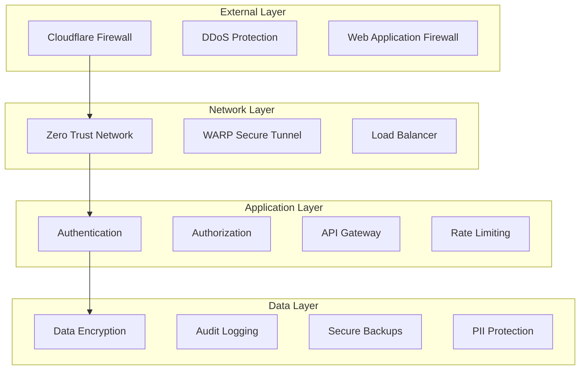

# 🔐 Security Guide

## 📋 Overview

Security is paramount in the EVA Platform, especially given our handling of sensitive financial data. This guide outlines comprehensive security measures, compliance requirements, and best practices for protecting customer data and maintaining regulatory compliance.

## 🛡️ Security Architecture

### Multi-Layer Security Model



## 🔐 Data Protection

### Encryption Standards

```typescript
// Data Encryption Configuration
const encryptionConfig = {
  // Data at Rest
  atRest: {
    algorithm: 'AES-256-GCM',
    keyRotation: '90days',
    keyManagement: 'Cloudflare SSL/TLS',
    storageEncryption: 'AES-256',
  },

  // Data in Transit
  inTransit: {
    protocol: 'TLS 1.3',
    certificateType: 'Extended Validation',
    cipherSuites: ['TLS_AES_256_GCM_SHA384', 'TLS_CHACHA20_POLY1305_SHA256'],
    hsts: true,
    certificatePinning: true,
  },

  // Field-Level Encryption
  fieldLevel: {
    sensitiveFields: ['ssn', 'bankAccount', 'taxId', 'creditScore'],
    algorithm: 'AES-256-GCM',
    keyDerivation: 'PBKDF2',
    saltLength: 32,
  },
};

// Encryption Service Implementation
class EncryptionService {
  private readonly KEY_LENGTH = 32; // 256 bits
  private readonly IV_LENGTH = 12; // 96 bits for GCM

  async encryptSensitiveData(data: string, context: string): Promise<EncryptedData> {
    // Generate encryption key based on context
    const key = await this.deriveKey(context);

    // Generate random IV
    const iv = crypto.getRandomValues(new Uint8Array(this.IV_LENGTH));

    // Encrypt data
    const encoder = new TextEncoder();
    const dataBuffer = encoder.encode(data);

    const encryptedData = await crypto.subtle.encrypt({ name: 'AES-GCM', iv }, key, dataBuffer);

    return {
      encryptedData: new Uint8Array(encryptedData),
      iv,
      keyId: await this.getKeyId(context),
      algorithm: 'AES-256-GCM',
    };
  }

  async decryptSensitiveData(encryptedData: EncryptedData, context: string): Promise<string> {
    const key = await this.deriveKey(context);

    const decryptedData = await crypto.subtle.decrypt(
      { name: 'AES-GCM', iv: encryptedData.iv },
      key,
      encryptedData.encryptedData
    );

    const decoder = new TextDecoder();
    return decoder.decode(decryptedData);
  }

  private async deriveKey(context: string): Promise<CryptoKey> {
    const baseKey = await this.getBaseKey();
    const contextBuffer = new TextEncoder().encode(context);

    return crypto.subtle.deriveKey(
      {
        name: 'PBKDF2',
        salt: contextBuffer,
        iterations: 100000,
        hash: 'SHA-256',
      },
      baseKey,
      { name: 'AES-GCM', length: 256 },
      false,
      ['encrypt', 'decrypt']
    );
  }
}
```

### PII Data Handling

```typescript
// PII Detection and Protection
class PIIProtectionService {
  private readonly PII_PATTERNS = {
    ssn: /\b\d{3}-?\d{2}-?\d{4}\b/g,
    creditCard: /\b\d{4}[\s-]?\d{4}[\s-]?\d{4}[\s-]?\d{4}\b/g,
    bankAccount: /\b\d{8,17}\b/g,
    taxId: /\b\d{2}-?\d{7}\b/g,
    email: /[a-zA-Z0-9._%+-]+@[a-zA-Z0-9.-]+\.[a-zA-Z]{2,}/g,
    phone: /\b\d{3}-?\d{3}-?\d{4}\b/g,
  };

  detectPII(text: string): PIIDetection[] {
    const detections: PIIDetection[] = [];

    Object.entries(this.PII_PATTERNS).forEach(([type, pattern]) => {
      const matches = text.match(pattern);
      if (matches) {
        matches.forEach(match => {
          detections.push({
            type: type as PIIType,
            value: match,
            startIndex: text.indexOf(match),
            endIndex: text.indexOf(match) + match.length,
            confidence: this.calculateConfidence(type, match),
          });
        });
      }
    });

    return detections;
  }

  async redactPII(text: string, options: RedactionOptions = {}): Promise<RedactedContent> {
    const detections = this.detectPII(text);
    let redactedText = text;
    const redactionMap = new Map<string, string>();

    // Sort detections by position (descending) to avoid index issues
    detections.sort((a, b) => b.startIndex - a.startIndex);

    for (const detection of detections) {
      if (detection.confidence >= (options.confidenceThreshold || 0.8)) {
        // Generate secure token for the PII
        const token = await this.generateSecureToken(detection.type);

        // Store mapping for potential restoration
        if (options.enableRestoration) {
          const encryptedValue = await this.encryptionService.encryptSensitiveData(
            detection.value,
            `pii-${detection.type}`
          );
          redactionMap.set(token, JSON.stringify(encryptedValue));
        }

        // Replace PII with token
        const redactionText = options.redactionText || `[${detection.type.toUpperCase()}_REDACTED]`;
        redactedText =
          redactedText.substring(0, detection.startIndex) +
          redactionText +
          redactedText.substring(detection.endIndex);
      }
    }

    return {
      redactedText,
      detections,
      redactionMap: Object.fromEntries(redactionMap),
    };
  }

  private async generateSecureToken(type: PIIType): Promise<string> {
    const randomBytes = crypto.getRandomValues(new Uint8Array(16));
    const timestamp = Date.now();
    const hash = await crypto.subtle.digest(
      'SHA-256',
      new TextEncoder().encode(`${type}-${timestamp}-${randomBytes}`)
    );
    return `PII_${type.toUpperCase()}_${Buffer.from(hash).toString('hex').substring(0, 16)}`;
  }
}
```

## 🔑 Authentication & Authorization

### Multi-Factor Authentication

```typescript
// MFA Implementation
class MFAService {
  async setupMFA(userId: string, method: MFAMethod): Promise<MFASetupResult> {
    switch (method) {
      case 'totp':
        return this.setupTOTP(userId);
      case 'sms':
        return this.setupSMS(userId);
      case 'email':
        return this.setupEmail(userId);
      case 'hardware':
        return this.setupHardwareToken(userId);
      default:
        throw new Error('Unsupported MFA method');
    }
  }

  private async setupTOTP(userId: string): Promise<MFASetupResult> {
    // Generate secret key
    const secret = this.generateSecretKey();

    // Store encrypted secret
    await this.storeMFASecret(userId, 'totp', secret);

    // Generate QR code for authenticator app
    const qrCode = await this.generateQRCode(userId, secret);

    return {
      method: 'totp',
      secret,
      qrCode,
      backupCodes: await this.generateBackupCodes(userId),
    };
  }

  async verifyMFA(userId: string, method: MFAMethod, code: string): Promise<MFAVerificationResult> {
    const user = await this.getUserMFAConfig(userId);

    if (!user.mfaEnabled) {
      throw new Error('MFA not enabled for user');
    }

    switch (method) {
      case 'totp':
        return this.verifyTOTP(userId, code);
      case 'sms':
        return this.verifySMS(userId, code);
      case 'backup':
        return this.verifyBackupCode(userId, code);
      default:
        throw new Error('Unsupported MFA method');
    }
  }

  private async verifyTOTP(userId: string, code: string): Promise<MFAVerificationResult> {
    const secret = await this.getMFASecret(userId, 'totp');
    const window = 30; // 30-second window
    const currentTime = Math.floor(Date.now() / 1000);

    // Check current window and adjacent windows for clock drift
    for (let i = -1; i <= 1; i++) {
      const timeStep = Math.floor((currentTime + i * window) / window);
      const expectedCode = this.generateTOTPCode(secret, timeStep);

      if (this.constantTimeCompare(code, expectedCode)) {
        // Prevent replay attacks
        await this.markCodeAsUsed(userId, code, timeStep);

        return {
          success: true,
          method: 'totp',
          timestamp: new Date(),
        };
      }
    }

    return {
      success: false,
      method: 'totp',
      error: 'Invalid or expired code',
    };
  }
}
```

### Role-Based Access Control (RBAC)

```typescript
// RBAC Implementation
class RBACService {
  private readonly ROLE_HIERARCHY = {
    'system-admin': ['org-admin', 'lender', 'broker', 'borrower', 'vendor'],
    'org-admin': ['lender-admin', 'broker-admin'],
    'lender-admin': ['lender'],
    'broker-admin': ['broker'],
    lender: ['viewer'],
    broker: ['viewer'],
    borrower: [],
    vendor: [],
    viewer: [],
  };

  private readonly PERMISSIONS = {
    // Agent Management
    'agents:create': ['system-admin', 'org-admin', 'lender-admin'],
    'agents:read': ['system-admin', 'org-admin', 'lender-admin', 'lender', 'broker'],
    'agents:update': ['system-admin', 'org-admin', 'lender-admin'],
    'agents:delete': ['system-admin', 'org-admin'],

    // Document Management
    'documents:upload': ['system-admin', 'org-admin', 'lender', 'broker', 'borrower'],
    'documents:read': ['system-admin', 'org-admin', 'lender', 'broker'],
    'documents:delete': ['system-admin', 'org-admin', 'lender'],

    // RAG Operations
    'rag:query': ['system-admin', 'org-admin', 'lender', 'broker'],
    'rag:configure': ['system-admin', 'org-admin', 'lender-admin'],

    // Sensitive Data
    'pii:view': ['system-admin', 'lender-admin'],
    'pii:export': ['system-admin'],

    // System Operations
    'system:monitor': ['system-admin'],
    'system:configure': ['system-admin'],
  };

  async checkPermission(
    userId: string,
    permission: string,
    resource?: Resource
  ): Promise<PermissionResult> {
    const user = await this.getUserWithRoles(userId);

    // Check if user has direct permission
    if (this.hasDirectPermission(user.roles, permission)) {
      return { granted: true, reason: 'Direct permission' };
    }

    // Check inherited permissions through role hierarchy
    if (this.hasInheritedPermission(user.roles, permission)) {
      return { granted: true, reason: 'Inherited permission' };
    }

    // Check resource-specific permissions
    if (resource && this.hasResourcePermission(user, permission, resource)) {
      return { granted: true, reason: 'Resource-specific permission' };
    }

    // Log permission denial for audit
    await this.logPermissionDenial(userId, permission, resource);

    return {
      granted: false,
      reason: 'Insufficient permissions',
      requiredRoles: this.PERMISSIONS[permission] || [],
    };
  }

  private hasDirectPermission(userRoles: string[], permission: string): boolean {
    const allowedRoles = this.PERMISSIONS[permission] || [];
    return userRoles.some(role => allowedRoles.includes(role));
  }

  private hasInheritedPermission(userRoles: string[], permission: string): boolean {
    const allowedRoles = this.PERMISSIONS[permission] || [];

    return userRoles.some(userRole => {
      const inheritedRoles = this.ROLE_HIERARCHY[userRole] || [];
      return inheritedRoles.some(inheritedRole => allowedRoles.includes(inheritedRole));
    });
  }

  async enforceDataIsolation(userId: string, query: DatabaseQuery): Promise<DatabaseQuery> {
    const user = await this.getUserWithContext(userId);

    // System admins can access all data
    if (user.roles.includes('system-admin')) {
      return query;
    }

    // Organization admins can access their org data
    if (user.roles.includes('org-admin')) {
      query.where = {
        ...query.where,
        organizationId: user.organizationId,
      };
      return query;
    }

    // Regular users can only access their own data
    query.where = {
      ...query.where,
      organizationId: user.organizationId,
      userId: user.id,
    };

    return query;
  }
}
```

## 📋 Compliance Framework

### SOC 2 Type II Compliance

```typescript
// SOC 2 Controls Implementation
class SOC2ComplianceService {
  private readonly CONTROLS = {
    // Security
    security: {
      'CC6.1': 'Logical and physical access controls',
      'CC6.2': 'Authentication and authorization',
      'CC6.3': 'System security configuration',
      'CC6.6': 'Data transmission protection',
      'CC6.7': 'Data retention and disposal',
      'CC6.8': 'Vulnerability management',
    },

    // Availability
    availability: {
      'A1.1': 'System availability monitoring',
      'A1.2': 'Capacity planning and management',
      'A1.3': 'System backup and recovery',
    },

    // Confidentiality
    confidentiality: {
      'C1.1': 'Data classification and handling',
      'C1.2': 'Encryption of confidential data',
    },
  };

  async performControlAssessment(controlId: string): Promise<ControlAssessment> {
    switch (controlId) {
      case 'CC6.1':
        return this.assessAccessControls();
      case 'CC6.2':
        return this.assessAuthentication();
      case 'CC6.6':
        return this.assessDataTransmission();
      case 'C1.2':
        return this.assessEncryption();
      default:
        throw new Error(`Unknown control: ${controlId}`);
    }
  }

  private async assessEncryption(): Promise<ControlAssessment> {
    const checks = [
      await this.checkDataAtRestEncryption(),
      await this.checkDataInTransitEncryption(),
      await this.checkKeyManagement(),
      await this.checkFieldLevelEncryption(),
    ];

    const passed = checks.every(check => check.status === 'pass');

    return {
      controlId: 'C1.2',
      status: passed ? 'pass' : 'fail',
      checks,
      evidence: await this.collectEncryptionEvidence(),
      timestamp: new Date(),
      assessor: 'automated-system',
    };
  }

  private async checkDataAtRestEncryption(): Promise<ControlCheck> {
    // Verify all databases use encryption
    const databases = await this.getDatabaseConfigurations();
    const encrypted = databases.every(db => db.encryption.enabled);

    return {
      checkId: 'data-at-rest-encryption',
      description: 'Verify data at rest encryption',
      status: encrypted ? 'pass' : 'fail',
      details: `${databases.length} databases checked, ${databases.filter(db => db.encryption.enabled).length} encrypted`,
    };
  }
}
```

### GDPR Compliance

```typescript
// GDPR Implementation
class GDPRComplianceService {
  async handleDataSubjectRequest(
    type: DataSubjectRequestType,
    subjectId: string,
    details: any
  ): Promise<DataSubjectResponse> {
    switch (type) {
      case 'access':
        return this.handleAccessRequest(subjectId);
      case 'rectification':
        return this.handleRectificationRequest(subjectId, details);
      case 'erasure':
        return this.handleErasureRequest(subjectId);
      case 'portability':
        return this.handlePortabilityRequest(subjectId);
      case 'objection':
        return this.handleObjectionRequest(subjectId, details);
      default:
        throw new Error(`Unsupported request type: ${type}`);
    }
  }

  private async handleErasureRequest(subjectId: string): Promise<DataSubjectResponse> {
    // Identify all data related to the subject
    const dataLocations = await this.findSubjectData(subjectId);

    // Check for legal basis to retain data
    const retentionRequirements = await this.checkRetentionRequirements(subjectId);

    const erasureResults: ErasureResult[] = [];

    for (const location of dataLocations) {
      if (retentionRequirements[location.type]) {
        // Data must be retained for legal reasons
        erasureResults.push({
          location: location.identifier,
          status: 'retained',
          reason: retentionRequirements[location.type].reason,
          retentionPeriod: retentionRequirements[location.type].period,
        });
      } else {
        // Safe to erase
        try {
          await this.eraseData(location);
          erasureResults.push({
            location: location.identifier,
            status: 'erased',
            timestamp: new Date(),
          });
        } catch (error) {
          erasureResults.push({
            location: location.identifier,
            status: 'error',
            error: error.message,
          });
        }
      }
    }

    // Log erasure request for audit trail
    await this.logDataSubjectRequest({
      type: 'erasure',
      subjectId,
      results: erasureResults,
      timestamp: new Date(),
    });

    return {
      requestId: `erasure-${Date.now()}`,
      status: 'completed',
      results: erasureResults,
      completedAt: new Date(),
    };
  }

  async assessDataProcessingLawfulness(
    processingActivity: ProcessingActivity
  ): Promise<LawfulnessAssessment> {
    const lawfulBases = [
      'consent',
      'contract',
      'legal_obligation',
      'vital_interests',
      'public_task',
      'legitimate_interests',
    ];

    const assessment = {
      activityId: processingActivity.id,
      lawfulBasis: processingActivity.lawfulBasis,
      isLawful: lawfulBases.includes(processingActivity.lawfulBasis),
      specialCategories: this.identifySpecialCategories(processingActivity.dataTypes),
      riskLevel: this.assessRiskLevel(processingActivity),
      recommendations: [] as string[],
    };

    if (assessment.specialCategories.length > 0) {
      assessment.recommendations.push('Additional safeguards required for special category data');
    }

    if (assessment.riskLevel === 'high') {
      assessment.recommendations.push('Conduct Data Protection Impact Assessment (DPIA)');
    }

    return assessment;
  }
}
```

## 🔒 Security Monitoring

### Real-time Threat Detection

```typescript
// Security Monitoring Service
class SecurityMonitoringService {
  private readonly THREAT_INDICATORS = {
    // Authentication anomalies
    authAnomalies: {
      multiple_failed_logins: { threshold: 5, window: 300 }, // 5 failures in 5 minutes
      login_from_new_location: { riskScore: 'medium' },
      login_outside_hours: { riskScore: 'low' },
      concurrent_sessions: { threshold: 3, riskScore: 'medium' },
    },

    // Data access anomalies
    dataAnomalies: {
      bulk_data_download: { threshold: 1000, riskScore: 'high' },
      sensitive_data_access: { riskScore: 'medium' },
      unusual_query_patterns: { riskScore: 'medium' },
      after_hours_access: { riskScore: 'low' },
    },

    // System anomalies
    systemAnomalies: {
      unusual_api_usage: { threshold: 1000, window: 3600 },
      error_rate_spike: { threshold: 0.1, window: 300 },
      resource_consumption: { threshold: 0.9, riskScore: 'high' },
    },
  };

  async detectThreats(event: SecurityEvent): Promise<ThreatDetectionResult> {
    const threats: DetectedThreat[] = [];

    // Check for authentication anomalies
    if (event.type === 'authentication') {
      const authThreats = await this.detectAuthThreats(event);
      threats.push(...authThreats);
    }

    // Check for data access anomalies
    if (event.type === 'data_access') {
      const dataThreats = await this.detectDataThreats(event);
      threats.push(...dataThreats);
    }

    // Check for system anomalies
    const systemThreats = await this.detectSystemThreats(event);
    threats.push(...systemThreats);

    // Calculate overall risk score
    const riskScore = this.calculateRiskScore(threats);

    // Trigger automated responses if necessary
    if (riskScore >= 0.8) {
      await this.triggerAutomatedResponse(threats, event);
    }

    return {
      eventId: event.id,
      threats,
      riskScore,
      timestamp: new Date(),
      recommendedActions: this.getRecommendedActions(threats),
    };
  }

  private async detectAuthThreats(event: SecurityEvent): Promise<DetectedThreat[]> {
    const threats: DetectedThreat[] = [];
    const user = event.userId;

    // Check for multiple failed logins
    const recentFailures = await this.getRecentFailedLogins(user, 300); // 5 minutes
    if (recentFailures >= this.THREAT_INDICATORS.authAnomalies.multiple_failed_logins.threshold) {
      threats.push({
        type: 'multiple_failed_logins',
        severity: 'high',
        description: `${recentFailures} failed login attempts in 5 minutes`,
        riskScore: 0.8,
        indicators: [`${recentFailures} failed attempts`],
        recommendedAction: 'Lock account temporarily',
      });
    }

    // Check for unusual location
    const userLocations = await this.getUserLoginLocations(user);
    const currentLocation = await this.getLocationFromIP(event.ipAddress);

    if (!this.isKnownLocation(currentLocation, userLocations)) {
      threats.push({
        type: 'login_from_new_location',
        severity: 'medium',
        description: `Login from new location: ${currentLocation.city}, ${currentLocation.country}`,
        riskScore: 0.6,
        indicators: [`New location: ${currentLocation.city}`],
        recommendedAction: 'Require additional verification',
      });
    }

    return threats;
  }

  private async triggerAutomatedResponse(
    threats: DetectedThreat[],
    event: SecurityEvent
  ): Promise<void> {
    for (const threat of threats) {
      switch (threat.recommendedAction) {
        case 'Lock account temporarily':
          await this.lockUserAccount(event.userId, '1 hour');
          break;
        case 'Require additional verification':
          await this.requireMFAForUser(event.userId);
          break;
        case 'Block IP address':
          await this.blockIPAddress(event.ipAddress, '24 hours');
          break;
        case 'Alert security team':
          await this.alertSecurityTeam(threat, event);
          break;
      }
    }
  }
}
```

### Audit Logging

```typescript
// Comprehensive Audit Logging
class AuditLoggingService {
  private readonly AUDIT_EVENTS = {
    authentication: ['login', 'logout', 'mfa_setup', 'password_change'],
    authorization: ['permission_granted', 'permission_denied', 'role_change'],
    data_access: ['document_view', 'document_download', 'query_execution', 'pii_access'],
    data_modification: ['document_upload', 'document_delete', 'agent_create', 'agent_update'],
    system_events: ['config_change', 'user_creation', 'backup_created', 'system_restart'],
    security_events: ['threat_detected', 'account_locked', 'suspicious_activity'],
  };

  async logEvent(category: AuditCategory, action: string, details: AuditDetails): Promise<void> {
    const auditEvent: AuditEvent = {
      id: crypto.randomUUID(),
      timestamp: new Date(),
      category,
      action,
      userId: details.userId,
      sessionId: details.sessionId,
      ipAddress: details.ipAddress,
      userAgent: details.userAgent,
      resource: details.resource,
      outcome: details.outcome || 'success',
      details: this.sanitizeDetails(details),
      riskLevel: this.calculateRiskLevel(category, action, details),
    };

    // Store in multiple locations for redundancy
    await Promise.all([
      this.storeInPrimaryLog(auditEvent),
      this.storeInSecondaryLog(auditEvent),
      this.streamToSIEM(auditEvent),
    ]);

    // Check for correlation with other events
    await this.checkEventCorrelation(auditEvent);
  }

  private sanitizeDetails(details: AuditDetails): Record<string, any> {
    const sanitized = { ...details };

    // Remove sensitive fields
    const sensitiveFields = ['password', 'token', 'secret', 'key', 'ssn', 'credit_card'];

    function recursiveSanitize(obj: any): any {
      if (typeof obj !== 'object' || obj === null) {
        return obj;
      }

      const result: any = Array.isArray(obj) ? [] : {};

      for (const [key, value] of Object.entries(obj)) {
        if (sensitiveFields.some(field => key.toLowerCase().includes(field))) {
          result[key] = '[REDACTED]';
        } else if (typeof value === 'object') {
          result[key] = recursiveSanitize(value);
        } else {
          result[key] = value;
        }
      }

      return result;
    }

    return recursiveSanitize(sanitized);
  }

  async generateComplianceReport(
    startDate: Date,
    endDate: Date,
    complianceFramework: 'SOC2' | 'GDPR' | 'CCPA'
  ): Promise<ComplianceReport> {
    const events = await this.getAuditEvents({
      startDate,
      endDate,
      categories: this.getRelevantCategories(complianceFramework),
    });

    const report: ComplianceReport = {
      framework: complianceFramework,
      period: { startDate, endDate },
      totalEvents: events.length,
      eventsByCategory: this.groupEventsByCategory(events),
      securityIncidents: events.filter(e => e.category === 'security_events'),
      dataAccessEvents: events.filter(e => e.category === 'data_access'),
      authenticationEvents: events.filter(e => e.category === 'authentication'),
      complianceScore: this.calculateComplianceScore(events, complianceFramework),
      recommendations: this.generateRecommendations(events, complianceFramework),
      generatedAt: new Date(),
    };

    return report;
  }
}
```

## 🚨 Incident Response

### Automated Incident Response

```typescript
// Incident Response Service
class IncidentResponseService {
  private readonly INCIDENT_PLAYBOOKS = {
    data_breach: {
      severity: 'critical',
      steps: [
        'isolate_affected_systems',
        'notify_stakeholders',
        'collect_evidence',
        'assess_impact',
        'notify_authorities',
        'remediate',
        'post_incident_review',
      ],
      timelineRequirements: {
        initial_response: 60, // minutes
        stakeholder_notification: 240, // 4 hours
        authority_notification: 4320, // 72 hours (GDPR requirement)
      },
    },

    unauthorized_access: {
      severity: 'high',
      steps: [
        'lock_compromised_accounts',
        'reset_credentials',
        'audit_access_logs',
        'identify_accessed_data',
        'notify_affected_users',
        'strengthen_security',
      ],
      timelineRequirements: {
        initial_response: 30,
        account_lockdown: 60,
        user_notification: 1440, // 24 hours
      },
    },

    system_compromise: {
      severity: 'critical',
      steps: [
        'isolate_systems',
        'preserve_evidence',
        'assess_damage',
        'restore_from_backup',
        'patch_vulnerabilities',
        'monitor_for_persistence',
      ],
    },
  };

  async handleIncident(
    incidentType: IncidentType,
    severity: IncidentSeverity,
    initialDetails: IncidentDetails
  ): Promise<IncidentResponse> {
    const incident: SecurityIncident = {
      id: `incident-${Date.now()}`,
      type: incidentType,
      severity,
      status: 'active',
      createdAt: new Date(),
      details: initialDetails,
      timeline: [],
      evidence: [],
      affectedSystems: [],
      affectedUsers: [],
    };

    // Store incident
    await this.createIncident(incident);

    // Execute automated response
    if (this.INCIDENT_PLAYBOOKS[incidentType]) {
      await this.executePlaybook(incident, this.INCIDENT_PLAYBOOKS[incidentType]);
    }

    // Notify appropriate teams
    await this.notifyIncidentTeams(incident);

    return {
      incidentId: incident.id,
      status: 'initiated',
      estimatedResolutionTime: this.estimateResolutionTime(incidentType, severity),
      nextSteps: this.getNextSteps(incident),
    };
  }

  private async executePlaybook(
    incident: SecurityIncident,
    playbook: IncidentPlaybook
  ): Promise<void> {
    for (const step of playbook.steps) {
      try {
        const result = await this.executeStep(incident, step);

        incident.timeline.push({
          timestamp: new Date(),
          action: step,
          result: result.success ? 'completed' : 'failed',
          details: result.details,
          automatedAction: true,
        });

        await this.updateIncident(incident);

        // Check timeline requirements
        if (playbook.timelineRequirements?.[step]) {
          const elapsed = Date.now() - incident.createdAt.getTime();
          const required = playbook.timelineRequirements[step] * 60 * 1000; // Convert to ms

          if (elapsed > required) {
            await this.flagTimelineViolation(incident, step, elapsed, required);
          }
        }
      } catch (error) {
        incident.timeline.push({
          timestamp: new Date(),
          action: step,
          result: 'error',
          details: error.message,
          automatedAction: true,
        });

        // Continue with next step for non-critical errors
        if (!this.isCriticalStep(step)) {
          continue;
        } else {
          break;
        }
      }
    }
  }

  private async executeStep(incident: SecurityIncident, step: string): Promise<StepResult> {
    switch (step) {
      case 'isolate_affected_systems':
        return this.isolateAffectedSystems(incident);
      case 'lock_compromised_accounts':
        return this.lockCompromisedAccounts(incident);
      case 'notify_stakeholders':
        return this.notifyStakeholders(incident);
      case 'collect_evidence':
        return this.collectEvidence(incident);
      default:
        return { success: false, details: `Unknown step: ${step}` };
    }
  }
}
```

## 🔍 Security Testing

### Penetration Testing

```typescript
// Security Testing Framework
class SecurityTestingService {
  async performSecurityAssessment(): Promise<SecurityAssessmentReport> {
    const tests = [
      this.testAuthentication(),
      this.testAuthorization(),
      this.testInputValidation(),
      this.testEncryption(),
      this.testSessionManagement(),
      this.testAPIEndpoints(),
      this.testFileUpload(),
      this.testSQLInjection(),
      this.testXSS(),
      this.testCSRF(),
    ];

    const results = await Promise.allSettled(tests);

    return {
      testDate: new Date(),
      overallScore: this.calculateSecurityScore(results),
      vulnerabilities: this.extractVulnerabilities(results),
      recommendations: this.generateSecurityRecommendations(results),
      complianceStatus: this.assessComplianceStatus(results),
    };
  }

  private async testAuthentication(): Promise<SecurityTestResult> {
    const tests = [
      this.testPasswordComplexity(),
      this.testAccountLockout(),
      this.testMFABypass(),
      this.testSessionFixation(),
      this.testBruteForceProtection(),
    ];

    const results = await Promise.all(tests);
    const passed = results.filter(r => r.status === 'pass').length;

    return {
      category: 'Authentication',
      score: (passed / results.length) * 100,
      tests: results,
      criticalIssues: results.filter(r => r.severity === 'critical' && r.status === 'fail'),
      recommendations: this.getAuthRecommendations(results),
    };
  }

  private async testAPIEndpoints(): Promise<SecurityTestResult> {
    const endpoints = await this.discoverAPIEndpoints();
    const testResults: TestResult[] = [];

    for (const endpoint of endpoints) {
      // Test for unauthorized access
      const unauthorizedTest = await this.testUnauthorizedAccess(endpoint);
      testResults.push(unauthorizedTest);

      // Test for injection vulnerabilities
      const injectionTest = await this.testInjectionVulnerabilities(endpoint);
      testResults.push(injectionTest);

      // Test for information disclosure
      const disclosureTest = await this.testInformationDisclosure(endpoint);
      testResults.push(disclosureTest);

      // Test for rate limiting
      const rateLimitTest = await this.testRateLimiting(endpoint);
      testResults.push(rateLimitTest);
    }

    return {
      category: 'API Security',
      score: this.calculateCategoryScore(testResults),
      tests: testResults,
      endpoints: endpoints.length,
      vulnerableEndpoints: testResults.filter(t => t.status === 'fail').length,
    };
  }
}
```

## 📚 Security Training & Awareness

### Security Policies

```typescript
// Security Policy Management
class SecurityPolicyService {
  private readonly SECURITY_POLICIES = {
    password_policy: {
      minLength: 12,
      requireUppercase: true,
      requireLowercase: true,
      requireNumbers: true,
      requireSpecialChars: true,
      prohibitCommonPasswords: true,
      maxAge: 90, // days
      preventReuse: 12, // last 12 passwords
    },

    data_classification: {
      levels: {
        public: { encryption: false, retention: 'indefinite' },
        internal: { encryption: true, retention: '7_years' },
        confidential: { encryption: true, retention: '7_years', auditRequired: true },
        restricted: {
          encryption: true,
          retention: '7_years',
          auditRequired: true,
          approvalRequired: true,
        },
      },
    },

    incident_response: {
      reportingTimeline: {
        low: 72, // hours
        medium: 24,
        high: 4,
        critical: 1,
      },
      escalationMatrix: {
        data_breach: ['CISO', 'Legal', 'Compliance'],
        system_compromise: ['CISO', 'IT_Director', 'CTO'],
        unauthorized_access: ['Security_Team', 'IT_Manager'],
      },
    },
  };

  async validatePasswordCompliance(password: string): Promise<PasswordValidationResult> {
    const policy = this.SECURITY_POLICIES.password_policy;
    const issues: string[] = [];

    if (password.length < policy.minLength) {
      issues.push(`Password must be at least ${policy.minLength} characters long`);
    }

    if (policy.requireUppercase && !/[A-Z]/.test(password)) {
      issues.push('Password must contain at least one uppercase letter');
    }

    if (policy.requireLowercase && !/[a-z]/.test(password)) {
      issues.push('Password must contain at least one lowercase letter');
    }

    if (policy.requireNumbers && !/\d/.test(password)) {
      issues.push('Password must contain at least one number');
    }

    if (policy.requireSpecialChars && !/[!@#$%^&*(),.?":{}|<>]/.test(password)) {
      issues.push('Password must contain at least one special character');
    }

    if (policy.prohibitCommonPasswords && (await this.isCommonPassword(password))) {
      issues.push('Password is too common, please choose a different one');
    }

    return {
      compliant: issues.length === 0,
      issues,
      strength: this.calculatePasswordStrength(password),
      recommendations: this.getPasswordRecommendations(password),
    };
  }
}
```

---

This comprehensive security guide ensures EVA Platform maintains the highest security standards for financial data protection, regulatory compliance, and threat mitigation. Regular reviews and updates to these security measures are essential to address evolving threats and regulatory requirements.

For additional security resources:

- [OWASP Top 10](https://owasp.org/www-project-top-ten/)
- [NIST Cybersecurity Framework](https://www.nist.gov/cyberframework)
- [SOC 2 Compliance Guide](https://www.aicpa.org/interestareas/frc/assuranceadvisoryservices/aicpasoc2report.html)
- [GDPR Compliance Checklist](https://gdpr.eu/checklist/)
