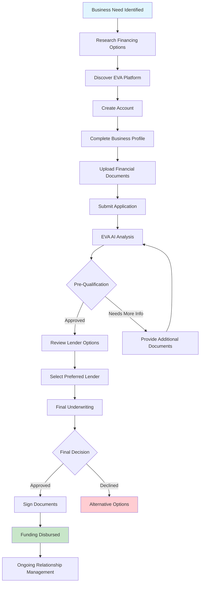
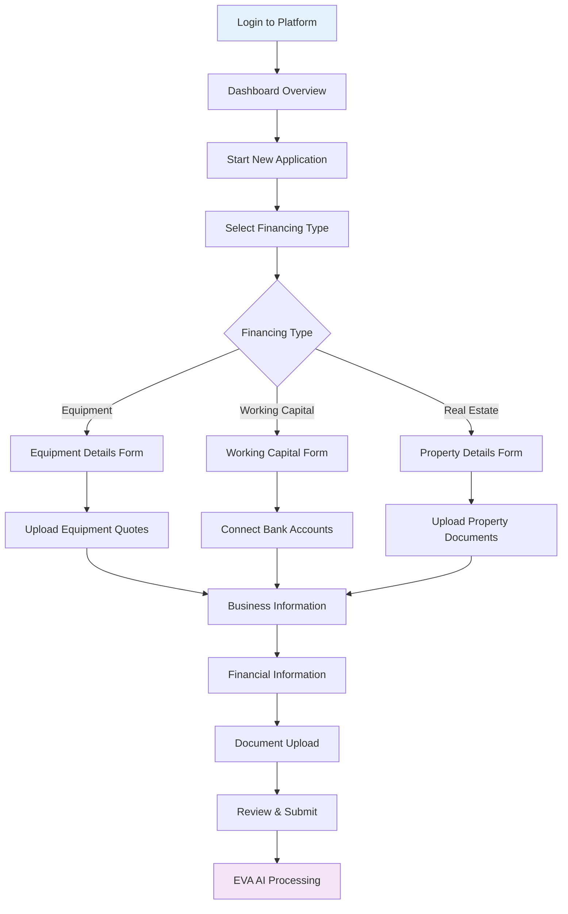
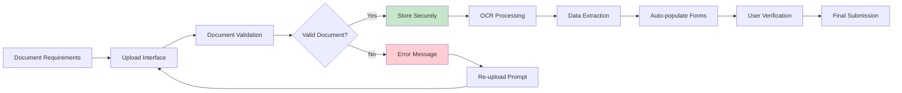
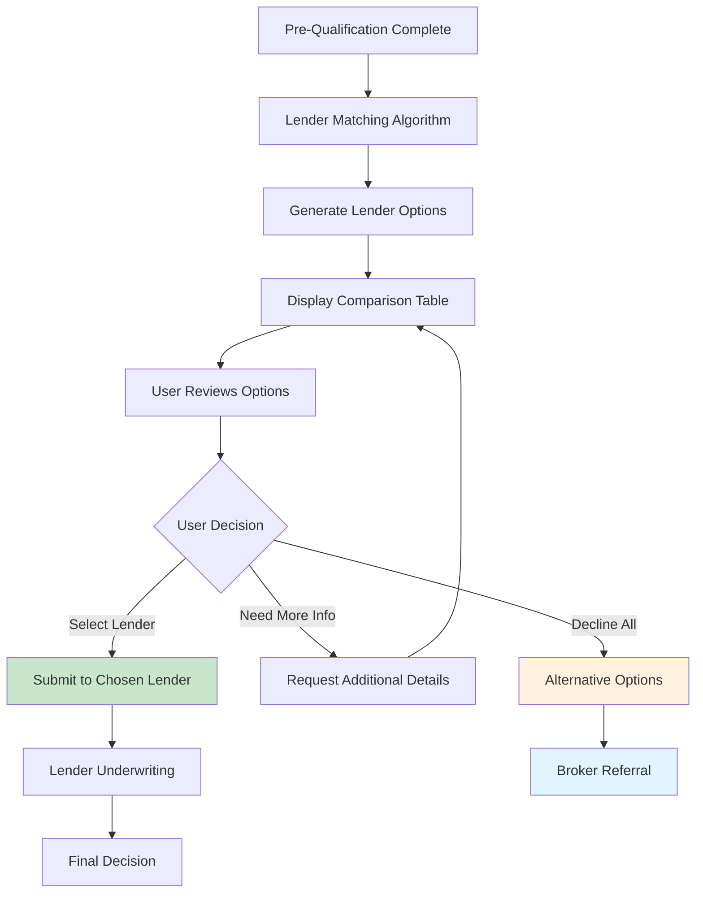
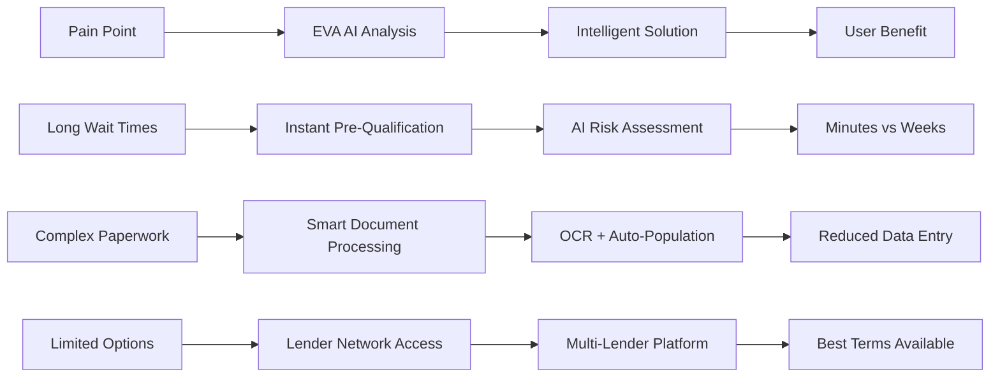

# 🏢 Business Owner (Borrower) - User Type Documentation

## Business Context
Business owners seeking financing for equipment, working capital, real estate, or business expansion. They need quick, transparent access to funding options with minimal paperwork and fast approval processes.

## User Personas

### Primary Persona: Equipment Financing Seeker
- **Name**: Sarah Chen, Manufacturing Business Owner
- **Company**: Precision Parts Manufacturing LLC
- **Need**: $250K equipment financing for new CNC machines
- **Pain Points**: Long approval times, complex paperwork, limited lender options
- **Goals**: Fast approval, competitive rates, minimal documentation

### Secondary Persona: Working Capital Borrower  
- **Name**: Marcus Rodriguez, Restaurant Owner
- **Company**: Rodriguez Family Restaurants (3 locations)
- **Need**: $75K working capital for seasonal inventory
- **Pain Points**: Cash flow gaps, seasonal revenue fluctuations
- **Goals**: Flexible repayment, quick access to funds, no collateral

## User Stories

### Epic 1: Equipment Financing Application
```
As a business owner,
I want to apply for equipment financing,
So that I can purchase necessary equipment to grow my business.

Acceptance Criteria:
- Can upload equipment quotes and specifications
- Receive instant pre-qualification decisions
- Track application status in real-time
- Access multiple lender options
- Complete application in under 15 minutes

User Story Breakdown:
1. As a business owner, I want to upload equipment quotes so that lenders can see exactly what I'm purchasing
2. As a business owner, I want instant pre-qualification so that I know if I'm likely to be approved
3. As a business owner, I want to track my application status so that I can plan my equipment purchase timeline
4. As a business owner, I want to compare multiple lender offers so that I can get the best terms
5. As a business owner, I want a simple application process so that I can apply quickly without disrupting my business
```

### Epic 2: Working Capital Access
```
As a business owner,
I want to access working capital quickly,
So that I can manage cash flow and operational expenses.

Acceptance Criteria:
- Connect bank accounts for cash flow analysis
- Receive automated credit decisions
- Access funds within 24-48 hours
- Flexible repayment terms
- No collateral requirements for qualified applicants

User Story Breakdown:
1. As a business owner, I want to connect my bank accounts so that lenders can see my cash flow patterns
2. As a business owner, I want automated credit decisions so that I don't have to wait for manual reviews
3. As a business owner, I want fast funding so that I can address immediate cash flow needs
4. As a business owner, I want flexible repayment terms so that payments align with my revenue cycles
5. As a business owner, I want unsecured financing so that I don't risk my business assets
```

### Epic 3: Real Estate Financing
```
As a business owner,
I want to finance commercial real estate,
So that I can expand my business operations or reduce rental costs.

Acceptance Criteria:
- Upload property information and appraisals
- Access SBA and conventional loan options
- Receive guidance on loan-to-value ratios
- Track application through underwriting process
- Access closing coordination services

User Story Breakdown:
1. As a business owner, I want to upload property details so that lenders can evaluate the investment
2. As a business owner, I want access to SBA loans so that I can get favorable terms
3. As a business owner, I want LTV guidance so that I know how much down payment I need
4. As a business owner, I want underwriting transparency so that I can provide additional information if needed
5. As a business owner, I want closing support so that the transaction goes smoothly
```

## Customer Journey Map



## Detailed Process Flowcharts

### Application Submission Process


### Document Management Flow


### Lender Selection Process


## Pain Points & Solutions

### Current Pain Points
1. **Long Approval Times**: Traditional lenders take 2-6 weeks
   - **EVA Solution**: AI-powered pre-qualification in minutes
   
2. **Complex Paperwork**: Extensive documentation requirements
   - **EVA Solution**: Smart document upload with OCR and auto-population
   
3. **Limited Options**: Single lender relationships
   - **EVA Solution**: Access to 50+ lender network
   
4. **Lack of Transparency**: No visibility into approval process
   - **EVA Solution**: Real-time status tracking and communication
   
5. **One-Size-Fits-All**: Generic loan products
   - **EVA Solution**: AI-powered matching to optimal loan products

### Solution Implementation


## Success Metrics & KPIs

### Primary Success Metrics
| Metric | Target | Current Industry Average |
|--------|--------|-------------------------|
| Application Completion Rate | >90% | 65% |
| Time to Pre-Qualification | <5 minutes | 2-5 days |
| Time to Funding | <48 hours | 2-6 weeks |
| Customer Satisfaction | >4.5/5 | 3.2/5 |
| Application Approval Rate | >75% | 45% |

### Secondary Metrics
- Document upload success rate: >95%
- Platform uptime: >99.9%
- Support response time: <2 hours
- Repeat usage rate: >60%
- Referral rate: >40%

## User Interface Requirements

### Dashboard Requirements
- Clean, intuitive design
- Application status at-a-glance
- Quick access to new applications
- Document management center
- Communication hub with lenders

### Mobile Optimization
- Responsive design for all screen sizes
- Touch-friendly interface elements
- Camera integration for document capture
- Push notifications for status updates
- Offline capability for form completion

### Accessibility Features
- WCAG 2.1 AA compliance
- Screen reader compatibility
- Keyboard navigation support
- High contrast mode
- Multiple language support

## Integration Requirements

### Banking Integration
- Plaid/Yodlee for bank account connectivity
- Real-time transaction analysis
- Cash flow pattern recognition
- Automated financial statement generation

### Accounting Software Integration
- QuickBooks Online/Desktop
- Xero integration
- Sage Business Cloud
- FreshBooks connectivity

### Document Management
- Secure cloud storage (AWS S3)
- OCR processing (AWS Textract)
- Digital signature capability (DocuSign)
- Version control and audit trails

## Security & Compliance

### Data Protection
- End-to-end encryption
- SOC 2 Type II compliance
- GDPR compliance for international users
- Regular security audits
- Multi-factor authentication

### Financial Compliance
- Bank Secrecy Act (BSA) compliance
- Know Your Customer (KYC) procedures
- Anti-Money Laundering (AML) checks
- Fair Credit Reporting Act (FCRA) compliance

## Support & Training

### Onboarding Process
1. Welcome email with platform overview
2. Interactive tutorial for first application
3. Video guides for common tasks
4. Live chat support during business hours
5. Follow-up check-in after first application

### Ongoing Support
- 24/7 chat support
- Phone support during business hours
- Email support with <4 hour response
- Knowledge base with searchable articles
- Video tutorial library

### Training Materials
- Platform overview video (5 minutes)
- Application walkthrough (10 minutes)
- Document preparation guide
- Lender selection best practices
- Troubleshooting common issues

---

*This documentation provides the foundation for developing business owner-focused features and ensuring optimal user experience throughout the financing journey.* 